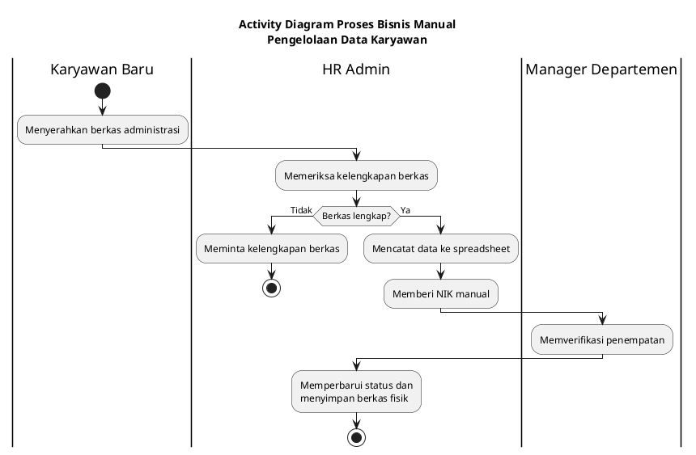
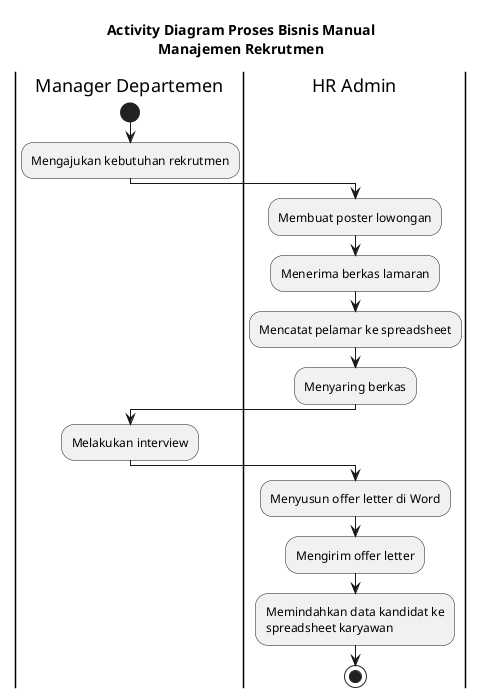
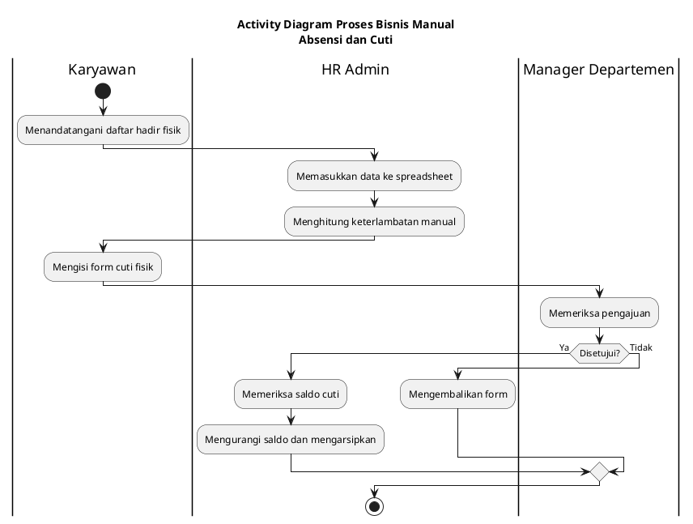
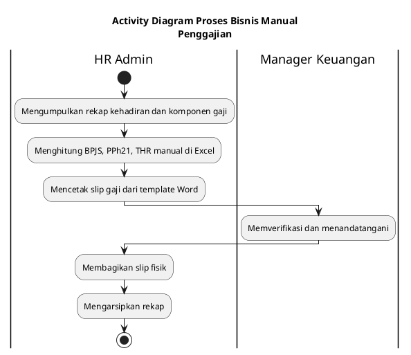
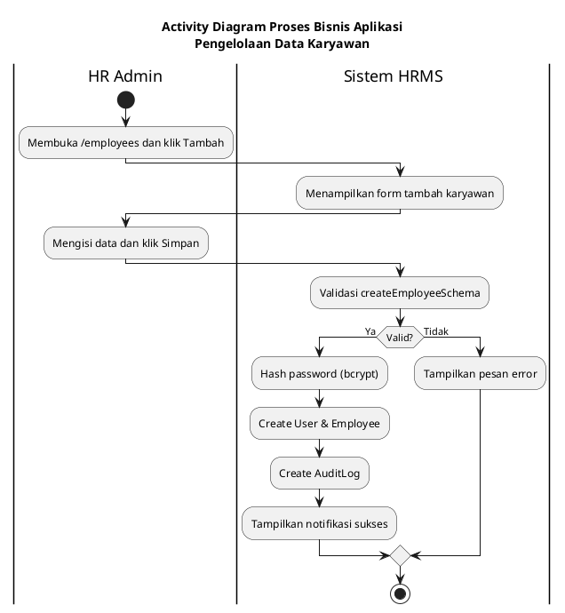
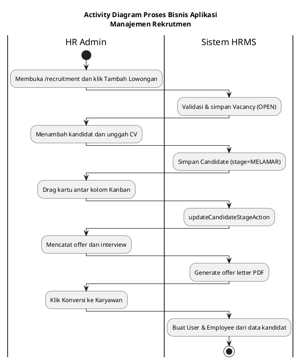
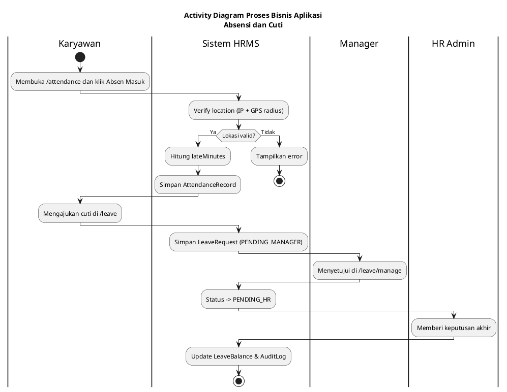
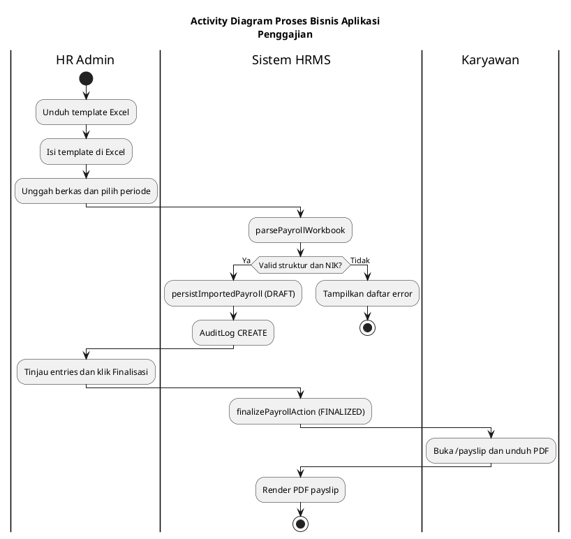
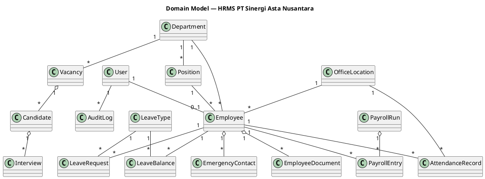

# BAB IV ANALISIS DAN PERANCANGAN SISTEM

## 4.1 Tahap Requirements

Tahap *requirements* merupakan tahap pertama dalam ICONIX Process yang bertujuan untuk memahami kebutuhan pemangku kepentingan terhadap sistem yang akan dibangun. Pada tahap ini dilakukan pengumpulan informasi melalui wawancara dengan pihak manajemen PT Sinergi Asta Nusantara, analisis proses bisnis berjalan, perumusan kebutuhan fungsional, pembentukan *domain model*, perumusan kebutuhan perilaku (*behavior requirements*) berupa *use case*, serta penyusunan prototipe antarmuka sistem. Keluaran dari tahap ini menjadi dasar untuk tahap *analysis and preliminary design* pada sub-bab berikutnya.

### 4.1.1 Hasil Wawancara

Wawancara dilakukan dengan pihak manajemen dan staf HRD PT Sinergi Asta Nusantara (PT SAN), sebuah perusahaan yang bergerak di bidang *collection management*. Wawancara bertujuan untuk memahami proses bisnis berjalan, kendala yang dihadapi, serta ekspektasi terhadap sistem informasi yang akan dibangun.

Berdasarkan hasil wawancara, diketahui bahwa PT SAN selama ini mengelola seluruh kegiatan kepegawaian secara manual menggunakan kombinasi berkas fisik, *spreadsheet* Microsoft Excel, serta dokumen Microsoft Word. Tidak terdapat sistem informasi terintegrasi yang menyatukan data karyawan, kehadiran, cuti, rekrutmen, maupun penggajian. Hal tersebut menimbulkan empat permasalahan utama yang dirangkum sebagai berikut.

1. **Modul Pengelolaan Data Karyawan.** Data karyawan disimpan dalam *spreadsheet* yang berbeda-beda untuk informasi personal, kepegawaian, pajak, dan BPJS, sehingga rentan terjadi duplikasi data dan inkonsistensi. Berkas pendukung seperti KTP, NPWP, kartu BPJS, serta kontrak kerja masih disimpan dalam map fisik di lemari arsip, menyulitkan proses pencarian dan pemutakhiran data.

2. **Modul Rekrutmen.** Proses rekrutmen masih dijalankan secara *ad-hoc*. Lowongan disebarkan melalui media sosial tanpa basis data terpusat, berkas lamaran diterima melalui beragam kanal (surel, WhatsApp, fisik), dan tahapan seleksi kandidat dicatat pada *spreadsheet* terpisah. Tidak terdapat *pipeline* yang memvisualisasikan posisi tiap kandidat di setiap tahap seleksi, sehingga sulit melakukan pemantauan secara real-time.

3. **Modul Absensi dan Cuti.** Kehadiran karyawan dicatat menggunakan lembar daftar hadir fisik, kemudian dipindahkan ke *spreadsheet* harian oleh HR Admin. Perhitungan keterlambatan, pulang cepat, dan lembur dilakukan secara manual menggunakan rumus *spreadsheet* yang berbeda tiap bulan. Pengajuan cuti diajukan melalui formulir kertas yang harus dilewatkan secara berurutan kepada *manager* dan HR, sehingga waktu persetujuan tidak terprediksi.

4. **Modul Penggajian.** Perhitungan gaji dilakukan oleh HR Admin menggunakan Microsoft Excel dengan rumus yang dimodifikasi setiap periode. Komponen gaji seperti tunjangan, BPJS, PPh 21, dan THR dihitung secara manual sehingga rentan terhadap kesalahan rumus. Slip gaji dicetak satu per satu menggunakan *template* Microsoft Word dan diserahkan secara fisik kepada karyawan.

Empat permasalahan tersebut menjadi dasar penentuan modul fungsional sistem yang akan dibangun, yaitu *Employee Data Management*, *Recruitment Management*, *Attendance & Leave Management*, dan *Payroll Management*. Dokumentasi wawancara yang dilakukan dapat dilihat pada Lampiran 1.

### 4.1.2 Hasil Analisis Proses Bisnis

Berdasarkan informasi yang diperoleh dari hasil wawancara, dilakukan analisis terhadap proses bisnis yang berjalan saat ini (*as-is*) dan proses bisnis yang diusulkan setelah sistem HRMS diterapkan (*to-be*). Hasil analisis disajikan dalam dua bagian, yaitu proses bisnis manual dan proses bisnis aplikasi.

#### 4.1.2.1 Proses Bisnis Manual

**a. Modul Pengelolaan Data Karyawan**

Proses pengelolaan data karyawan saat ini diawali ketika seorang karyawan baru menyerahkan berkas administrasi (KTP, NPWP, kartu BPJS, dokumen kontrak) kepada HR Admin. HR Admin kemudian memeriksa kelengkapan berkas dan mencatat data karyawan ke dalam *spreadsheet*. Berkas fisik selanjutnya diarsipkan dalam map dan disimpan di lemari berkas. *Manager* departemen melakukan verifikasi penempatan jabatan secara terpisah. Langkah-langkah proses bisnis manual modul pengelolaan data karyawan adalah sebagai berikut.

1. Karyawan baru menyerahkan berkas administrasi kepada HR Admin.
2. HR Admin memeriksa kelengkapan berkas. Apabila tidak lengkap, HR Admin meminta kelengkapan kepada karyawan.
3. HR Admin mencatat data karyawan ke dalam *spreadsheet* master karyawan dan memberi NIK secara manual.
4. *Manager* departemen memverifikasi penempatan departemen dan jabatan.
5. HR Admin memperbarui status karyawan pada *spreadsheet* dan menyimpan berkas fisik di map arsip.

[Sisipkan gambar di sini]

**Gambar 4.1 *Activity Diagram* Proses Bisnis Manual Pengelolaan Data Karyawan**

**b. Modul Rekrutmen**

Proses rekrutmen manual diawali oleh permintaan perekrutan dari *manager* departemen kepada HR Admin. HR Admin kemudian membuat poster lowongan dan menyebarkannya melalui media sosial. Berkas lamaran yang diterima melalui berbagai kanal direkapitulasi ke dalam *spreadsheet*. Proses seleksi berjalan secara berurutan dari seleksi berkas, interview oleh *manager*, hingga penerbitan *offer letter*. Langkah-langkah proses bisnis manual modul rekrutmen adalah sebagai berikut.

1. *Manager* departemen mengajukan kebutuhan perekrutan kepada HR Admin.
2. HR Admin membuat poster lowongan dan menyebarkannya melalui media sosial.
3. Pelamar mengirimkan lamaran melalui email, WhatsApp, atau fisik.
4. HR Admin mencatat data pelamar ke *spreadsheet* dan menyaring berkas.
5. Pelamar yang lolos diundang interview oleh *manager*.
6. HR Admin mencatat hasil interview dan menyusun *offer letter* untuk kandidat yang diterima.
7. Kandidat menandatangani *offer letter*, kemudian datanya dipindahkan ke *spreadsheet* karyawan.

[Sisipkan gambar di sini]

**Gambar 4.2 *Activity Diagram* Proses Bisnis Manual Manajemen Rekrutmen**

**c. Modul Absensi dan Cuti**

Karyawan mencatat kehadiran dengan menandatangani daftar hadir fisik. Daftar hadir kemudian dikumpulkan oleh HR Admin dan dipindahkan ke *spreadsheet*. Pengajuan cuti dilakukan dengan formulir kertas atau email yang harus diteruskan kepada *manager* dan kemudian kepada HR Admin. Langkah-langkah proses bisnis manual modul absensi dan cuti adalah sebagai berikut.

1. Karyawan menandatangani daftar hadir fisik di meja resepsionis.
2. HR Admin mengumpulkan daftar hadir dan memasukkan datanya ke *spreadsheet* bulanan.
3. HR Admin menghitung keterlambatan, pulang cepat, dan lembur secara manual.
4. Karyawan mengisi form cuti fisik atau mengirim email pengajuan cuti.
5. *Manager* departemen memeriksa pengajuan cuti. Apabila disetujui, formulir diteruskan ke HR Admin.
6. HR Admin memeriksa saldo cuti, mengurangi saldo, dan mengarsipkan formulir.

[Sisipkan gambar di sini]

**Gambar 4.3 *Activity Diagram* Proses Bisnis Manual Absensi dan Cuti**

**d. Modul Penggajian**

HR Admin mengumpulkan rekap kehadiran bulanan dan komponen gaji, kemudian menghitung gaji setiap karyawan secara manual menggunakan rumus *spreadsheet*. Slip gaji dicetak satu per satu dari *template* Microsoft Word. Langkah-langkah proses bisnis manual modul penggajian adalah sebagai berikut.

1. HR Admin mengumpulkan rekap kehadiran, potongan, tunjangan, dan THR.
2. HR Admin menghitung BPJS, PPh 21, dan komponen gaji secara manual di Excel.
3. HR Admin mencetak slip gaji menggunakan *template* Word.
4. *Manager* Keuangan memverifikasi total nominal dan menandatangani slip.
5. HR Admin membagikan slip gaji fisik kepada karyawan dan mengarsipkan rekap.

[Sisipkan gambar di sini]

**Gambar 4.4 *Activity Diagram* Proses Bisnis Manual Penggajian**

#### 4.1.2.2 Proses Bisnis Aplikasi

Setelah sistem HRMS diterapkan, seluruh modul akan terintegrasi dalam satu aplikasi berbasis *web*. Data disimpan pada basis data terpusat (PostgreSQL) dan diakses sesuai peran pengguna melalui mekanisme autentikasi berbasis *session* JWT. Berikut adalah deskripsi proses bisnis aplikasi untuk setiap modul.

**a. Modul Pengelolaan Data Karyawan**

HR Admin mengakses halaman *Tambah Karyawan* dan mengisi *form* yang terbagi menjadi empat bagian (informasi akun, personal, kepegawaian, pajak dan BPJS). Sistem akan memvalidasi input menggunakan *schema* Zod, kemudian secara otomatis membuat akun pengguna sekaligus data karyawan dalam satu transaksi basis data. Langkah-langkah proses bisnis aplikasi modul pengelolaan data karyawan adalah sebagai berikut.

1. HR Admin mengakses halaman `/employees` dan menekan tombol "Tambah Karyawan".
2. Sistem menampilkan *form* tambah karyawan dengan empat bagian yang harus diisi.
3. HR Admin mengisi data dan menekan tombol "Simpan".
4. Sistem memvalidasi input melalui *createEmployeeSchema*.
5. Sistem melakukan *hash password* dengan *bcrypt*, membuat entitas `User` dan `Employee`, lalu mencatat aktivitas pada `AuditLog`.
6. Sistem menampilkan notifikasi sukses dan mengarahkan ke halaman profil karyawan.

[Sisipkan gambar di sini]

**Gambar 4.5 *Activity Diagram* Proses Bisnis Aplikasi Pengelolaan Data Karyawan**

**b. Modul Rekrutmen**

HR Admin membuat lowongan baru pada halaman rekrutmen, kemudian menambahkan kandidat beserta CV-nya. Sistem menyediakan *Kanban board* berbasis *drag-and-drop* untuk memindahkan kandidat antar tahap seleksi (MELAMAR, SELEKSI_BERKAS, INTERVIEW, PENAWARAN, DITERIMA, DITOLAK). Setelah kandidat dinyatakan diterima, sistem dapat menghasilkan *offer letter* dalam format PDF dan mengonversi data kandidat menjadi karyawan tetap. Langkah-langkah proses bisnis aplikasi modul rekrutmen adalah sebagai berikut.

1. HR Admin mengakses `/recruitment` dan menekan "Tambah Lowongan".
2. HR Admin mengisi *form* lowongan (judul, departemen, deskripsi, persyaratan, tanggal buka).
3. Sistem menyimpan `Vacancy` dengan status OPEN.
4. HR Admin membuka detail lowongan, menambahkan kandidat, dan mengunggah CV melalui `/api/recruitment/cv`.
5. HR Admin menggeser kartu kandidat antar kolom *Kanban*, dan sistem memperbarui *field* `stage`.
6. HR Admin menjadwalkan *interview* dan mencatat penawaran (`offerSalary`, `offerNotes`).
7. Sistem menghasilkan *offer letter* PDF melalui `/api/recruitment/offer-letter/[candidateId]`.
8. HR Admin menekan "Konversi ke Karyawan", sistem menjalankan `convertCandidateToEmployeeAction`.

[Sisipkan gambar di sini]

**Gambar 4.6 *Activity Diagram* Proses Bisnis Aplikasi Manajemen Rekrutmen**

**c. Modul Absensi dan Cuti**

Karyawan mencatat kehadiran melalui tombol *Absen Masuk* dan *Absen Pulang* yang memvalidasi lokasi berdasarkan *IP allowlist* serta koordinat GPS dengan radius yang ditetapkan oleh kantor. Pengajuan cuti dilakukan melalui *form* dan mengalir secara otomatis ke *Manager* lalu HR untuk persetujuan dua tahap. Langkah-langkah proses bisnis aplikasi modul absensi dan cuti adalah sebagai berikut.

1. Karyawan membuka `/attendance` dan menekan tombol "Absen Masuk".
2. *Browser* mengambil koordinat GPS, sistem mengambil IP klien dari *header*.
3. Sistem menjalankan `clockInAction`, memverifikasi lokasi melalui `verifyLocation`.
4. Sistem menghitung `isLate` dan `lateMinutes` melalui `calculateAttendanceFlags`, lalu menyimpan `AttendanceRecord`.
5. Pada akhir jam kerja, karyawan menekan "Absen Pulang"; sistem memperbarui *field* `clockOut`, `isEarlyOut`, dan `overtimeMinutes`.
6. Karyawan membuka `/leave` dan mengajukan cuti melalui *form*.
7. Sistem memvalidasi `submitLeaveSchema`, menghitung `workingDays`, dan menyimpan `LeaveRequest` dengan status `PENDING_MANAGER`.
8. *Manager* membuka `/leave/manage`, menyetujui atau menolak. Jika disetujui, status berubah menjadi `PENDING_HR`.
9. HR memberikan keputusan akhir. Jika disetujui, sistem memperbarui `LeaveBalance` (`usedDays`).

[Sisipkan gambar di sini]

**Gambar 4.7 *Activity Diagram* Proses Bisnis Aplikasi Absensi dan Cuti**

**d. Modul Penggajian**

Berbeda dengan sistem yang melakukan perhitungan gaji secara otomatis, sistem HRMS pada studi kasus ini menggunakan pendekatan *import-based*. HR Admin tetap menghitung komponen gaji pada *spreadsheet* eksternal, namun hasil perhitungan diunggah ke sistem melalui *template* Excel terstandardisasi. Sistem berperan sebagai *system of record* yang menyimpan, menampilkan, dan mendistribusikan slip gaji secara digital. Langkah-langkah proses bisnis aplikasi modul penggajian adalah sebagai berikut.

1. HR Admin mengakses `/payroll` dan mengunduh *template* Excel melalui `/api/payroll/template`.
2. HR Admin mengisi *template* (NIK, *earnings*, *deductions*, *benefits*, ringkasan absensi).
3. HR Admin memilih bulan dan tahun, lalu mengunggah berkas yang sudah diisi.
4. Sistem menjalankan `importPayrollAction`, memvalidasi tipe berkas dan struktur kolom melalui `parsePayrollWorkbook`.
5. Sistem mencocokkan NIK pada baris dengan `Employee` melalui `matchRowsToEmployees`.
6. Apabila berhasil, sistem menyimpan `PayrollRun` dan `PayrollEntry` dengan status `DRAFT`.
7. HR Admin meninjau setiap *entry* pada `/payroll/{periodId}`, lalu menekan tombol "Finalisasi".
8. Sistem menjalankan `finalizePayrollAction`, mengubah status menjadi `FINALIZED`.
9. Karyawan membuka `/payslip` dan mengunduh slip gaji PDF melalui `/api/payroll/payslip/{entryId}`.

[Sisipkan gambar di sini]

**Gambar 4.8 *Activity Diagram* Proses Bisnis Aplikasi Penggajian**

### 4.1.3 Functional Requirements

Berdasarkan hasil analisis proses bisnis, dirumuskan kebutuhan fungsional sistem HRMS sebagai berikut. Setiap kebutuhan diberi pengenal unik berformat **SRS-HRMS-F-XX** dan dikelompokkan berdasarkan modul.

**Tabel 4.1 Daftar Kebutuhan Fungsional Sistem HRMS PT SAN**

| No | SRS-ID | Deskripsi |
|----|--------|-----------|
| 1 | SRS-HRMS-F-01 | Sistem menyediakan fitur *login* dengan kombinasi *email* dan *password* untuk seluruh peran pengguna. |
| 2 | SRS-HRMS-F-02 | Sistem menyediakan fitur *logout* untuk mengakhiri sesi pengguna. |
| 3 | SRS-HRMS-F-03 | Sistem menampilkan *dashboard* dengan ringkasan informasi yang disesuaikan dengan peran pengguna (Superadmin, HR Admin, *Manager*, *Employee*). |
| 4 | SRS-HRMS-F-04 | Sistem menyediakan fitur pengelolaan akun pengguna (menambah, mengubah, mengaktifkan, dan menonaktifkan) yang hanya dapat diakses oleh Superadmin. |
| 5 | SRS-HRMS-F-05 | Sistem menyediakan pengelolaan *master* departemen (tambah, ubah, hapus *soft delete*). |
| 6 | SRS-HRMS-F-06 | Sistem menyediakan pengelolaan *master* jabatan yang terikat pada satu departemen. |
| 7 | SRS-HRMS-F-07 | Sistem menyediakan pengelolaan *master* lokasi kantor lengkap dengan *IP allowlist*, koordinat GPS, radius, serta jam kerja. |
| 8 | SRS-HRMS-F-08 | Sistem menyediakan pengelolaan *master* jenis cuti dengan kuota tahunan, status berbayar, dan restriksi *gender* opsional. |
| 9 | SRS-HRMS-F-09 | Sistem mencatat seluruh aktivitas penting (CREATE, UPDATE, DELETE) dan menampilkannya pada halaman *log audit*. |
| 10 | SRS-HRMS-F-10 | Sistem menampilkan daftar karyawan dengan fitur pencarian dan pagination. |
| 11 | SRS-HRMS-F-11 | Sistem menyediakan fitur penambahan data karyawan baru sekaligus pembentukan akun pengguna terkait. |
| 12 | SRS-HRMS-F-12 | Sistem menyediakan pemutakhiran informasi personal karyawan (nama, tempat/tanggal lahir, *gender*, agama, status pernikahan, alamat, nomor HP). |
| 13 | SRS-HRMS-F-13 | Sistem menyediakan pemutakhiran informasi kepegawaian (departemen, jabatan, tipe kontrak, tanggal masuk, lokasi kantor). |
| 14 | SRS-HRMS-F-14 | Sistem menyediakan pemutakhiran informasi pajak dan BPJS (NPWP, status PTKP, nomor BPJS Kesehatan, BPJS Ketenagakerjaan, *tax borne by company*). |
| 15 | SRS-HRMS-F-15 | Sistem menyediakan fitur unggah, unduh, dan hapus dokumen karyawan (PDF, JPEG, PNG, maksimum 5 MB). |
| 16 | SRS-HRMS-F-16 | Sistem menyediakan pengelolaan kontak darurat karyawan (tambah, ubah, hapus). |
| 17 | SRS-HRMS-F-17 | Sistem menyediakan fitur penonaktifan karyawan dengan pencatatan tanggal dan alasan *termination*. |
| 18 | SRS-HRMS-F-18 | Sistem menyediakan pengelolaan lowongan pekerjaan, termasuk perubahan status OPEN/CLOSED. |
| 19 | SRS-HRMS-F-19 | Sistem menyediakan fitur penambahan kandidat beserta unggahan berkas CV. |
| 20 | SRS-HRMS-F-20 | Sistem menyediakan *Kanban board* untuk mengubah tahap kandidat secara *drag-and-drop*. |
| 21 | SRS-HRMS-F-21 | Sistem menyediakan fitur penjadwalan *interview* untuk setiap kandidat. |
| 22 | SRS-HRMS-F-22 | Sistem menyediakan fitur pencatatan penawaran kerja (*offer salary* dan *offer notes*) serta penerbitan *offer letter* dalam format PDF. |
| 23 | SRS-HRMS-F-23 | Sistem menyediakan fitur konversi kandidat dengan tahap DITERIMA menjadi entitas karyawan. |
| 24 | SRS-HRMS-F-24 | Sistem menyediakan pencatatan kehadiran (*clock in* dan *clock out*) dengan verifikasi *IP allowlist* dan koordinat GPS terhadap lokasi kantor. |
| 25 | SRS-HRMS-F-25 | Sistem menampilkan riwayat absensi pribadi karyawan beserta status keterlambatan, pulang cepat, dan lembur. |
| 26 | SRS-HRMS-F-26 | Sistem menampilkan rekap absensi bulanan yang dapat difilter berdasarkan periode (dan departemen untuk peran *Manager*). |
| 27 | SRS-HRMS-F-27 | Sistem menyediakan fitur koreksi manual (*manual override*) catatan absensi oleh HR Admin disertai alasan. |
| 28 | SRS-HRMS-F-28 | Sistem menyediakan ekspor rekap absensi dalam format CSV/Excel dan PDF. |
| 29 | SRS-HRMS-F-29 | Sistem menyediakan fitur pengajuan cuti karyawan beserta perhitungan jumlah hari kerja secara otomatis. |
| 30 | SRS-HRMS-F-30 | Sistem menyediakan alur persetujuan cuti dua tahap, yaitu *Manager* (PENDING_MANAGER → PENDING_HR) dan HR Admin (PENDING_HR → APPROVED/REJECTED). |
| 31 | SRS-HRMS-F-31 | Sistem menyediakan fitur pembatalan cuti oleh karyawan sebelum disetujui. |
| 32 | SRS-HRMS-F-32 | Sistem menampilkan saldo dan riwayat cuti karyawan per jenis cuti per tahun. |
| 33 | SRS-HRMS-F-33 | Sistem menyediakan laporan cuti berbentuk KPI dan grafik tren untuk HR Admin. |
| 34 | SRS-HRMS-F-34 | Sistem menyediakan unduhan *template* Excel untuk impor penggajian. |
| 35 | SRS-HRMS-F-35 | Sistem menyediakan impor data *payroll* dari berkas Excel/CSV dengan validasi struktur kolom dan pencocokan NIK. |
| 36 | SRS-HRMS-F-36 | Sistem menampilkan detail periode *payroll* yang sudah diimpor, termasuk seluruh komponen *earnings*, *deductions*, *benefits*, dan THP. |
| 37 | SRS-HRMS-F-37 | Sistem menyediakan fitur finalisasi periode *payroll* yang mengubah status dari DRAFT menjadi FINALIZED. |
| 38 | SRS-HRMS-F-38 | Sistem menyediakan pengunduhan slip gaji per karyawan dalam format PDF. |
| 39 | SRS-HRMS-F-39 | Sistem menampilkan daftar slip gaji yang dapat diakses oleh karyawan terkait. |

### 4.1.4 Domain Modeling

Tahap *domain modeling* dalam ICONIX Process bertujuan untuk mengidentifikasi entitas-entitas yang menjadi objek perhatian sistem beserta hubungan antar entitas tersebut. Identifikasi dilakukan dengan mengekstraksi kata benda dari hasil wawancara dan deskripsi proses bisnis, kemudian diverifikasi dengan struktur basis data aktual. Berikut adalah daftar *domain object* yang teridentifikasi.

1. **User** — akun pengguna sistem dengan empat peran (SUPER_ADMIN, HR_ADMIN, MANAGER, EMPLOYEE).
2. **Employee** — data kepegawaian seseorang yang terhubung dengan satu akun *User*.
3. **Department** — unit organisasi yang menampung beberapa jabatan dan karyawan.
4. **Position** — jabatan yang dimiliki oleh karyawan, terikat pada satu departemen.
5. **OfficeLocation** — lokasi kantor sebagai acuan validasi kehadiran (*IP allowlist*, GPS, radius, jam kerja).
6. **LeaveType** — jenis cuti dengan kuota tahunan dan status berbayar.
7. **EmployeeDocument** — berkas dokumen karyawan (KTP, NPWP, BPJS, kontrak, foto, lainnya).
8. **EmergencyContact** — kontak darurat karyawan.
9. **AttendanceRecord** — catatan kehadiran harian karyawan.
10. **LeaveRequest** — pengajuan cuti yang mengalami alur persetujuan dua tahap.
11. **LeaveBalance** — saldo cuti per karyawan per jenis cuti per tahun.
12. **PayrollRun** — periode penggajian bulanan dengan status DRAFT atau FINALIZED.
13. **PayrollEntry** — *snapshot* gaji satu karyawan dalam satu periode *payroll*.
14. **Vacancy** — lowongan pekerjaan dengan status OPEN/CLOSED.
15. **Candidate** — pelamar yang melamar pada suatu *Vacancy*.
16. **Interview** — penjadwalan *interview* terhadap *Candidate*.
17. **AuditLog** — catatan jejak audit aktivitas penting di sistem.

Hubungan antar *domain object* dijelaskan sebagai berikut. Setiap *User* dapat memiliki paling banyak satu *Employee*. *Department* memiliki banyak *Position* dan banyak *Employee*; setiap *Employee* terikat pada satu *Department*, satu *Position*, dan secara opsional pada satu *OfficeLocation*. *Employee* mengagregasi banyak *EmployeeDocument* dan *EmergencyContact* (terhapus berantai bila *Employee* dihapus), serta memiliki banyak *AttendanceRecord*, *LeaveRequest*, *LeaveBalance*, dan *PayrollEntry*. *LeaveType* dirujuk oleh banyak *LeaveRequest* dan *LeaveBalance*. *PayrollRun* mengagregasi banyak *PayrollEntry*. Pada modul rekrutmen, *Vacancy* mengagregasi banyak *Candidate*, dan setiap *Candidate* memiliki banyak *Interview*. *AuditLog* selalu merujuk pada satu *User* sebagai pelaku aksi.

[Sisipkan gambar di sini]

**Gambar 4.9 *Domain Model* Aplikasi HRMS PT SAN**

### 4.1.5 Behavior Requirements

Kebutuhan perilaku (*behavior requirements*) menggambarkan interaksi antara aktor dan sistem dalam bentuk *use case*. Pada sub-bab ini disajikan daftar *use case*, diagram *use case*, serta skenario untuk masing-masing *use case*.

#### 4.1.5.1 Daftar Use Case

Setiap *use case* diberi pengenal unik berformat **UC-HRMS-XX** dan dipetakan terhadap satu atau lebih SRS-ID kebutuhan fungsional. Daftar *use case* sistem HRMS PT SAN disajikan pada Tabel 4.2.

**Tabel 4.2 Daftar *Use Case* Sistem HRMS PT SAN**

| No | UC-ID | Nama Use Case | SRS-ID Terkait | Aktor |
|----|-------|---------------|----------------|-------|
| 1 | UC-HRMS-01 | Login | SRS-HRMS-F-01 | Superadmin, HR Admin, Manager, Employee |
| 2 | UC-HRMS-02 | Logout | SRS-HRMS-F-02 | Superadmin, HR Admin, Manager, Employee |
| 3 | UC-HRMS-03 | Melihat *Dashboard* | SRS-HRMS-F-03 | Superadmin, HR Admin, Manager, Employee |
| 4 | UC-HRMS-04 | Mengelola Pengguna Sistem | SRS-HRMS-F-04 | Superadmin |
| 5 | UC-HRMS-05 | Mengelola *Master* Departemen | SRS-HRMS-F-05 | Superadmin |
| 6 | UC-HRMS-06 | Mengelola *Master* Jabatan | SRS-HRMS-F-06 | Superadmin |
| 7 | UC-HRMS-07 | Mengelola *Master* Lokasi Kantor | SRS-HRMS-F-07 | Superadmin |
| 8 | UC-HRMS-08 | Mengelola *Master* Jenis Cuti | SRS-HRMS-F-08 | Superadmin |
| 9 | UC-HRMS-09 | Melihat *Log Audit* | SRS-HRMS-F-09 | Superadmin |
| 10 | UC-HRMS-10 | Melihat Daftar Karyawan | SRS-HRMS-F-10 | HR Admin, Manager, Employee |
| 11 | UC-HRMS-11 | Menambah Data Karyawan | SRS-HRMS-F-11 | HR Admin |
| 12 | UC-HRMS-12 | Mengubah Profil Karyawan | SRS-HRMS-F-12, F-13, F-14 | HR Admin |
| 13 | UC-HRMS-13 | Mengelola Dokumen Karyawan | SRS-HRMS-F-15 | HR Admin |
| 14 | UC-HRMS-14 | Mengelola Kontak Darurat | SRS-HRMS-F-16 | HR Admin |
| 15 | UC-HRMS-15 | Menonaktifkan Karyawan | SRS-HRMS-F-17 | HR Admin |
| 16 | UC-HRMS-16 | Mengelola Lowongan | SRS-HRMS-F-18 | HR Admin |
| 17 | UC-HRMS-17 | Mengelola Kandidat | SRS-HRMS-F-19 | HR Admin |
| 18 | UC-HRMS-18 | Mengubah Tahap Kandidat | SRS-HRMS-F-20 | HR Admin |
| 19 | UC-HRMS-19 | Menjadwalkan *Interview* | SRS-HRMS-F-21 | HR Admin |
| 20 | UC-HRMS-20 | Mengelola Penawaran Kerja | SRS-HRMS-F-22 | HR Admin |
| 21 | UC-HRMS-21 | Mengonversi Kandidat menjadi Karyawan | SRS-HRMS-F-23 | HR Admin |
| 22 | UC-HRMS-22 | Mencatat Kehadiran | SRS-HRMS-F-24, F-25 | Employee |
| 23 | UC-HRMS-23 | Melihat Rekap Absensi | SRS-HRMS-F-26 | HR Admin, Manager |
| 24 | UC-HRMS-24 | Koreksi Manual Absensi | SRS-HRMS-F-27 | HR Admin |
| 25 | UC-HRMS-25 | Mengekspor Rekap Absensi | SRS-HRMS-F-28 | HR Admin, Manager |
| 26 | UC-HRMS-26 | Mengajukan Cuti | SRS-HRMS-F-29, F-32 | Employee |
| 27 | UC-HRMS-27 | Menyetujui / Menolak Cuti | SRS-HRMS-F-30 | Manager, HR Admin |
| 28 | UC-HRMS-28 | Membatalkan Cuti | SRS-HRMS-F-31 | Employee |
| 29 | UC-HRMS-29 | Melihat Laporan Cuti | SRS-HRMS-F-33 | HR Admin |
| 30 | UC-HRMS-30 | Mengimpor Data *Payroll* | SRS-HRMS-F-34, F-35, F-36 | HR Admin |
| 31 | UC-HRMS-31 | Memfinalisasi *Payroll* | SRS-HRMS-F-37 | HR Admin |
| 32 | UC-HRMS-32 | Melihat dan Mengunduh Slip Gaji | SRS-HRMS-F-38, F-39 | Employee, HR Admin, Manager |

#### 4.1.5.2 Use Case Diagram

*Use case diagram* memberikan representasi visual atas interaksi antara empat aktor utama (Superadmin, HR Admin, *Manager*, *Employee*) dengan kelompok *use case* dalam sistem HRMS PT SAN. *Use case* dikelompokkan menjadi enam paket fungsional, yaitu Umum, Administrasi Sistem, *Employee Data Management*, *Recruitment Management*, *Attendance & Leave*, serta *Payroll Management*.

```plantuml
@startuml use_case_diagram
title Use Case Diagram — HRMS PT Sinergi Asta Nusantara
left to right direction

actor "Superadmin" as SA
actor "HR Admin" as HR
actor "Manager" as MG
actor "Employee" as EM

rectangle "Sistem HRMS PT SAN" {
  package "Umum" {
    usecase "Login" as UC01
    usecase "Logout" as UC02
    usecase "Melihat Dashboard" as UC03
  }
  package "Administrasi Sistem" {
    usecase "Mengelola Pengguna" as UC04
    usecase "Mengelola Master\nDepartemen" as UC05
    usecase "Mengelola Master\nJabatan" as UC06
    usecase "Mengelola Master\nLokasi Kantor" as UC07
    usecase "Mengelola Master\nJenis Cuti" as UC08
    usecase "Melihat Log Audit" as UC09
  }
  package "Employee Data Management" {
    usecase "Melihat Daftar\nKaryawan" as UC10
    usecase "Menambah Data\nKaryawan" as UC11
    usecase "Mengubah Profil\nKaryawan" as UC12
    usecase "Mengelola Dokumen" as UC13
    usecase "Mengelola Kontak\nDarurat" as UC14
    usecase "Menonaktifkan\nKaryawan" as UC15
  }
  package "Recruitment" {
    usecase "Mengelola Lowongan" as UC16
    usecase "Mengelola Kandidat" as UC17
    usecase "Mengubah Tahap\nKandidat" as UC18
    usecase "Menjadwalkan\nInterview" as UC19
    usecase "Mengelola\nPenawaran" as UC20
    usecase "Konversi Kandidat" as UC21
  }
  package "Attendance & Leave" {
    usecase "Mencatat Kehadiran" as UC22
    usecase "Melihat Rekap\nAbsensi" as UC23
    usecase "Koreksi Manual\nAbsensi" as UC24
    usecase "Ekspor Rekap" as UC25
    usecase "Mengajukan Cuti" as UC26
    usecase "Menyetujui/Menolak\nCuti" as UC27
    usecase "Membatalkan Cuti" as UC28
    usecase "Melihat Laporan\nCuti" as UC29
  }
  package "Payroll" {
    usecase "Mengimpor Payroll" as UC30
    usecase "Memfinalisasi Payroll" as UC31
    usecase "Melihat Slip Gaji" as UC32
  }
}

SA --> UC01
HR --> UC01
MG --> UC01
EM --> UC01
SA --> UC02
HR --> UC02
MG --> UC02
EM --> UC02
SA --> UC03
HR --> UC03
MG --> UC03
EM --> UC03
SA --> UC04
SA --> UC05
SA --> UC06
SA --> UC07
SA --> UC08
SA --> UC09
HR --> UC10
MG --> UC10
EM --> UC10
HR --> UC11
HR --> UC12
HR --> UC13
HR --> UC14
HR --> UC15
HR --> UC16
HR --> UC17
HR --> UC18
HR --> UC19
HR --> UC20
HR --> UC21
EM --> UC22
HR --> UC23
MG --> UC23
HR --> UC24
HR --> UC25
MG --> UC25
EM --> UC26
MG --> UC27
HR --> UC27
EM --> UC28
HR --> UC29
HR --> UC30
HR --> UC31
EM --> UC32
HR --> UC32
MG --> UC32
@enduml
```

[Sisipkan gambar di sini]

**Gambar 4.10 *Use Case Diagram* Sistem HRMS PT SAN**

Penjelasan keterlibatan masing-masing aktor pada *use case* sistem adalah sebagai berikut.

1. **Superadmin** memiliki kewenangan tertinggi dan dapat mengakses seluruh fitur administrasi sistem (UC-HRMS-04 sampai UC-HRMS-09). Aktor ini bertugas mengelola pengguna sistem, data *master*, dan memantau jejak audit aktivitas seluruh pengguna.
2. **HR Admin** adalah aktor utama yang menjalankan operasional harian terkait kepegawaian. HR Admin terlibat pada *use case* modul *Employee Data Management* (UC-HRMS-11 sampai UC-HRMS-15), modul Rekrutmen (UC-HRMS-16 sampai UC-HRMS-21), pengelolaan absensi dan cuti dari sisi administratif (UC-HRMS-23, UC-HRMS-24, UC-HRMS-25, UC-HRMS-27, UC-HRMS-29), serta seluruh fungsi *payroll* (UC-HRMS-30, UC-HRMS-31, UC-HRMS-32).
3. **Manager** berperan dalam tahap pertama persetujuan cuti (UC-HRMS-27) dan dapat memantau rekap absensi anggota departemennya (UC-HRMS-23, UC-HRMS-25).
4. **Employee** dapat melakukan pencatatan kehadiran (UC-HRMS-22), mengajukan serta membatalkan cuti (UC-HRMS-26, UC-HRMS-28), melihat profil dan saldo cutinya, serta mengunduh slip gajinya (UC-HRMS-32).

#### 4.1.5.3 Use Case Scenario

Bagian ini menyajikan skenario rinci untuk setiap *use case* yang telah didaftarkan pada Tabel 4.2. Setiap skenario menjelaskan aktor, kondisi awal, alur utama, serta alur alternatif yang mungkin terjadi.

**Tabel 4.3 Skenario *Use Case* UC-HRMS-01 Login**

| Nama | Deskripsi |
|------|-----------|
| ID Use Case | UC-HRMS-01 |
| Nama | Login |
| Aktor | Superadmin, HR Admin, Manager, Employee |
| Deskripsi | Pengguna melakukan autentikasi untuk mendapatkan akses ke sistem sesuai perannya. |
| Kondisi Awal | Pengguna belum memiliki sesi aktif dan berada pada halaman `/login`. |
| Skenario Utama | 1. Pengguna memasukkan *email* dan *password*. 2. Pengguna menekan tombol "Masuk". 3. Sistem memvalidasi input dengan `loginSchema`. 4. Sistem memanggil `signIn("credentials")` dengan parameter *email* dan *password*. 5. Sistem mencocokkan *password* dengan *hash bcrypt* di basis data. 6. Sistem membuat sesi JWT (maxAge 8 jam) dan mengarahkan pengguna ke `/dashboard`. |
| Skenario Alternatif | 3a. Bila format *email* tidak valid atau *password* kosong, sistem menampilkan pesan kesalahan pada *field* terkait. 5a. Bila kredensial salah atau akun nonaktif, sistem menampilkan pesan "Email atau password salah". |

**Tabel 4.4 Skenario *Use Case* UC-HRMS-02 Logout**

| Nama | Deskripsi |
|------|-----------|
| ID Use Case | UC-HRMS-02 |
| Nama | Logout |
| Aktor | Superadmin, HR Admin, Manager, Employee |
| Deskripsi | Pengguna mengakhiri sesi aktif pada sistem. |
| Kondisi Awal | Pengguna sudah dalam keadaan terautentikasi. |
| Skenario Utama | 1. Pengguna menekan menu profil di *header*. 2. Pengguna memilih opsi "Keluar". 3. Sistem memanggil `signOut()`. 4. Sistem menghapus JWT *cookie* dan mengarahkan pengguna ke halaman `/login`. |
| Skenario Alternatif | - |

**Tabel 4.5 Skenario *Use Case* UC-HRMS-03 Melihat *Dashboard***

| Nama | Deskripsi |
|------|-----------|
| ID Use Case | UC-HRMS-03 |
| Nama | Melihat *Dashboard* |
| Aktor | Superadmin, HR Admin, Manager, Employee |
| Deskripsi | Pengguna melihat ringkasan informasi yang sesuai dengan perannya. |
| Kondisi Awal | Pengguna terautentikasi. |
| Skenario Utama | 1. Pengguna mengakses `/dashboard`. 2. Sistem membaca peran pengguna dari sesi JWT. 3. Sistem memanggil fungsi *dashboard service* yang sesuai (`getSuperAdminDashboardData`, `getHrAdminDashboardData`, `getManagerDashboardData`, atau `getEmployeeDashboardData`). 4. Sistem merender komponen *dashboard* yang relevan dengan peran pengguna. |
| Skenario Alternatif | 1a. Bila pengguna belum *login*, sistem mengarahkan ke `/login`. |

**Tabel 4.6 Skenario *Use Case* UC-HRMS-04 Mengelola Pengguna Sistem**

| Nama | Deskripsi |
|------|-----------|
| ID Use Case | UC-HRMS-04 |
| Nama | Mengelola Pengguna Sistem |
| Aktor | Superadmin |
| Deskripsi | Superadmin menambah, mengubah data, atau mengaktifkan/menonaktifkan akun pengguna. |
| Kondisi Awal | Superadmin telah *login* dan berada pada halaman `/users`. |
| Skenario Utama | 1. Superadmin menekan "Tambah Pengguna". 2. Sistem menampilkan *dialog form* berisi nama, *email*, *password*, peran. 3. Superadmin mengisi data dan menekan "Simpan". 4. Sistem memvalidasi `createUserSchema`. 5. Sistem melakukan *hash password* dan menyimpan entitas `User`. 6. Sistem mencatat *audit log*. 7. Sistem menampilkan notifikasi sukses. |
| Skenario Alternatif | 4a. Bila validasi gagal (*password* tidak memenuhi pola, *email* sudah dipakai), sistem menampilkan pesan kesalahan. 1b. Untuk pemutakhiran, Superadmin menekan ikon edit pada baris pengguna, mengubah *field* yang diizinkan, dan menyimpan. 1c. Untuk menonaktifkan, Superadmin menekan tombol *toggle* aktif/nonaktif. |

**Tabel 4.7 Skenario *Use Case* UC-HRMS-05 Mengelola *Master* Departemen**

| Nama | Deskripsi |
|------|-----------|
| ID Use Case | UC-HRMS-05 |
| Nama | Mengelola *Master* Departemen |
| Aktor | Superadmin |
| Deskripsi | Superadmin menambah, mengubah, atau menghapus (*soft delete*) data departemen. |
| Kondisi Awal | Superadmin telah *login* dan berada pada tab "Departemen" di halaman `/master-data`. |
| Skenario Utama | 1. Superadmin menekan "Tambah Departemen". 2. Sistem menampilkan *dialog* dengan *field* nama dan deskripsi. 3. Superadmin mengisi data dan menekan "Simpan". 4. Sistem memvalidasi `departmentSchema`. 5. Sistem menyimpan entitas `Department` dan mencatat *audit log*. |
| Skenario Alternatif | 1a. Untuk pemutakhiran, Superadmin menekan ikon edit. 1b. Untuk menghapus, Superadmin menekan ikon hapus; sistem mengisi *field* `deletedAt` (*soft delete*). |

**Tabel 4.8 Skenario *Use Case* UC-HRMS-06 Mengelola *Master* Jabatan**

| Nama | Deskripsi |
|------|-----------|
| ID Use Case | UC-HRMS-06 |
| Nama | Mengelola *Master* Jabatan |
| Aktor | Superadmin |
| Deskripsi | Superadmin menambah, mengubah, dan menghapus data jabatan yang terikat pada suatu departemen. |
| Kondisi Awal | Superadmin telah *login* dan berada pada tab "Jabatan" di `/master-data`. |
| Skenario Utama | 1. Superadmin menekan "Tambah Jabatan". 2. Sistem menampilkan *dialog* dengan *field* nama dan pilihan departemen. 3. Sistem memvalidasi `positionSchema`. 4. Sistem menyimpan entitas `Position`. |
| Skenario Alternatif | 1a. Pemutakhiran dan penghapusan dilakukan dengan pola serupa departemen. |

**Tabel 4.9 Skenario *Use Case* UC-HRMS-07 Mengelola *Master* Lokasi Kantor**

| Nama | Deskripsi |
|------|-----------|
| ID Use Case | UC-HRMS-07 |
| Nama | Mengelola *Master* Lokasi Kantor |
| Aktor | Superadmin |
| Deskripsi | Superadmin menambah, mengubah, dan menghapus lokasi kantor untuk validasi kehadiran. |
| Kondisi Awal | Superadmin telah *login* dan berada pada tab "Lokasi Kantor" di `/master-data`. |
| Skenario Utama | 1. Superadmin menekan "Tambah Lokasi". 2. Sistem menampilkan *dialog* dengan *field* nama, alamat, *allowed IPs* (*array*), *latitude*, *longitude*, *radiusMeters*. 3. Sistem memvalidasi `officeLocationSchema` (radius 50–10.000 meter). 4. Sistem menyimpan entitas `OfficeLocation`. |
| Skenario Alternatif | 2a. *Field* GPS dan IP dapat dikosongkan untuk lingkungan pengembangan. |

**Tabel 4.10 Skenario *Use Case* UC-HRMS-08 Mengelola *Master* Jenis Cuti**

| Nama | Deskripsi |
|------|-----------|
| ID Use Case | UC-HRMS-08 |
| Nama | Mengelola *Master* Jenis Cuti |
| Aktor | Superadmin |
| Deskripsi | Superadmin menambah, mengubah, dan menghapus jenis cuti beserta kuotanya. |
| Kondisi Awal | Superadmin berada pada tab "Jenis Cuti" di `/master-data`. |
| Skenario Utama | 1. Superadmin menekan "Tambah Jenis Cuti". 2. Sistem menampilkan *dialog* dengan *field* nama, kuota tahunan, status berbayar, dan restriksi *gender*. 3. Sistem memvalidasi `leaveTypeSchema`. 4. Sistem menyimpan `LeaveType`. |
| Skenario Alternatif | - |

**Tabel 4.11 Skenario *Use Case* UC-HRMS-09 Melihat *Log Audit***

| Nama | Deskripsi |
|------|-----------|
| ID Use Case | UC-HRMS-09 |
| Nama | Melihat *Log Audit* |
| Aktor | Superadmin |
| Deskripsi | Superadmin meninjau jejak aktivitas penting di sistem. |
| Kondisi Awal | Superadmin telah *login*. |
| Skenario Utama | 1. Superadmin mengakses `/audit-log`. 2. Sistem menampilkan tabel *audit log* dengan kolom waktu, pengguna, modul, aksi. 3. Superadmin menggunakan filter (pengguna, modul, rentang tanggal). 4. Superadmin dapat menekan satu baris untuk melihat detail `oldValue` dan `newValue` pada `/audit-log/[id]`. |
| Skenario Alternatif | - |

**Tabel 4.12 Skenario *Use Case* UC-HRMS-10 Melihat Daftar Karyawan**

| Nama | Deskripsi |
|------|-----------|
| ID Use Case | UC-HRMS-10 |
| Nama | Melihat Daftar Karyawan |
| Aktor | HR Admin, Manager, Employee |
| Deskripsi | Pengguna melihat daftar karyawan dengan dukungan pencarian dan pagination. |
| Kondisi Awal | Pengguna telah *login*. |
| Skenario Utama | 1. Pengguna mengakses `/employees`. 2. Sistem menjalankan `getEmployees` (HR Admin) atau `getEmployeesForManager` (*Manager*). 3. Sistem menampilkan tabel beserta filter departemen dan kotak pencarian. |
| Skenario Alternatif | - |

**Tabel 4.13 Skenario *Use Case* UC-HRMS-11 Menambah Data Karyawan**

| Nama | Deskripsi |
|------|-----------|
| ID Use Case | UC-HRMS-11 |
| Nama | Menambah Data Karyawan |
| Aktor | HR Admin |
| Deskripsi | HR Admin menambah data karyawan baru sekaligus akun pengguna terkait. |
| Kondisi Awal | HR Admin telah *login* dan berada pada `/employees/new`. |
| Skenario Utama | 1. HR Admin mengisi *form* (informasi akun, personal, kepegawaian, pajak & BPJS). 2. HR Admin menekan "Simpan". 3. Sistem memvalidasi `createEmployeeSchema`. 4. Sistem melakukan *hash password* awal. 5. Sistem membuat `User` lalu `Employee` dalam satu transaksi. 6. Sistem mencatat *audit log* dan mengarahkan ke profil karyawan. |
| Skenario Alternatif | 3a. Bila NIK KTP, *email*, atau *password* tidak memenuhi aturan, sistem menampilkan pesan kesalahan. 5a. Bila *email* sudah digunakan, sistem mengembalikan pesan duplikasi. |

**Tabel 4.14 Skenario *Use Case* UC-HRMS-12 Mengubah Profil Karyawan**

| Nama | Deskripsi |
|------|-----------|
| ID Use Case | UC-HRMS-12 |
| Nama | Mengubah Profil Karyawan |
| Aktor | HR Admin |
| Deskripsi | HR Admin memutakhirkan informasi personal, kepegawaian, atau pajak/BPJS pada profil karyawan. |
| Kondisi Awal | HR Admin berada pada `/employees/[id]`. |
| Skenario Utama | 1. HR Admin memilih *tab* (Personal, Kepegawaian, atau Pajak & BPJS). 2. HR Admin mengubah *field* yang diizinkan. 3. HR Admin menekan "Simpan". 4. Sistem memvalidasi skema yang sesuai (`updatePersonalInfoSchema` / `updateEmploymentSchema` / `updateTaxBpjsSchema`). 5. Sistem memperbarui `Employee` dan mencatat *audit log*. |
| Skenario Alternatif | 4a. Bila validasi gagal, sistem menampilkan pesan kesalahan. |

**Tabel 4.15 Skenario *Use Case* UC-HRMS-13 Mengelola Dokumen Karyawan**

| Nama | Deskripsi |
|------|-----------|
| ID Use Case | UC-HRMS-13 |
| Nama | Mengelola Dokumen Karyawan |
| Aktor | HR Admin |
| Deskripsi | HR Admin mengunggah, mengunduh, atau menghapus dokumen karyawan. |
| Kondisi Awal | HR Admin berada pada *tab* "Dokumen" di profil karyawan. |
| Skenario Utama | 1. HR Admin memilih jenis dokumen dan *file*. 2. Sistem mengirim *file* ke `POST /api/employees/[id]/documents`. 3. Sistem memvalidasi *MIME type* (PDF/JPEG/PNG) dan ukuran (≤ 5 MB). 4. Sistem menyimpan *file* ke *filesystem* lokal dan membuat *record* `EmployeeDocument`. 5. Untuk unduhan, sistem mengarahkan ke `GET /api/employees/[id]/documents/[docId]`. 6. Untuk penghapusan, sistem memanggil `DELETE` pada *endpoint* yang sama. |
| Skenario Alternatif | 3a. Bila tipe *file* tidak diizinkan atau ukuran melebihi batas, sistem mengembalikan kode 400 dengan pesan kesalahan. |

**Tabel 4.16 Skenario *Use Case* UC-HRMS-14 Mengelola Kontak Darurat**

| Nama | Deskripsi |
|------|-----------|
| ID Use Case | UC-HRMS-14 |
| Nama | Mengelola Kontak Darurat |
| Aktor | HR Admin |
| Deskripsi | HR Admin menambah, mengubah, atau menghapus kontak darurat karyawan. |
| Kondisi Awal | HR Admin berada pada *tab* "Kontak Darurat" di profil karyawan. |
| Skenario Utama | 1. HR Admin menekan "Tambah Kontak". 2. Sistem menampilkan *dialog* dengan *field* nama, hubungan, nomor telepon, alamat. 3. Sistem memvalidasi `emergencyContactSchema`. 4. Sistem menyimpan `EmergencyContact`. |
| Skenario Alternatif | 1a. Untuk pemutakhiran/penghapusan, HR Admin menggunakan ikon edit/hapus pada baris kontak. |

**Tabel 4.17 Skenario *Use Case* UC-HRMS-15 Menonaktifkan Karyawan**

| Nama | Deskripsi |
|------|-----------|
| ID Use Case | UC-HRMS-15 |
| Nama | Menonaktifkan Karyawan |
| Aktor | HR Admin |
| Deskripsi | HR Admin menonaktifkan karyawan disertai tanggal dan alasan *termination*. |
| Kondisi Awal | HR Admin berada pada `/employees/[id]`. |
| Skenario Utama | 1. HR Admin menekan tombol "Nonaktifkan Karyawan". 2. Sistem menampilkan *dialog* konfirmasi dengan *field* tanggal *termination* dan alasan. 3. HR Admin mengisi dan menekan "Konfirmasi". 4. Sistem memvalidasi `deactivateEmployeeSchema`. 5. Sistem memperbarui `isActive=false`, `terminationDate`, dan `terminationReason`. 6. Sistem juga menonaktifkan akun `User` terkait. |
| Skenario Alternatif | 2a. HR Admin dapat membatalkan tindakan dengan menekan "Batal". |

**Tabel 4.18 Skenario *Use Case* UC-HRMS-16 Mengelola Lowongan**

| Nama | Deskripsi |
|------|-----------|
| ID Use Case | UC-HRMS-16 |
| Nama | Mengelola Lowongan |
| Aktor | HR Admin |
| Deskripsi | HR Admin membuat lowongan baru, mengubah datanya, atau mengubah status OPEN/CLOSED. |
| Kondisi Awal | HR Admin berada pada `/recruitment`. |
| Skenario Utama | 1. HR Admin menekan "Tambah Lowongan" dan diarahkan ke `/recruitment/new`. 2. HR Admin mengisi judul, departemen, deskripsi, persyaratan, tanggal buka, tanggal tutup. 3. Sistem memvalidasi `createVacancySchema`. 4. Sistem menyimpan `Vacancy` dengan status OPEN. |
| Skenario Alternatif | 1a. Untuk pemutakhiran, HR Admin masuk ke detail lowongan dan memilih edit. 1b. Untuk menutup/membuka, HR Admin menjalankan `toggleVacancyStatusAction`. |

**Tabel 4.19 Skenario *Use Case* UC-HRMS-17 Mengelola Kandidat**

| Nama | Deskripsi |
|------|-----------|
| ID Use Case | UC-HRMS-17 |
| Nama | Mengelola Kandidat |
| Aktor | HR Admin |
| Deskripsi | HR Admin menambahkan kandidat baru pada suatu lowongan dan mengunggah CV-nya. |
| Kondisi Awal | HR Admin berada pada `/recruitment/[vacancyId]`. |
| Skenario Utama | 1. HR Admin menekan "Tambah Kandidat". 2. Sistem menampilkan *dialog* berisi *field* nama, *email*, telepon, catatan, dan pilihan *file* CV. 3. Sistem mengunggah *file* CV ke `POST /api/recruitment/cv`. 4. Sistem menjalankan `createCandidateAction` dengan `cvPath` hasil unggahan. 5. Sistem menyimpan `Candidate` dengan tahap `MELAMAR`. |
| Skenario Alternatif | 3a. Bila *file* CV tidak valid, sistem mengembalikan pesan kesalahan. |

**Tabel 4.20 Skenario *Use Case* UC-HRMS-18 Mengubah Tahap Kandidat**

| Nama | Deskripsi |
|------|-----------|
| ID Use Case | UC-HRMS-18 |
| Nama | Mengubah Tahap Kandidat |
| Aktor | HR Admin |
| Deskripsi | HR Admin memindahkan kandidat antar tahap seleksi melalui antarmuka *Kanban*. |
| Kondisi Awal | HR Admin berada pada `/recruitment/[vacancyId]` (tampilan Kanban). |
| Skenario Utama | 1. HR Admin menggeser kartu kandidat dari satu kolom ke kolom lain. 2. Komponen *Kanban* (dnd-kit) memanggil `updateCandidateStageAction(stage)`. 3. Sistem memvalidasi `updateCandidateStageSchema`. 4. Sistem memperbarui *field* `stage` pada `Candidate`. |
| Skenario Alternatif | 2a. Bila tahap baru tidak valid, sistem mengembalikan kandidat ke kolom semula dan menampilkan *toast* kesalahan. |

**Tabel 4.21 Skenario *Use Case* UC-HRMS-19 Menjadwalkan *Interview***

| Nama | Deskripsi |
|------|-----------|
| ID Use Case | UC-HRMS-19 |
| Nama | Menjadwalkan *Interview* |
| Aktor | HR Admin |
| Deskripsi | HR Admin menjadwalkan *interview* untuk seorang kandidat. |
| Kondisi Awal | HR Admin berada pada `/recruitment/candidates/[candidateId]`. |
| Skenario Utama | 1. HR Admin menekan "Tambah *Interview*". 2. Sistem menampilkan *form* dengan *field* waktu (`scheduledAt`), nama pewawancara, catatan. 3. Sistem memvalidasi `createInterviewSchema`. 4. Sistem menyimpan `Interview` yang merujuk pada kandidat. |
| Skenario Alternatif | - |

**Tabel 4.22 Skenario *Use Case* UC-HRMS-20 Mengelola Penawaran Kerja**

| Nama | Deskripsi |
|------|-----------|
| ID Use Case | UC-HRMS-20 |
| Nama | Mengelola Penawaran Kerja |
| Aktor | HR Admin |
| Deskripsi | HR Admin mencatat *offer salary* dan menghasilkan *offer letter* PDF. |
| Kondisi Awal | Kandidat berada pada tahap PENAWARAN. |
| Skenario Utama | 1. HR Admin mengisi `offerSalary` dan `offerNotes`. 2. Sistem memvalidasi `updateOfferSchema`. 3. Sistem memperbarui `Candidate`. 4. HR Admin menekan "Unduh *Offer Letter*". 5. Sistem memanggil `GET /api/recruitment/offer-letter/[candidateId]` yang merender PDF via `offer-letter-pdf.tsx`. |
| Skenario Alternatif | 2a. Bila `offerSalary` bukan bilangan positif, sistem menampilkan pesan kesalahan. |

**Tabel 4.23 Skenario *Use Case* UC-HRMS-21 Mengonversi Kandidat menjadi Karyawan**

| Nama | Deskripsi |
|------|-----------|
| ID Use Case | UC-HRMS-21 |
| Nama | Mengonversi Kandidat menjadi Karyawan |
| Aktor | HR Admin |
| Deskripsi | HR Admin mengonversi kandidat dengan tahap DITERIMA menjadi entitas `Employee`. |
| Kondisi Awal | Kandidat berada pada tahap DITERIMA. |
| Skenario Utama | 1. HR Admin menekan "Konversi ke Karyawan". 2. Sistem menjalankan `convertCandidateToEmployeeAction`. 3. Sistem membuat `User` baru dengan peran EMPLOYEE dan `Employee` baru menggunakan data kandidat. 4. Sistem mengisi *field* `hiredAt` pada `Candidate` dan mencatat *audit log*. |
| Skenario Alternatif | 2a. Bila tahap kandidat bukan DITERIMA, sistem menolak permintaan dan menampilkan pesan kesalahan. |

**Tabel 4.24 Skenario *Use Case* UC-HRMS-22 Mencatat Kehadiran**

| Nama | Deskripsi |
|------|-----------|
| ID Use Case | UC-HRMS-22 |
| Nama | Mencatat Kehadiran |
| Aktor | Employee |
| Deskripsi | Karyawan melakukan absen masuk dan absen pulang berbasis lokasi. |
| Kondisi Awal | Karyawan telah *login* dan berada pada `/attendance`. |
| Skenario Utama | 1. Karyawan menekan "Absen Masuk". 2. *Browser* mengakses koordinat GPS. 3. Sistem menjalankan `clockInAction(coords)` dan membaca IP dari *header*. 4. Sistem memanggil `verifyLocation` untuk mencocokkan IP dengan `allowedIPs` atau jarak GPS dengan `radiusMeters`. 5. Sistem menghitung `lateMinutes` melalui `calculateAttendanceFlags`. 6. Sistem menyimpan `AttendanceRecord`. 7. Pada akhir hari, karyawan menekan "Absen Pulang"; sistem menjalankan `clockOutAction` dan memperbarui `clockOut`, `isEarlyOut`, `overtimeMinutes`. |
| Skenario Alternatif | 4a. Bila lokasi tidak valid, sistem menampilkan pesan "Lokasi tidak diizinkan". 6a. Bila absen masuk untuk tanggal yang sama sudah ada (P2002 *unique constraint*), sistem menolak permintaan. |

**Tabel 4.25 Skenario *Use Case* UC-HRMS-23 Melihat Rekap Absensi**

| Nama | Deskripsi |
|------|-----------|
| ID Use Case | UC-HRMS-23 |
| Nama | Melihat Rekap Absensi |
| Aktor | HR Admin, Manager |
| Deskripsi | HR Admin/Manager melihat rekap absensi bulanan seluruh karyawan atau anggota departemen. |
| Kondisi Awal | Pengguna telah *login* dan berada pada `/attendance-admin`. |
| Skenario Utama | 1. Pengguna memilih bulan dan tahun melalui filter URL (`?month=&year=`). 2. Sistem menjalankan `getMonthlyAttendanceRecap`. 3. Sistem menampilkan tabel ringkasan per karyawan. 4. Pengguna dapat menekan baris karyawan untuk membuka detail di `/attendance-admin/[employeeId]`. |
| Skenario Alternatif | 1a. Bila pengguna berperan *Manager*, sistem otomatis membatasi data hanya pada `departmentId` *manager* tersebut. |

**Tabel 4.26 Skenario *Use Case* UC-HRMS-24 Koreksi Manual Absensi**

| Nama | Deskripsi |
|------|-----------|
| ID Use Case | UC-HRMS-24 |
| Nama | Koreksi Manual Absensi |
| Aktor | HR Admin |
| Deskripsi | HR Admin mengubah catatan absensi yang tidak akurat dengan menyertakan alasan. |
| Kondisi Awal | HR Admin berada pada `/attendance-admin`. |
| Skenario Utama | 1. HR Admin menekan tombol "Koreksi Manual". 2. Sistem menampilkan *dialog* dengan *field* karyawan, tanggal, jam masuk, jam pulang, alasan. 3. Sistem memvalidasi `manualAttendanceSchema`. 4. Sistem menjalankan `manualOverrideAction` yang mengisi atau memperbarui `AttendanceRecord` dengan `isManualOverride=true`, `overrideById`, dan `overrideReason`. |
| Skenario Alternatif | 3a. Bila format jam tidak sesuai HH:MM atau alasan kosong, sistem menampilkan pesan kesalahan. |

**Tabel 4.27 Skenario *Use Case* UC-HRMS-25 Mengekspor Rekap Absensi**

| Nama | Deskripsi |
|------|-----------|
| ID Use Case | UC-HRMS-25 |
| Nama | Mengekspor Rekap Absensi |
| Aktor | HR Admin, Manager |
| Deskripsi | Pengguna mengunduh rekap absensi dalam format CSV/Excel atau PDF. |
| Kondisi Awal | Pengguna berada pada `/attendance-admin`. |
| Skenario Utama | 1. Pengguna memilih format ekspor (CSV/Excel atau PDF). 2. Sistem memanggil `GET /api/attendance/export` dengan parameter periode. 3. Sistem mengembalikan berkas hasil ekspor. |
| Skenario Alternatif | - |

**Tabel 4.28 Skenario *Use Case* UC-HRMS-26 Mengajukan Cuti**

| Nama | Deskripsi |
|------|-----------|
| ID Use Case | UC-HRMS-26 |
| Nama | Mengajukan Cuti |
| Aktor | Employee |
| Deskripsi | Karyawan mengajukan cuti dengan memilih jenis cuti dan rentang tanggal. |
| Kondisi Awal | Karyawan telah *login* dan berada pada `/leave`. |
| Skenario Utama | 1. Karyawan memilih jenis cuti dan rentang tanggal pada *form*. 2. Karyawan mengisi alasan. 3. Karyawan menekan "Kirim Pengajuan". 4. Sistem memvalidasi `submitLeaveSchema` (termasuk syarat `endDate >= startDate`). 5. Sistem menghitung `workingDays` menggunakan `countWorkingDays`. 6. Sistem memastikan saldo cuti memadai. 7. Sistem menyimpan `LeaveRequest` dengan status `PENDING_MANAGER`. |
| Skenario Alternatif | 6a. Bila saldo cuti tidak mencukupi, sistem menolak dan menampilkan pesan kesalahan. 4a. Bila tanggal akhir lebih awal dari tanggal mulai, validasi gagal. |

**Tabel 4.29 Skenario *Use Case* UC-HRMS-27 Menyetujui / Menolak Cuti**

| Nama | Deskripsi |
|------|-----------|
| ID Use Case | UC-HRMS-27 |
| Nama | Menyetujui / Menolak Cuti |
| Aktor | Manager, HR Admin |
| Deskripsi | Aktor memberikan keputusan persetujuan cuti pada salah satu dari dua tahap. |
| Kondisi Awal | Terdapat pengajuan cuti dengan status `PENDING_MANAGER` atau `PENDING_HR`. |
| Skenario Utama | 1. Aktor membuka `/leave/manage`. 2. Sistem menampilkan daftar pengajuan yang relevan. 3. Aktor memilih satu pengajuan dan menekan "Setujui" atau "Tolak". 4. Sistem memvalidasi `approveLeaveSchema` atau `rejectLeaveSchema`. 5. Bila *Manager* menyetujui, status berubah menjadi `PENDING_HR`. Bila HR Admin menyetujui, status berubah menjadi `APPROVED` dan `LeaveBalance.usedDays` diperbarui. Bila ditolak, status menjadi `REJECTED`. |
| Skenario Alternatif | 4a. Saat menolak, kolom catatan wajib diisi. 5a. *Manager* hanya dapat memproses pengajuan dari departemennya. |

**Tabel 4.30 Skenario *Use Case* UC-HRMS-28 Membatalkan Cuti**

| Nama | Deskripsi |
|------|-----------|
| ID Use Case | UC-HRMS-28 |
| Nama | Membatalkan Cuti |
| Aktor | Employee |
| Deskripsi | Karyawan membatalkan pengajuan cuti yang masih dalam status menunggu. |
| Kondisi Awal | Pengajuan cuti milik karyawan masih berstatus `PENDING_MANAGER` atau `PENDING_HR`. |
| Skenario Utama | 1. Karyawan membuka riwayat cuti di `/leave`. 2. Karyawan menekan "Batalkan" pada pengajuan. 3. Sistem menjalankan `cancelLeaveAction`. 4. Sistem mengubah status pengajuan menjadi `CANCELLED`. |
| Skenario Alternatif | 3a. Bila pengajuan sudah `APPROVED` atau `REJECTED`, tombol batal tidak tersedia. |

**Tabel 4.31 Skenario *Use Case* UC-HRMS-29 Melihat Laporan Cuti**

| Nama | Deskripsi |
|------|-----------|
| ID Use Case | UC-HRMS-29 |
| Nama | Melihat Laporan Cuti |
| Aktor | HR Admin |
| Deskripsi | HR Admin meninjau KPI dan grafik tren penggunaan cuti. |
| Kondisi Awal | HR Admin berada pada `/leave/report`. |
| Skenario Utama | 1. HR Admin memilih filter periode. 2. Sistem mengagregasi `LeaveRequest` per status dan per jenis. 3. Sistem merender *KPI cards* dan *trend chart* menggunakan Recharts. |
| Skenario Alternatif | - |

**Tabel 4.32 Skenario *Use Case* UC-HRMS-30 Mengimpor Data *Payroll***

| Nama | Deskripsi |
|------|-----------|
| ID Use Case | UC-HRMS-30 |
| Nama | Mengimpor Data *Payroll* |
| Aktor | HR Admin |
| Deskripsi | HR Admin mengunggah berkas Excel/CSV hasil perhitungan gaji untuk satu periode. |
| Kondisi Awal | HR Admin berada pada `/payroll`. |
| Skenario Utama | 1. HR Admin menekan "Unduh Template" untuk memperoleh *template* Excel via `/api/payroll/template`. 2. HR Admin mengisi *template* dengan komponen *earnings*, *deductions*, *benefits*, dan ringkasan absensi. 3. HR Admin memilih bulan dan tahun, lalu mengunggah *file* (.xlsx, .xls, atau .csv). 4. Sistem menjalankan `importPayrollAction` yang memvalidasi tipe *file* dan `importPayrollSchema`. 5. Sistem memanggil `parsePayrollWorkbook` untuk parsing struktural. 6. Sistem memanggil `matchRowsToEmployees` untuk mencocokkan NIK dengan `Employee`. 7. Sistem menjalankan `persistImportedPayroll` yang menyimpan `PayrollRun` (status DRAFT) dan banyak `PayrollEntry`. 8. Sistem mencatat *audit log*. |
| Skenario Alternatif | 5a. Bila ada baris yang gagal parsing, sistem menampilkan ringkasan kesalahan beserta nomor baris. 6a. Bila ada NIK yang tidak ditemukan, sistem menampilkan daftar NIK tidak valid. 7a. Bila periode (`month`, `year`) sudah ada dengan status DRAFT, sistem menimpa data sebelumnya. |

**Tabel 4.33 Skenario *Use Case* UC-HRMS-31 Memfinalisasi *Payroll***

| Nama | Deskripsi |
|------|-----------|
| ID Use Case | UC-HRMS-31 |
| Nama | Memfinalisasi *Payroll* |
| Aktor | HR Admin |
| Deskripsi | HR Admin mengubah status periode *payroll* dari DRAFT menjadi FINALIZED. |
| Kondisi Awal | HR Admin berada pada `/payroll/[periodId]` dan periode masih berstatus DRAFT. |
| Skenario Utama | 1. HR Admin meninjau seluruh *entry*. 2. HR Admin menekan "Finalisasi". 3. Sistem menampilkan konfirmasi. 4. Sistem menjalankan `finalizePayrollAction`. 5. Sistem memvalidasi `finalizePayrollSchema`, memperbarui status menjadi FINALIZED, dan mencatat *audit log*. |
| Skenario Alternatif | 4a. Bila periode sudah FINALIZED, tombol tidak tersedia. |

**Tabel 4.34 Skenario *Use Case* UC-HRMS-32 Melihat dan Mengunduh Slip Gaji**

| Nama | Deskripsi |
|------|-----------|
| ID Use Case | UC-HRMS-32 |
| Nama | Melihat dan Mengunduh Slip Gaji |
| Aktor | Employee, HR Admin, Manager |
| Deskripsi | Pengguna mengunduh slip gaji PDF untuk periode tertentu. |
| Kondisi Awal | Periode *payroll* sudah FINALIZED dan pengguna berada pada `/payslip` (atau halaman detail payroll untuk HR). |
| Skenario Utama | 1. Pengguna membuka `/payslip`. 2. Sistem menampilkan daftar slip gaji yang dimiliki pengguna. 3. Pengguna menekan tombol unduh. 4. Sistem memanggil `GET /api/payroll/payslip/[entryId]`. 5. Sistem merender PDF melalui `payslip-pdf.tsx` dan mengirimnya ke *browser*. |
| Skenario Alternatif | 4a. Bila pengguna mencoba mengakses *entry* yang bukan miliknya (kecuali HR Admin), sistem menolak dengan kode 403. |

### 4.1.6 Prototipe Antarmuka Sistem

Tahap akhir dari *requirements* adalah pembuatan prototipe antarmuka. Prototipe dibuat agar pemangku kepentingan dapat memvalidasi alur interaksi sebelum implementasi penuh dijalankan. Prototipe dirancang berdasarkan pustaka komponen *shadcn/ui* di atas *Tailwind CSS*, dengan pendekatan *responsive* untuk perangkat *desktop* maupun *mobile*. Berikut adalah deskripsi prototipe untuk halaman-halaman utama sistem HRMS PT SAN.

**a. Halaman *Login***

Desain antarmuka halaman *login* memberikan gambaran ketika pengguna mengakses halaman *login* dengan disajikan tata letak dua kolom (*split-screen*): kolom kiri menampilkan identitas perusahaan dan ringkasan fitur, sedangkan kolom kanan memuat *form* berisi *field email* dan *password*, *checkbox* perlihatkan *password*, serta tombol "Masuk". Gambar 4.11 menunjukkan desain antarmuka halaman *login*.

[Sisipkan gambar di sini]

**Gambar 4.11 Prototipe Halaman *Login***

**b. Halaman *Dashboard***

Desain antarmuka halaman *dashboard* memberikan gambaran ketika pengguna mengakses halaman utama setelah berhasil *login* dengan disajikan komponen ringkasan yang berbeda untuk setiap peran. *Dashboard* Superadmin menampilkan KPI sistem dan distribusi modul, *dashboard* HR Admin menampilkan jumlah karyawan aktif, pengajuan cuti tertunda, status *payroll* terbaru, dan grafik tren, *dashboard* *Manager* menampilkan ringkasan tim dan pengajuan cuti yang menunggu persetujuannya, sementara *dashboard* *Employee* menampilkan absensi hari ini, saldo cuti, dan slip gaji terakhir. Gambar 4.12 menunjukkan desain antarmuka halaman *dashboard*.

[Sisipkan gambar di sini]

**Gambar 4.12 Prototipe Halaman *Dashboard***

**c. Halaman Daftar Karyawan**

Desain antarmuka halaman daftar karyawan memberikan gambaran ketika pengguna mengakses modul *Employee Data Management* dengan disajikan tabel karyawan beserta kolom NIK, nama, departemen, jabatan, tipe kontrak, dan status. Halaman ini dilengkapi dengan kotak pencarian, filter departemen, *pagination*, serta tombol "Tambah Karyawan" pada pojok kanan atas. Gambar 4.13 menunjukkan desain antarmuka halaman daftar karyawan.

[Sisipkan gambar di sini]

**Gambar 4.13 Prototipe Halaman Daftar Karyawan**

**d. Halaman Profil Karyawan**

Desain antarmuka halaman profil karyawan memberikan gambaran ketika pengguna membuka detail satu karyawan dengan disajikan navigasi *tabs* yang terdiri atas Informasi Personal, Kepegawaian, Pajak & BPJS, Dokumen, dan Kontak Darurat. Setiap *tab* berisi *form* yang dapat disunting oleh HR Admin. Gambar 4.14 menunjukkan desain antarmuka halaman profil karyawan.

[Sisipkan gambar di sini]

**Gambar 4.14 Prototipe Halaman Profil Karyawan**

**e. Halaman Rekrutmen — *Kanban Board***

Desain antarmuka halaman *kanban* rekrutmen memberikan gambaran ketika HR Admin mengakses detail satu lowongan dengan disajikan enam kolom yang merepresentasikan tahap kandidat (MELAMAR, SELEKSI_BERKAS, INTERVIEW, PENAWARAN, DITERIMA, DITOLAK). Kartu kandidat dapat digeser antar kolom untuk memperbarui tahap. Gambar 4.15 menunjukkan desain antarmuka halaman *kanban* rekrutmen.

[Sisipkan gambar di sini]

**Gambar 4.15 Prototipe Halaman *Kanban* Rekrutmen**

**f. Halaman Absensi**

Desain antarmuka halaman absensi memberikan gambaran ketika karyawan mengakses halaman absensinya dengan disajikan kartu status hari ini (jam masuk, jam pulang, status keterlambatan), tombol besar "Absen Masuk"/"Absen Pulang", ringkasan mingguan, serta tabel riwayat absensi. Gambar 4.16 menunjukkan desain antarmuka halaman absensi.

[Sisipkan gambar di sini]

**Gambar 4.16 Prototipe Halaman Absensi**

**g. Halaman Cuti**

Desain antarmuka halaman cuti memberikan gambaran ketika karyawan mengakses modul cuti dengan disajikan kartu saldo cuti per jenis, panel informasi jenis cuti, *form* pengajuan dengan pilihan jenis cuti, rentang tanggal, dan alasan, serta tabel riwayat pengajuan. Gambar 4.17 menunjukkan desain antarmuka halaman cuti.

[Sisipkan gambar di sini]

**Gambar 4.17 Prototipe Halaman Cuti**

**h. Halaman Persetujuan Cuti**

Desain antarmuka halaman persetujuan cuti memberikan gambaran ketika *Manager* atau HR Admin mengakses `/leave/manage` dengan disajikan tabel pengajuan cuti yang menunggu keputusannya, beserta tombol "Setujui" dan "Tolak" pada setiap baris dan *dialog* untuk memasukkan catatan keputusan. Gambar 4.18 menunjukkan desain antarmuka halaman persetujuan cuti.

[Sisipkan gambar di sini]

**Gambar 4.18 Prototipe Halaman Persetujuan Cuti**

**i. Halaman *Payroll***

Desain antarmuka halaman *payroll* memberikan gambaran ketika HR Admin mengakses modul penggajian dengan disajikan ringkasan KPI (total periode, periode terfinalisasi, *draft*, periode terbaru), kartu unggah berkas *payroll* lengkap dengan tombol "Unduh Template" dan area *drag-and-drop*, serta tabel riwayat periode *payroll*. Gambar 4.19 menunjukkan desain antarmuka halaman *payroll*.

[Sisipkan gambar di sini]

**Gambar 4.19 Prototipe Halaman *Payroll***

**j. Halaman Detail Periode *Payroll***

Desain antarmuka halaman detail periode *payroll* memberikan gambaran ketika HR Admin membuka satu periode *payroll* dengan disajikan tabel entries karyawan yang menampilkan total *earnings*, total *deductions*, dan *take-home pay*, serta tombol "Finalisasi" apabila status masih DRAFT. Gambar 4.20 menunjukkan desain antarmuka halaman detail periode *payroll*.

[Sisipkan gambar di sini]

**Gambar 4.20 Prototipe Halaman Detail Periode *Payroll***

**k. Halaman Slip Gaji**

Desain antarmuka halaman slip gaji memberikan gambaran ketika karyawan mengakses `/payslip` dengan disajikan ringkasan KPI slip gaji yang dimiliki dan tabel daftar slip per periode dilengkapi tombol unduh PDF. Gambar 4.21 menunjukkan desain antarmuka halaman slip gaji.

[Sisipkan gambar di sini]

**Gambar 4.21 Prototipe Halaman Slip Gaji**

**l. Halaman *Master Data***

Desain antarmuka halaman *master data* memberikan gambaran ketika Superadmin mengakses `/master-data` dengan disajikan navigasi *tabs* yang terdiri atas Departemen, Jabatan, Lokasi Kantor, dan Jenis Cuti. Setiap *tab* berisi tabel beserta *dialog form* untuk tambah/ubah data. Gambar 4.22 menunjukkan desain antarmuka halaman *master data*.

[Sisipkan gambar di sini]

**Gambar 4.22 Prototipe Halaman *Master Data***

**m. Halaman *Log Audit***

Desain antarmuka halaman *log audit* memberikan gambaran ketika Superadmin mengakses `/audit-log` dengan disajikan ringkasan jumlah aktivitas per jenis (CREATE/UPDATE/DELETE), filter (pengguna, modul, rentang tanggal), dan tabel aktivitas yang dapat ditelusuri ke detail `oldValue`/`newValue`. Gambar 4.23 menunjukkan desain antarmuka halaman *log audit*.

[Sisipkan gambar di sini]

**Gambar 4.23 Prototipe Halaman *Log Audit***
