# BAB IV ANALISIS DAN PERANCANGAN SISTEM (lanjutan)

## 4.4 Milestone 2: Preliminary Design Review

Pada *Milestone 2: Preliminary Design Review* (PDR) dilakukan peninjauan kembali atas seluruh artefak yang dihasilkan pada tahap *analysis/preliminary design* (sub-bab 4.3), yaitu *robustness diagram* dan *updated domain model*. Tujuan peninjauan adalah memastikan tiga hal berikut. Pertama, setiap *use case* yang terdaftar pada Tabel 4.2 telah memiliki *robustness diagram* yang lengkap dan konsisten dengan skenario *use case*-nya. Kedua, setiap *boundary*, *control*, dan *entity* yang muncul pada *robustness diagram* terhubung dengan komponen aplikasi nyata (halaman/komponen, *server action*/fungsi, dan model Prisma). Ketiga, *updated domain model* (Gambar 4.56) benar-benar memuat seluruh atribut yang dibutuhkan oleh kontroler-kontroler yang teridentifikasi pada tahap *robustness analysis*.

Hasil peninjauan disajikan dalam dua bagian. Bagian pertama berupa verifikasi kelengkapan *robustness diagram* (Tabel 4.36), dan bagian kedua berupa verifikasi konsistensi *boundary*/*control*/*entity* terhadap basis kode aktual.

**Tabel 4.36 Verifikasi Kelengkapan *Robustness Diagram* terhadap *Use Case***

| No | UC-ID | Nama *Use Case* | RD-ID | Status |
|----|-------|-----------------|-------|--------|
| 1 | UC-HRMS-01 | Login | RD-HRMS-01 | Lengkap |
| 2 | UC-HRMS-02 | Logout | RD-HRMS-02 | Lengkap |
| 3 | UC-HRMS-03 | Melihat *Dashboard* | RD-HRMS-03 | Lengkap |
| 4 | UC-HRMS-04 | Mengelola Pengguna Sistem | RD-HRMS-04 | Lengkap |
| 5 | UC-HRMS-05 | Mengelola *Master* Departemen | RD-HRMS-05 | Lengkap |
| 6 | UC-HRMS-06 | Mengelola *Master* Jabatan | RD-HRMS-06 | Lengkap |
| 7 | UC-HRMS-07 | Mengelola *Master* Lokasi Kantor | RD-HRMS-07 | Lengkap |
| 8 | UC-HRMS-08 | Mengelola *Master* Jenis Cuti | RD-HRMS-08 | Lengkap |
| 9 | UC-HRMS-09 | Melihat *Log Audit* | RD-HRMS-09 | Lengkap |
| 10 | UC-HRMS-10 | Melihat Daftar Karyawan | RD-HRMS-10 | Lengkap |
| 11 | UC-HRMS-11 | Menambah Data Karyawan | RD-HRMS-11 | Lengkap |
| 12 | UC-HRMS-12 | Mengubah Profil Karyawan | RD-HRMS-12 | Lengkap |
| 13 | UC-HRMS-13 | Mengelola Dokumen Karyawan | RD-HRMS-13 | Lengkap |
| 14 | UC-HRMS-14 | Mengelola Kontak Darurat | RD-HRMS-14 | Lengkap |
| 15 | UC-HRMS-15 | Menonaktifkan Karyawan | RD-HRMS-15 | Lengkap |
| 16 | UC-HRMS-16 | Mengelola Lowongan | RD-HRMS-16 | Lengkap |
| 17 | UC-HRMS-17 | Mengelola Kandidat | RD-HRMS-17 | Lengkap |
| 18 | UC-HRMS-18 | Mengubah Tahap Kandidat | RD-HRMS-18 | Lengkap |
| 19 | UC-HRMS-19 | Menjadwalkan *Interview* | RD-HRMS-19 | Lengkap |
| 20 | UC-HRMS-20 | Mengelola Penawaran Kerja | RD-HRMS-20 | Lengkap |
| 21 | UC-HRMS-21 | Mengonversi Kandidat menjadi Karyawan | RD-HRMS-21 | Lengkap |
| 22 | UC-HRMS-22 | Mencatat Kehadiran | RD-HRMS-22 | Lengkap |
| 23 | UC-HRMS-23 | Melihat Rekap Absensi | RD-HRMS-23 | Lengkap |
| 24 | UC-HRMS-24 | Koreksi Manual Absensi | RD-HRMS-24 | Lengkap |
| 25 | UC-HRMS-25 | Mengekspor Rekap Absensi | RD-HRMS-25 | Lengkap |
| 26 | UC-HRMS-26 | Mengajukan Cuti | RD-HRMS-26 | Lengkap |
| 27 | UC-HRMS-27 | Menyetujui / Menolak Cuti | RD-HRMS-27 | Lengkap |
| 28 | UC-HRMS-28 | Membatalkan Cuti | RD-HRMS-28 | Lengkap |
| 29 | UC-HRMS-29 | Melihat Laporan Cuti | RD-HRMS-29 | Lengkap |
| 30 | UC-HRMS-30 | Mengimpor Data *Payroll* | RD-HRMS-30 | Lengkap |
| 31 | UC-HRMS-31 | Memfinalisasi *Payroll* | RD-HRMS-31 | Lengkap |
| 32 | UC-HRMS-32 | Melihat dan Mengunduh Slip Gaji | RD-HRMS-32 | Lengkap |

Sebagaimana ditunjukkan pada Tabel 4.36, seluruh 32 *use case* telah memiliki *robustness diagram* yang berpasangan satu-satu. Setiap *robustness diagram* memuat minimal satu *boundary*, satu *control*, dan satu *entity*, sehingga memenuhi *bentuk kanonik* analisis robustness pada ICONIX Process.

Peninjauan konsistensi *boundary*/*control*/*entity* terhadap basis kode juga menunjukkan hasil yang positif. *Boundary* berupa halaman atau dialog (misalnya `Halaman /employees/new`, `UserFormDialog`, `Kanban Board`) terbukti tersedia sebagai komponen React pada direktori `src/app/(dashboard)/...` dan `src/components/`. *Control* berupa *server action* (misalnya `createEmployeeAction`, `clockInAction`, `submitLeaveAction`, `importPayrollAction`) dan fungsi *service* (misalnya `verifyLocation`, `calculateAttendanceFlags`, `parsePayrollWorkbook`) seluruhnya teridentifikasi di `src/lib/actions/*.ts` dan `src/lib/services/*.ts`. *Entity* berupa model Prisma (misalnya `User`, `Employee`, `AttendanceRecord`, `LeaveRequest`, `PayrollEntry`) seluruhnya didefinisikan di `prisma/schema.prisma` sebagaimana telah dirinci pada *updated domain model* (Gambar 4.56).

Selain itu, atribut yang muncul pada *updated domain model* telah dibandingkan dengan kebutuhan kontroler. Sebagai contoh, kontroler `verifyLocation` membutuhkan atribut `allowedIPs`, `latitude`, `longitude`, `radiusMeters` pada `OfficeLocation`; kontroler `calculateAttendanceFlags` menghasilkan atribut `isLate`, `lateMinutes`, `isEarlyOut`, `earlyOutMinutes`, `overtimeMinutes` pada `AttendanceRecord`; kontroler `persistImportedPayroll` mengisi seluruh komponen *snapshot* (*earnings*, *deductions*, *benefits*, dan ringkasan absensi) pada `PayrollEntry`; serta kontroler `approveLeaveRequest` memerlukan pemisahan atribut `managerApprovedById`/`managerApprovedAt`/`managerNotes` dan `hrApprovedById`/`hrApprovedAt`/`hrNotes` pada `LeaveRequest`. Seluruh atribut ini telah tercantum di *updated domain model*.

Berdasarkan tiga hasil verifikasi tersebut, dapat disimpulkan bahwa desain awal sistem HRMS PT Sinergi Asta Nusantara — yang meliputi *use case scenario*, *robustness diagram*, dan *updated domain model* — telah konsisten satu sama lain dan dengan basis kode aktual. *Milestone 2: Preliminary Design Review* dengan demikian dinyatakan selesai, dan tahap berikutnya, yaitu *Detailed Design*, dapat dilanjutkan.

## 4.5 Tahap Detailed Design

Tahap *detailed design* dalam ICONIX Process merupakan tahap perancangan rinci yang menyiapkan artefak siap-implementasi. Pada tahap ini terdapat dua aktivitas utama. Pertama, penyusunan *sequence diagram* untuk *use case* representatif sebagai turunan langsung dari *robustness diagram* yang telah dihasilkan pada sub-bab 4.3.1. *Sequence diagram* memodelkan urutan pemanggilan antar objek berdasarkan waktu, sehingga interaksi antara *boundary*, *control*, dan *entity* yang sebelumnya bersifat statis kini direpresentasikan sebagai pesan berurutan dengan skenario utama maupun alternatif. Kedua, penyusunan *class diagram* yang merupakan refinemen dari *updated domain model* (Gambar 4.56) dengan memunculkan secara eksplisit operasi (*method*) yang melekat pada setiap kelas. Operasi tersebut diperoleh dari *server action* dan fungsi *service* yang berinteraksi dengan entitas terkait pada basis kode aplikasi.

### 4.5.1 Sequence Diagram

Sistem HRMS PT SAN memiliki 32 *use case*, dan setiap *use case* tersebut telah memiliki *robustness diagram* berpasangan satu-satu sebagaimana diverifikasi pada Tabel 4.36. Pada tahap *detailed design* ini, setiap *robustness diagram* diturunkan menjadi *sequence diagram* sehingga jumlah *sequence diagram* yang dihasilkan juga berjumlah 32 (SD-HRMS-01 sampai SD-HRMS-32). Pendekatan satu-satu ini menjaga konsistensi antara *boundary*/*control*/*entity* pada *robustness diagram* dengan urutan pesan pada *sequence diagram*, sekaligus memastikan setiap *use case* memiliki dokumentasi alur interaksi yang lengkap dan dapat ditelusuri kembali ke basis kode.

Setiap *sequence diagram* diberi pengenal **SD-HRMS-XX** yang merujuk pada nomor *use case* terkait. Notasi PlantUML pada setiap diagram menggunakan stereotip `<<boundary>>`, `<<control>>`, dan `<<entity>>` agar konsistensi dengan *robustness diagram* dipertahankan. Penomoran gambar melanjutkan penomoran terakhir pada sub-bab 4.3.2 (Gambar 4.56), sehingga SD-HRMS-01 sampai SD-HRMS-32 menempati Gambar 4.57 sampai Gambar 4.88. Setiap diagram di-*trace* langsung dari kode aktual pada `src/lib/actions/*.ts`, `src/lib/services/*.ts`, *route handler* di `src/app/api/`, dan komponen halaman terkait, sehingga nama *server action*, *Zod schema*, fungsi *service*, dan model Prisma yang muncul pada diagram dapat ditemukan apa-adanya di basis kode.

**1. Sequence Diagram Login (SD-HRMS-01)**

*Sequence diagram* Login menggambarkan interaksi antar objek berdasarkan urutan waktu ketika pengguna (Superadmin, HR Admin, *Manager*, atau *Employee*) melakukan autentikasi pada sistem. Alur dimulai ketika pengguna mengisi *email* dan *password* pada *boundary* halaman `/login` lalu menekan tombol "Masuk". Komponen halaman memanggil kontroler validasi `loginSchema` (Zod). Bila validasi gagal (format *email* salah atau *password* kosong), pesan kesalahan ditampilkan pada *field* terkait. Bila validasi berhasil, halaman memanggil `signIn("credentials", { email, password })` yang ditangani oleh NextAuth. NextAuth memanggil *callback* `authorize` (`src/lib/auth.ts:17`) yang melakukan `prisma.user.findUnique({ email, isActive: true })` terhadap entitas `User`. Bila *user* tidak ditemukan atau nonaktif, *callback* mengembalikan `null` dan halaman menampilkan pesan "Email atau password salah". Bila *user* ditemukan, *callback* memanggil `bcrypt.compare(password, user.hashedPassword)`. Bila *password* tidak cocok, *callback* mengembalikan `null` dengan pesan kesalahan yang sama. Bila cocok, *callback* mengembalikan objek `{ id, name, email, role }` yang kemudian diproses oleh *callback* `jwt` (mengisi `token.id` dan `token.role`) dan *callback* `session` (mengekspos kedua *field* tersebut pada `session.user`). NextAuth lalu membuat *cookie* JWT dengan `maxAge` delapan jam dan mengarahkan pengguna ke `/dashboard`. Gambar 4.57 menunjukkan *sequence diagram* Login.

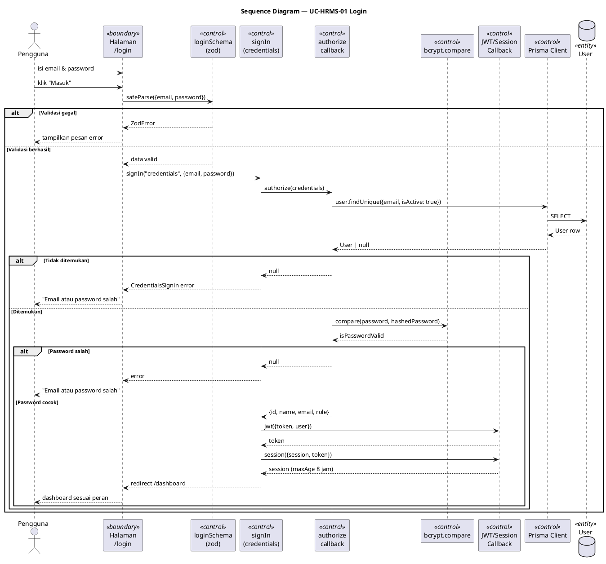
```plantuml
@startuml sequence_login
title Sequence Diagram — UC-HRMS-01 Login

actor "Pengguna" as U
participant "Halaman\n/login" as UI <<boundary>>
participant "loginSchema\n(zod)" as Val <<control>>
participant "signIn\n(credentials)" as SignIn <<control>>
participant "authorize\ncallback" as Auth <<control>>
participant "bcrypt.compare" as Bcrypt <<control>>
participant "JWT/Session\nCallback" as JWT <<control>>
participant "Prisma Client" as DB <<control>>
database "User" as E <<entity>>

U -> UI : isi email & password
U -> UI : klik "Masuk"
UI -> Val : safeParse({email, password})
alt Validasi gagal
  Val --> UI : ZodError
  UI --> U : tampilkan pesan error
else Validasi berhasil
  Val --> UI : data valid
  UI -> SignIn : signIn("credentials", {email, password})
  SignIn -> Auth : authorize(credentials)
  Auth -> DB : user.findUnique({email, isActive: true})
  DB -> E : SELECT
  E --> DB : User row
  DB --> Auth : User | null
  alt Tidak ditemukan
    Auth --> SignIn : null
    SignIn --> UI : CredentialsSignin error
    UI --> U : "Email atau password salah"
  else Ditemukan
    Auth -> Bcrypt : compare(password, hashedPassword)
    Bcrypt --> Auth : isPasswordValid
    alt Password salah
      Auth --> SignIn : null
      SignIn --> UI : error
      UI --> U : "Email atau password salah"
    else Password cocok
      Auth --> SignIn : {id, name, email, role}
      SignIn -> JWT : jwt({token, user})
      JWT --> SignIn : token
      SignIn -> JWT : session({session, token})
      JWT --> SignIn : session (maxAge 8 jam)
      SignIn --> UI : redirect /dashboard
      UI --> U : dashboard sesuai peran
    end
  end
end
@enduml
```

[Sisipkan gambar di sini]

**Gambar 4.57 *Sequence Diagram* Login (SD-HRMS-01)**

**2. Sequence Diagram Logout (SD-HRMS-02)**

*Sequence diagram* Logout menggambarkan interaksi antar objek berdasarkan urutan waktu ketika pengguna mengakhiri sesi aktif pada sistem. Alur dimulai ketika pengguna menekan menu profil pada komponen *Header* (`UserMenu`) dan memilih opsi "Keluar". Komponen memanggil `signOut({ callbackUrl: "/login" })` dari NextAuth, yang menghapus *cookie* JWT pada sisi *browser* dan mengarahkan pengguna ke halaman `/login`. Karena alur ini tidak berinteraksi dengan basis data, *boundary* dan *control* berjumlah minimal — hanya komponen *Header*, *controller* `signOut`, dan *handler cookie*. Gambar 4.58 menunjukkan *sequence diagram* Logout.

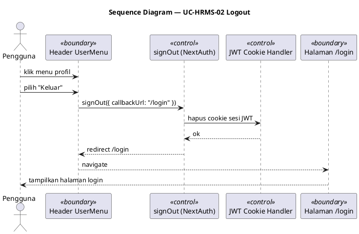
```plantuml
@startuml sequence_logout
title Sequence Diagram — UC-HRMS-02 Logout

actor "Pengguna" as U
participant "Header UserMenu" as UI <<boundary>>
participant "signOut (NextAuth)" as Out <<control>>
participant "JWT Cookie Handler" as Cookie <<control>>
participant "Halaman /login" as Login <<boundary>>

U -> UI : klik menu profil
U -> UI : pilih "Keluar"
UI -> Out : signOut({ callbackUrl: "/login" })
Out -> Cookie : hapus cookie sesi JWT
Cookie --> Out : ok
Out --> UI : redirect /login
UI --> Login : navigate
Login --> U : tampilkan halaman login
@enduml
```

[Sisipkan gambar di sini]

**Gambar 4.58 *Sequence Diagram* Logout (SD-HRMS-02)**

**3. Sequence Diagram Melihat *Dashboard* (SD-HRMS-03)**

*Sequence diagram* Melihat *Dashboard* menggambarkan interaksi antar objek berdasarkan urutan waktu ketika pengguna mengakses `/dashboard` setelah berhasil *login*. Halaman `/dashboard` (server component di `src/app/(dashboard)/dashboard/page.tsx`) memanggil `auth()` untuk membaca sesi. Bila tidak terotentikasi, halaman mengarahkan ke `/login`. Bila terotentikasi, halaman membaca `session.user.role` lalu memanggil salah satu dari empat fungsi *service* sesuai peran: `getSuperAdminDashboardData`, `getHrAdminDashboardData`, `getManagerDashboardData(userId)`, atau `getEmployeeDashboardData(userId)` (`src/lib/services/dashboard.service.ts`). Masing-masing fungsi menjalankan agregasi `findMany` dan `count` terhadap entitas relevan (`Employee`, `LeaveRequest`, `AttendanceRecord`, `PayrollEntry`) untuk menghasilkan ringkasan KPI. Halaman lalu me-*render* komponen *dashboard* yang sesuai (`SuperAdminDashboard`, `HRAdminDashboard`, `ManagerDashboard`, atau `EmployeeDashboard`). Gambar 4.59 menunjukkan *sequence diagram* Melihat *Dashboard*.

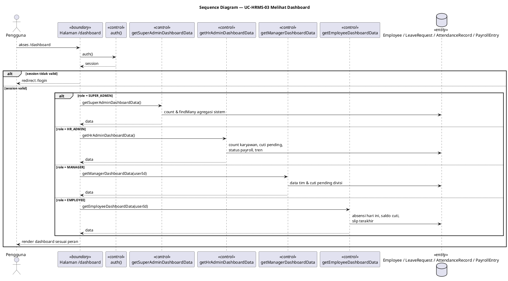
```plantuml
@startuml sequence_dashboard
title Sequence Diagram — UC-HRMS-03 Melihat Dashboard

actor "Pengguna" as U
participant "Halaman /dashboard" as UI <<boundary>>
participant "auth()" as Sess <<control>>
participant "getSuperAdminDashboardData" as SA <<control>>
participant "getHrAdminDashboardData" as HR <<control>>
participant "getManagerDashboardData" as MG <<control>>
participant "getEmployeeDashboardData" as EM <<control>>
database "Employee / LeaveRequest / AttendanceRecord / PayrollEntry" as DB <<entity>>

U -> UI : akses /dashboard
UI -> Sess : auth()
Sess --> UI : session
alt session tidak valid
  UI --> U : redirect /login
else session valid
  alt role = SUPER_ADMIN
    UI -> SA : getSuperAdminDashboardData()
    SA -> DB : count & findMany agregasi sistem
    SA --> UI : data
  else role = HR_ADMIN
    UI -> HR : getHrAdminDashboardData()
    HR -> DB : count karyawan, cuti pending,\nstatus payroll, tren
    HR --> UI : data
  else role = MANAGER
    UI -> MG : getManagerDashboardData(userId)
    MG -> DB : data tim & cuti pending divisi
    MG --> UI : data
  else role = EMPLOYEE
    UI -> EM : getEmployeeDashboardData(userId)
    EM -> DB : absensi hari ini, saldo cuti,\nslip terakhir
    EM --> UI : data
  end
  UI --> U : render dashboard sesuai peran
end
@enduml
```

[Sisipkan gambar di sini]

**Gambar 4.59 *Sequence Diagram* Melihat *Dashboard* (SD-HRMS-03)**

**4. Sequence Diagram Mengelola Pengguna Sistem (SD-HRMS-04)**

*Sequence diagram* Mengelola Pengguna Sistem menggambarkan interaksi antar objek berdasarkan urutan waktu ketika Superadmin menambah, mengubah, atau mengaktifkan/menonaktifkan akun pengguna pada halaman `/users`. Untuk skenario tambah, dialog `UserFormDialog` memanggil `createUserAction(formData)` (`src/lib/actions/user.actions.ts:29`). *Action* memanggil `requireSuperAdmin()` (memeriksa `session.user.role === "SUPER_ADMIN"`), lalu `createUserSchema.safeParse(formData)`. Setelah validasi sukses, *action* memanggil `createUser(data, actorId)` pada *service*. *Service* memeriksa keunikan *email* via `prisma.user.findUnique`; bila sudah ada, mengembalikan `"Email sudah terdaftar"`. Bila unik, *service* memanggil `bcrypt.hash(password, 12)`, membuat entitas `User` dengan peran yang dipilih, lalu `createAuditLog(CREATE, USER)`. Untuk skenario ubah, dialog memanggil `updateUserAction(id, formData)` yang mengikuti pola serupa dengan `updateUserSchema` dan `updateUser` *service*. Untuk skenario *toggle* aktif, tombol memanggil `toggleUserActiveAction(id)` yang menyatakan *guard* "Tidak dapat menonaktifkan akun sendiri" (`id === actorId`), kemudian membalik nilai `isActive`. Setiap aksi mencatat *audit log* dan memanggil `revalidatePath("/users")`. Gambar 4.60 menunjukkan *sequence diagram* Mengelola Pengguna Sistem.

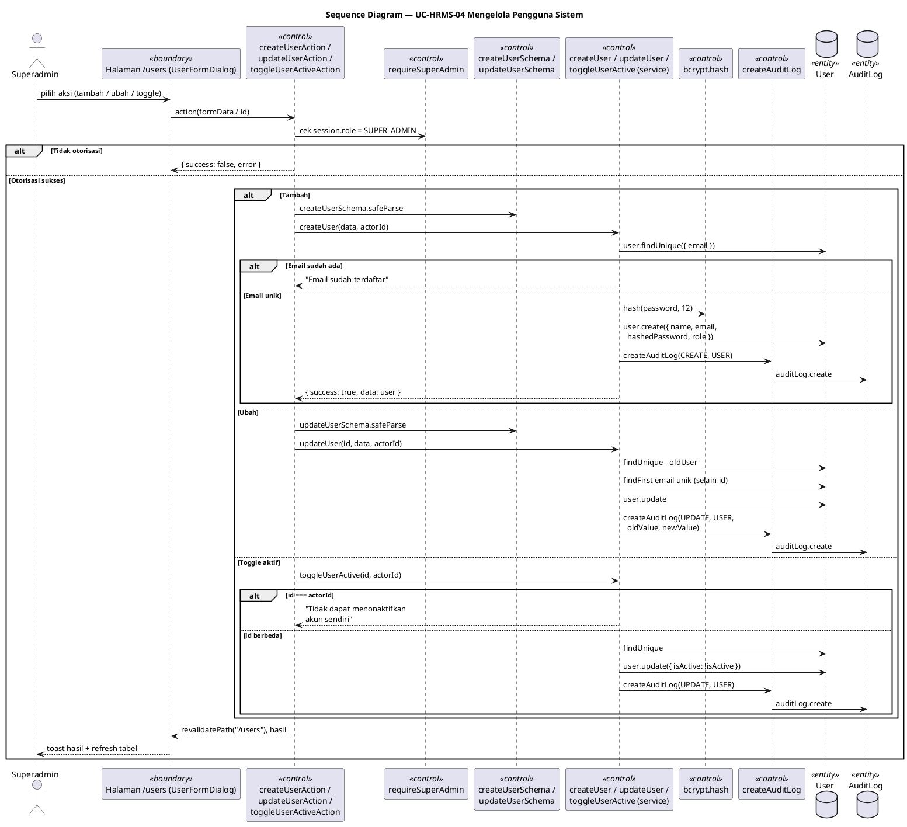
```plantuml
@startuml sequence_manage_user
title Sequence Diagram — UC-HRMS-04 Mengelola Pengguna Sistem

actor "Superadmin" as SA
participant "Halaman /users (UserFormDialog)" as UI <<boundary>>
participant "createUserAction /\nupdateUserAction /\ntoggleUserActiveAction" as Act <<control>>
participant "requireSuperAdmin" as Guard <<control>>
participant "createUserSchema /\nupdateUserSchema" as Val <<control>>
participant "createUser / updateUser /\ntoggleUserActive (service)" as Svc <<control>>
participant "bcrypt.hash" as Bcrypt <<control>>
participant "createAuditLog" as Audit <<control>>
database "User" as E1 <<entity>>
database "AuditLog" as E2 <<entity>>

SA -> UI : pilih aksi (tambah / ubah / toggle)
UI -> Act : action(formData / id)
Act -> Guard : cek session.role = SUPER_ADMIN
alt Tidak otorisasi
  Act --> UI : { success: false, error }
else Otorisasi sukses
  alt Tambah
    Act -> Val : createUserSchema.safeParse
    Act -> Svc : createUser(data, actorId)
    Svc -> E1 : user.findUnique({ email })
    alt Email sudah ada
      Svc --> Act : "Email sudah terdaftar"
    else Email unik
      Svc -> Bcrypt : hash(password, 12)
      Svc -> E1 : user.create({ name, email,\n  hashedPassword, role })
      Svc -> Audit : createAuditLog(CREATE, USER)
      Audit -> E2 : auditLog.create
      Svc --> Act : { success: true, data: user }
    end
  else Ubah
    Act -> Val : updateUserSchema.safeParse
    Act -> Svc : updateUser(id, data, actorId)
    Svc -> E1 : findUnique - oldUser
    Svc -> E1 : findFirst email unik (selain id)
    Svc -> E1 : user.update
    Svc -> Audit : createAuditLog(UPDATE, USER,\n  oldValue, newValue)
    Audit -> E2 : auditLog.create
  else Toggle aktif
    Act -> Svc : toggleUserActive(id, actorId)
    alt id === actorId
      Svc --> Act : "Tidak dapat menonaktifkan\nakun sendiri"
    else id berbeda
      Svc -> E1 : findUnique
      Svc -> E1 : user.update({ isActive: !isActive })
      Svc -> Audit : createAuditLog(UPDATE, USER)
      Audit -> E2 : auditLog.create
    end
  end
  Act --> UI : revalidatePath("/users"), hasil
  UI --> SA : toast hasil + refresh tabel
end
@enduml
```

[Sisipkan gambar di sini]

**Gambar 4.60 *Sequence Diagram* Mengelola Pengguna Sistem (SD-HRMS-04)**

**5. Sequence Diagram Mengelola *Master* Departemen (SD-HRMS-05)**

*Sequence diagram* Mengelola *Master* Departemen menggambarkan interaksi antar objek berdasarkan urutan waktu ketika Superadmin menambah, mengubah, atau menghapus (*soft delete*) data departemen pada tab "Departemen" di halaman `/master-data`. *Action* `createDepartmentAction`, `updateDepartmentAction`, dan `deleteDepartmentAction` (`src/lib/actions/master-data.actions.ts`) seluruhnya memanggil `getAuthenticatedSuperAdmin()` sebagai *guard*, kemudian `departmentSchema.parse(formData)` untuk validasi. *Service* `createDepartment`/`updateDepartment` (`src/lib/services/master-data.service.ts`) melakukan operasi `prisma.department.create`/`update`, sedangkan `deleteDepartment` melakukan *soft delete* dengan `findUniqueOrThrow` (memeriksa `_count.positions`) dan menolak penghapusan bila masih ada jabatan aktif (`throw "Departemen memiliki jabatan aktif"`). Bila lolos, *service* mengisi `deletedAt` dengan waktu saat ini. Setiap operasi mencatat *audit log* dengan `oldValue`/`newValue` dan memanggil `revalidatePath("/master-data")`. Gambar 4.61 menunjukkan *sequence diagram* Mengelola *Master* Departemen.

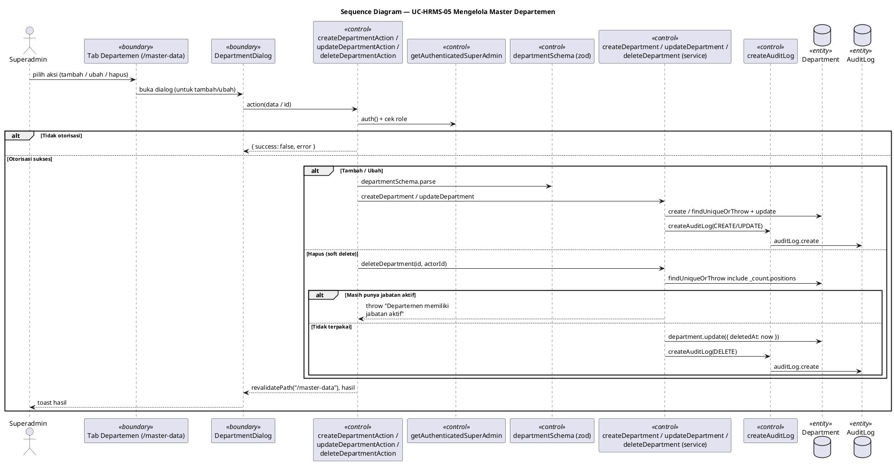
```plantuml
@startuml sequence_manage_department
title Sequence Diagram — UC-HRMS-05 Mengelola Master Departemen

actor "Superadmin" as SA
participant "Tab Departemen (/master-data)" as UI <<boundary>>
participant "DepartmentDialog" as Dlg <<boundary>>
participant "createDepartmentAction /\nupdateDepartmentAction /\ndeleteDepartmentAction" as Act <<control>>
participant "getAuthenticatedSuperAdmin" as Guard <<control>>
participant "departmentSchema (zod)" as Val <<control>>
participant "createDepartment / updateDepartment /\ndeleteDepartment (service)" as Svc <<control>>
participant "createAuditLog" as Audit <<control>>
database "Department" as E1 <<entity>>
database "AuditLog" as E2 <<entity>>

SA -> UI : pilih aksi (tambah / ubah / hapus)
UI -> Dlg : buka dialog (untuk tambah/ubah)
Dlg -> Act : action(data / id)
Act -> Guard : auth() + cek role
alt Tidak otorisasi
  Act --> Dlg : { success: false, error }
else Otorisasi sukses
  alt Tambah / Ubah
    Act -> Val : departmentSchema.parse
    Act -> Svc : createDepartment / updateDepartment
    Svc -> E1 : create / findUniqueOrThrow + update
    Svc -> Audit : createAuditLog(CREATE/UPDATE)
    Audit -> E2 : auditLog.create
  else Hapus (soft delete)
    Act -> Svc : deleteDepartment(id, actorId)
    Svc -> E1 : findUniqueOrThrow include _count.positions
    alt Masih punya jabatan aktif
      Svc --> Act : throw "Departemen memiliki\njabatan aktif"
    else Tidak terpakai
      Svc -> E1 : department.update({ deletedAt: now })
      Svc -> Audit : createAuditLog(DELETE)
      Audit -> E2 : auditLog.create
    end
  end
  Act --> Dlg : revalidatePath("/master-data"), hasil
  Dlg --> SA : toast hasil
end
@enduml
```

[Sisipkan gambar di sini]

**Gambar 4.61 *Sequence Diagram* Mengelola *Master* Departemen (SD-HRMS-05)**

**6. Sequence Diagram Mengelola *Master* Jabatan (SD-HRMS-06)**

*Sequence diagram* Mengelola *Master* Jabatan menggambarkan interaksi antar objek berdasarkan urutan waktu ketika Superadmin menambah, mengubah, atau menghapus jabatan pada tab "Jabatan". Polanya serupa dengan SD-HRMS-05, namun memiliki *guard* tambahan pada `createPosition` dan `updatePosition` yaitu pemanggilan `department.findUniqueOrThrow({ id: departmentId, deletedAt: null })` untuk memastikan departemen tujuan tidak terhapus. Pada `deletePosition`, *service* memeriksa `_count.employees` (karyawan aktif) sebelum melakukan *soft delete*. *Audit log* dicatat dengan menyertakan `departmentName` agar entri tetap informatif setelah *soft delete*. Gambar 4.62 menunjukkan *sequence diagram* Mengelola *Master* Jabatan.

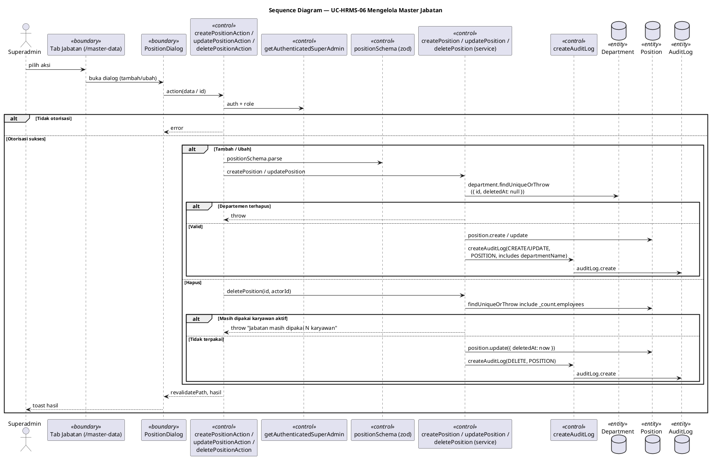
```plantuml
@startuml sequence_manage_position
title Sequence Diagram — UC-HRMS-06 Mengelola Master Jabatan

actor "Superadmin" as SA
participant "Tab Jabatan (/master-data)" as UI <<boundary>>
participant "PositionDialog" as Dlg <<boundary>>
participant "createPositionAction /\nupdatePositionAction /\ndeletePositionAction" as Act <<control>>
participant "getAuthenticatedSuperAdmin" as Guard <<control>>
participant "positionSchema (zod)" as Val <<control>>
participant "createPosition / updatePosition /\ndeletePosition (service)" as Svc <<control>>
participant "createAuditLog" as Audit <<control>>
database "Department" as Dept <<entity>>
database "Position" as E1 <<entity>>
database "AuditLog" as E2 <<entity>>

SA -> UI : pilih aksi
UI -> Dlg : buka dialog (tambah/ubah)
Dlg -> Act : action(data / id)
Act -> Guard : auth + role
alt Tidak otorisasi
  Act --> Dlg : error
else Otorisasi sukses
  alt Tambah / Ubah
    Act -> Val : positionSchema.parse
    Act -> Svc : createPosition / updatePosition
    Svc -> Dept : department.findUniqueOrThrow\n  ({ id, deletedAt: null })
    alt Departemen terhapus
      Svc --> Act : throw
    else Valid
      Svc -> E1 : position.create / update
      Svc -> Audit : createAuditLog(CREATE/UPDATE,\n  POSITION, includes departmentName)
      Audit -> E2 : auditLog.create
    end
  else Hapus
    Act -> Svc : deletePosition(id, actorId)
    Svc -> E1 : findUniqueOrThrow include _count.employees
    alt Masih dipakai karyawan aktif
      Svc --> Act : throw "Jabatan masih dipakai N karyawan"
    else Tidak terpakai
      Svc -> E1 : position.update({ deletedAt: now })
      Svc -> Audit : createAuditLog(DELETE, POSITION)
      Audit -> E2 : auditLog.create
    end
  end
  Act --> Dlg : revalidatePath, hasil
  Dlg --> SA : toast hasil
end
@enduml
```

[Sisipkan gambar di sini]

**Gambar 4.62 *Sequence Diagram* Mengelola *Master* Jabatan (SD-HRMS-06)**

**7. Sequence Diagram Mengelola *Master* Lokasi Kantor (SD-HRMS-07)**

*Sequence diagram* Mengelola *Master* Lokasi Kantor menggambarkan interaksi antar objek berdasarkan urutan waktu ketika Superadmin menambah, mengubah, atau menghapus lokasi kantor. Polanya serupa dengan SD-HRMS-05/06; perbedaan utamanya adalah *Zod schema* `officeLocationSchema` memvalidasi `radiusMeters` dalam rentang 50–10.000 meter dan *field* GPS yang bersifat opsional (untuk lingkungan pengembangan). *Service* `deleteOfficeLocation` memeriksa `_count.employees` aktif sebelum melakukan *soft delete*. Atribut `allowedIPs` (array string), `latitude`, `longitude`, dan `radiusMeters` yang disimpan di entitas `OfficeLocation` kemudian digunakan oleh kontroler `verifyLocation` pada SD-HRMS-22. Gambar 4.63 menunjukkan *sequence diagram* Mengelola *Master* Lokasi Kantor.

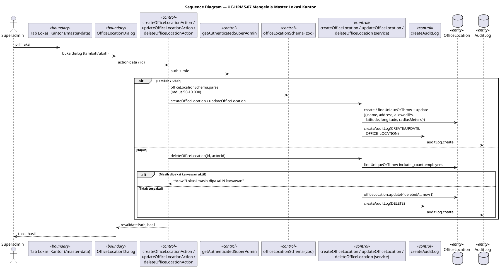
```plantuml
@startuml sequence_manage_office_location
title Sequence Diagram — UC-HRMS-07 Mengelola Master Lokasi Kantor

actor "Superadmin" as SA
participant "Tab Lokasi Kantor (/master-data)" as UI <<boundary>>
participant "OfficeLocationDialog" as Dlg <<boundary>>
participant "createOfficeLocationAction /\nupdateOfficeLocationAction /\ndeleteOfficeLocationAction" as Act <<control>>
participant "getAuthenticatedSuperAdmin" as Guard <<control>>
participant "officeLocationSchema (zod)" as Val <<control>>
participant "createOfficeLocation / updateOfficeLocation /\ndeleteOfficeLocation (service)" as Svc <<control>>
participant "createAuditLog" as Audit <<control>>
database "OfficeLocation" as E1 <<entity>>
database "AuditLog" as E2 <<entity>>

SA -> UI : pilih aksi
UI -> Dlg : buka dialog (tambah/ubah)
Dlg -> Act : action(data / id)
Act -> Guard : auth + role
alt Tambah / Ubah
  Act -> Val : officeLocationSchema.parse\n(radius 50–10.000)
  Act -> Svc : createOfficeLocation / updateOfficeLocation
  Svc -> E1 : create / findUniqueOrThrow + update\n({ name, address, allowedIPs,\n  latitude, longitude, radiusMeters })
  Svc -> Audit : createAuditLog(CREATE/UPDATE,\n  OFFICE_LOCATION)
  Audit -> E2 : auditLog.create
else Hapus
  Act -> Svc : deleteOfficeLocation(id, actorId)
  Svc -> E1 : findUniqueOrThrow include _count.employees
  alt Masih dipakai karyawan aktif
    Svc --> Act : throw "Lokasi masih dipakai N karyawan"
  else Tidak terpakai
    Svc -> E1 : officeLocation.update({ deletedAt: now })
    Svc -> Audit : createAuditLog(DELETE)
    Audit -> E2 : auditLog.create
  end
end
Act --> Dlg : revalidatePath, hasil
Dlg --> SA : toast hasil
@enduml
```

[Sisipkan gambar di sini]

**Gambar 4.63 *Sequence Diagram* Mengelola *Master* Lokasi Kantor (SD-HRMS-07)**

**8. Sequence Diagram Mengelola *Master* Jenis Cuti (SD-HRMS-08)**

*Sequence diagram* Mengelola *Master* Jenis Cuti menggambarkan interaksi antar objek berdasarkan urutan waktu ketika Superadmin menambah, mengubah, atau menghapus jenis cuti pada tab "Jenis Cuti". *Zod schema* `leaveTypeSchema` memvalidasi `name`, `annualQuota`, `isPaid`, dan `genderRestriction` (opsional, `MALE`/`FEMALE`). *Service* `deleteLeaveType` memeriksa apakah masih ada `LeaveRequest` dengan status `PENDING_MANAGER`, `PENDING_HR`, atau `APPROVED` sebelum melakukan *soft delete* — bila masih ada, mengembalikan "Jenis cuti masih terkait N pengajuan aktif". Gambar 4.64 menunjukkan *sequence diagram* Mengelola *Master* Jenis Cuti.

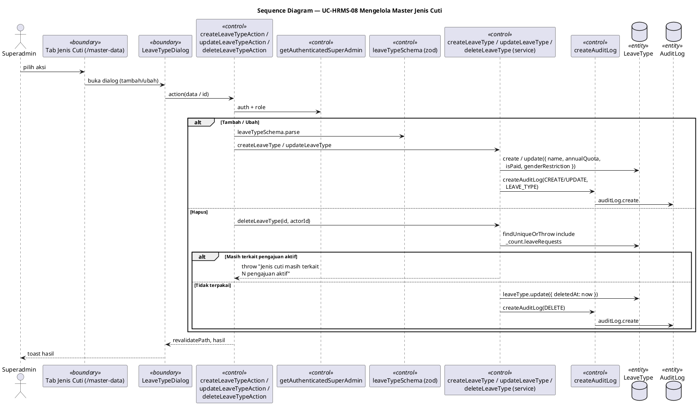
```plantuml
@startuml sequence_manage_leave_type
title Sequence Diagram — UC-HRMS-08 Mengelola Master Jenis Cuti

actor "Superadmin" as SA
participant "Tab Jenis Cuti (/master-data)" as UI <<boundary>>
participant "LeaveTypeDialog" as Dlg <<boundary>>
participant "createLeaveTypeAction /\nupdateLeaveTypeAction /\ndeleteLeaveTypeAction" as Act <<control>>
participant "getAuthenticatedSuperAdmin" as Guard <<control>>
participant "leaveTypeSchema (zod)" as Val <<control>>
participant "createLeaveType / updateLeaveType /\ndeleteLeaveType (service)" as Svc <<control>>
participant "createAuditLog" as Audit <<control>>
database "LeaveType" as E1 <<entity>>
database "AuditLog" as E2 <<entity>>

SA -> UI : pilih aksi
UI -> Dlg : buka dialog (tambah/ubah)
Dlg -> Act : action(data / id)
Act -> Guard : auth + role
alt Tambah / Ubah
  Act -> Val : leaveTypeSchema.parse
  Act -> Svc : createLeaveType / updateLeaveType
  Svc -> E1 : create / update({ name, annualQuota,\n  isPaid, genderRestriction })
  Svc -> Audit : createAuditLog(CREATE/UPDATE,\n  LEAVE_TYPE)
  Audit -> E2 : auditLog.create
else Hapus
  Act -> Svc : deleteLeaveType(id, actorId)
  Svc -> E1 : findUniqueOrThrow include\n  _count.leaveRequests
  alt Masih terkait pengajuan aktif
    Svc --> Act : throw "Jenis cuti masih terkait\nN pengajuan aktif"
  else Tidak terpakai
    Svc -> E1 : leaveType.update({ deletedAt: now })
    Svc -> Audit : createAuditLog(DELETE)
    Audit -> E2 : auditLog.create
  end
end
Act --> Dlg : revalidatePath, hasil
Dlg --> SA : toast hasil
@enduml
```

[Sisipkan gambar di sini]

**Gambar 4.64 *Sequence Diagram* Mengelola *Master* Jenis Cuti (SD-HRMS-08)**

**9. Sequence Diagram Melihat *Log Audit* (SD-HRMS-09)**

*Sequence diagram* Melihat *Log Audit* menggambarkan interaksi antar objek berdasarkan urutan waktu ketika Superadmin meninjau jejak aktivitas pada halaman `/audit-log`. Halaman (server component) memanggil `auth()` dan memeriksa peran. Bila peran bukan `SUPER_ADMIN`, halaman mengarahkan ke `/dashboard`. Bila valid, halaman menjalankan tiga panggilan paralel: `getAuditLogs(filters)`, `getAuditLogUsers()`, dan `getAuditLogModules()` (`src/lib/services/audit.service.ts`). `getAuditLogs` melakukan `findMany` terhadap entitas `AuditLog` dengan filter `userId`, `module`, dan rentang `createdAt`, lalu `count(where)` untuk *pagination*. Setelah data dimuat, halaman menghitung jumlah aksi `CREATE`, `UPDATE`, dan `DELETE` untuk *summary tile* lalu memuat tabel beserta komponen `AuditLogFilters`. Bila Superadmin mengklik satu baris, halaman `/audit-log/[id]` memanggil `getAuditLogById(id)` untuk menampilkan detail `oldValue` dan `newValue`. Gambar 4.65 menunjukkan *sequence diagram* Melihat *Log Audit*.

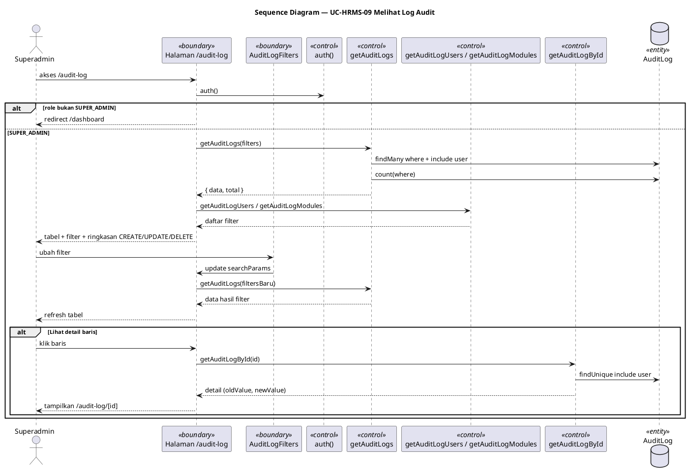
```plantuml
@startuml sequence_view_audit_log
title Sequence Diagram — UC-HRMS-09 Melihat Log Audit

actor "Superadmin" as SA
participant "Halaman /audit-log" as UI <<boundary>>
participant "AuditLogFilters" as Flt <<boundary>>
participant "auth()" as Sess <<control>>
participant "getAuditLogs" as Get <<control>>
participant "getAuditLogUsers / getAuditLogModules" as Meta <<control>>
participant "getAuditLogById" as GetById <<control>>
database "AuditLog" as E1 <<entity>>

SA -> UI : akses /audit-log
UI -> Sess : auth()
alt role bukan SUPER_ADMIN
  UI --> SA : redirect /dashboard
else SUPER_ADMIN
  UI -> Get : getAuditLogs(filters)
  Get -> E1 : findMany where + include user
  Get -> E1 : count(where)
  Get --> UI : { data, total }
  UI -> Meta : getAuditLogUsers / getAuditLogModules
  Meta --> UI : daftar filter
  UI --> SA : tabel + filter + ringkasan CREATE/UPDATE/DELETE
  SA -> Flt : ubah filter
  Flt -> UI : update searchParams
  UI -> Get : getAuditLogs(filtersBaru)
  Get --> UI : data hasil filter
  UI --> SA : refresh tabel
  alt Lihat detail baris
    SA -> UI : klik baris
    UI -> GetById : getAuditLogById(id)
    GetById -> E1 : findUnique include user
    GetById --> UI : detail (oldValue, newValue)
    UI --> SA : tampilkan /audit-log/[id]
  end
end
@enduml
```

[Sisipkan gambar di sini]

**Gambar 4.65 *Sequence Diagram* Melihat *Log Audit* (SD-HRMS-09)**

**10. Sequence Diagram Melihat Daftar Karyawan (SD-HRMS-10)**

*Sequence diagram* Melihat Daftar Karyawan menggambarkan interaksi antar objek berdasarkan urutan waktu ketika pengguna mengakses halaman `/employees`. Halaman (`src/app/(dashboard)/employees/page.tsx`) memanggil `auth()` lalu bercabang berdasarkan peran. Bila peran adalah `EMPLOYEE`, halaman memanggil `getEmployeeByUserId(userId)` dan mengarahkan pengguna ke halaman profil dirinya `/employees/[id]`. Bila peran adalah `MANAGER`, halaman memanggil `getEmployeesForManager(userId, params)` yang mengambil `departmentId` *manager* lalu menjalankan `getEmployees` dengan filter `departmentId` agar daftar terbatas pada divisi *manager*. Bila peran adalah `HR_ADMIN` atau `SUPER_ADMIN`, halaman memanggil `getEmployees(params)` tanpa pembatasan divisi. Pada ketiga cabang, halaman juga memanggil `getEmployeeStatsSummary()`, `getAllDepartments()`, dan `getAllPositions()` secara paralel (menggunakan `Promise.all`) untuk mengisi *KPI cards* dan opsi filter. Komponen `EmployeeFilters` memperbarui *URL searchParams* untuk pencarian/filter, dan halaman me-*refetch* data sesuai filter. Gambar 4.66 menunjukkan *sequence diagram* Melihat Daftar Karyawan.

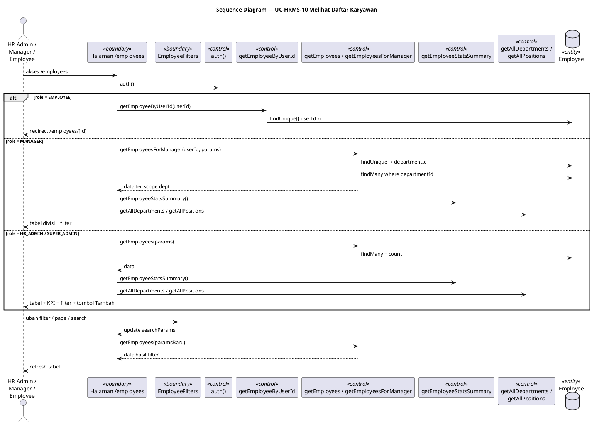
```plantuml
@startuml sequence_list_employees
title Sequence Diagram — UC-HRMS-10 Melihat Daftar Karyawan

actor "HR Admin /\nManager /\nEmployee" as U
participant "Halaman /employees" as UI <<boundary>>
participant "EmployeeFilters" as Flt <<boundary>>
participant "auth()" as Sess <<control>>
participant "getEmployeeByUserId" as ByUser <<control>>
participant "getEmployees / getEmployeesForManager" as Get <<control>>
participant "getEmployeeStatsSummary" as Stats <<control>>
participant "getAllDepartments /\ngetAllPositions" as MD <<control>>
database "Employee" as E1 <<entity>>

U -> UI : akses /employees
UI -> Sess : auth()
alt role = EMPLOYEE
  UI -> ByUser : getEmployeeByUserId(userId)
  ByUser -> E1 : findUnique({ userId })
  UI --> U : redirect /employees/[id]
else role = MANAGER
  UI -> Get : getEmployeesForManager(userId, params)
  Get -> E1 : findUnique → departmentId
  Get -> E1 : findMany where departmentId
  Get --> UI : data ter-scope dept
  UI -> Stats : getEmployeeStatsSummary()
  UI -> MD : getAllDepartments / getAllPositions
  UI --> U : tabel divisi + filter
else role = HR_ADMIN / SUPER_ADMIN
  UI -> Get : getEmployees(params)
  Get -> E1 : findMany + count
  Get --> UI : data
  UI -> Stats : getEmployeeStatsSummary()
  UI -> MD : getAllDepartments / getAllPositions
  UI --> U : tabel + KPI + filter + tombol Tambah
end
U -> Flt : ubah filter / page / search
Flt -> UI : update searchParams
UI -> Get : getEmployees(paramsBaru)
Get --> UI : data hasil filter
UI --> U : refresh tabel
@enduml
```

[Sisipkan gambar di sini]

**Gambar 4.66 *Sequence Diagram* Melihat Daftar Karyawan (SD-HRMS-10)**

**11. Sequence Diagram Menambah Data Karyawan (SD-HRMS-11)**

*Sequence diagram* Menambah Data Karyawan menggambarkan interaksi antar objek berdasarkan urutan waktu ketika HR Admin menambahkan karyawan baru sekaligus akun pengguna terkait. Alur dimulai ketika HR Admin mengisi *form* empat-bagian pada *boundary* `Halaman /employees/new` dan menekan tombol "Simpan". Halaman memanggil `createEmployeeAction(formData)` (`src/lib/actions/employee.actions.ts:36`). Kontroler memanggil *helper* `requireHRAdmin()` yang membaca *session* via `auth()` dan memverifikasi `session.user.role`. Bila bukan HR Admin atau Superadmin, kontroler mengembalikan `{ success: false, error: "Akses ditolak" }`. Bila otorisasi sukses, kontroler memanggil `createEmployeeSchema.safeParse(formData)`. Bila gagal, kontroler mengembalikan pesan kesalahan pertama. Bila berhasil, kontroler memanggil `createEmployee(data, actorId)` pada *service* (`src/lib/services/employee.service.ts:147`). *Service* membuka transaksi Prisma `prisma.$transaction`. Di dalam transaksi, *service* memeriksa keunikan *email* (`tx.user.findUnique`); bila *email* sudah ada, transaksi melempar `"Email sudah terdaftar"`. Bila *email* unik, *service* memanggil `generateEmployeeNIK(tx)` yang membaca `nik` terakhir dengan prefiks `EMP-{YYYY}-` lalu menghasilkan NIK berikutnya. *Service* lalu memanggil `bcrypt.hash(initialPassword, 12)`, membuat entitas `User` dengan peran `EMPLOYEE`, dan membuat entitas `Employee` yang terhubung dengan `User`. Setelah transaksi berhasil, *service* memanggil `createAuditLog` untuk mencatat aksi `CREATE` pada `AuditLog`. Kontroler kemudian memanggil `revalidatePath("/employees")` dan mengembalikan `{ success: true, data: { id } }`. Halaman menampilkan *toast* sukses dan mengarahkan ke `/employees/[id]`. Gambar 4.67 menunjukkan *sequence diagram* Menambah Data Karyawan.

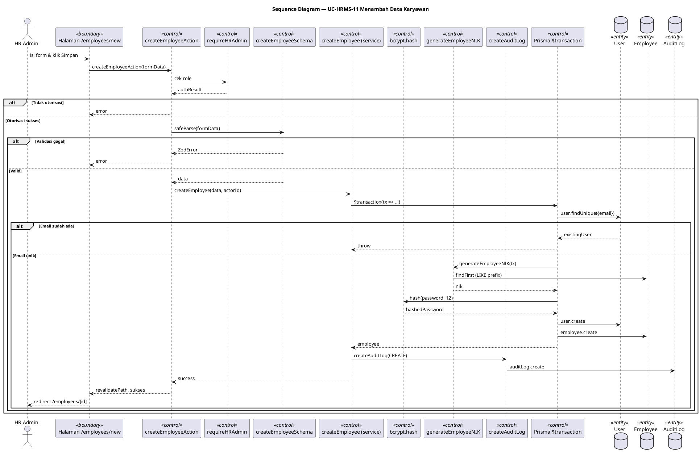
```plantuml
@startuml sequence_create_employee
title Sequence Diagram — UC-HRMS-11 Menambah Data Karyawan

actor "HR Admin" as HR
participant "Halaman /employees/new" as UI <<boundary>>
participant "createEmployeeAction" as Act <<control>>
participant "requireHRAdmin" as Guard <<control>>
participant "createEmployeeSchema" as Val <<control>>
participant "createEmployee (service)" as Svc <<control>>
participant "bcrypt.hash" as Bcrypt <<control>>
participant "generateEmployeeNIK" as NIK <<control>>
participant "createAuditLog" as Audit <<control>>
participant "Prisma $transaction" as TX <<control>>
database "User" as E1 <<entity>>
database "Employee" as E2 <<entity>>
database "AuditLog" as E3 <<entity>>

HR -> UI : isi form & klik Simpan
UI -> Act : createEmployeeAction(formData)
Act -> Guard : cek role
Guard --> Act : authResult
alt Tidak otorisasi
  Act --> UI : error
else Otorisasi sukses
  Act -> Val : safeParse(formData)
  alt Validasi gagal
    Val --> Act : ZodError
    Act --> UI : error
  else Valid
    Val --> Act : data
    Act -> Svc : createEmployee(data, actorId)
    Svc -> TX : $transaction(tx => ...)
    TX -> E1 : user.findUnique({email})
    alt Email sudah ada
      E1 --> TX : existingUser
      TX --> Svc : throw
    else Email unik
      TX -> NIK : generateEmployeeNIK(tx)
      NIK -> E2 : findFirst (LIKE prefix)
      NIK --> TX : nik
      TX -> Bcrypt : hash(password, 12)
      Bcrypt --> TX : hashedPassword
      TX -> E1 : user.create
      TX -> E2 : employee.create
      TX --> Svc : employee
      Svc -> Audit : createAuditLog(CREATE)
      Audit -> E3 : auditLog.create
      Svc --> Act : success
      Act --> UI : revalidatePath, sukses
      UI --> HR : redirect /employees/[id]
    end
  end
end
@enduml
```

[Sisipkan gambar di sini]

**Gambar 4.67 *Sequence Diagram* Menambah Data Karyawan (SD-HRMS-11)**

**12. Sequence Diagram Mengubah Profil Karyawan (SD-HRMS-12)**

*Sequence diagram* Mengubah Profil Karyawan menggambarkan interaksi antar objek berdasarkan urutan waktu ketika HR Admin memutakhirkan informasi personal, kepegawaian, atau pajak/BPJS pada halaman `/employees/[id]`. Tab yang dipilih memanggil salah satu dari tiga *action*: `updatePersonalInfoAction`, `updateEmploymentAction`, atau `updateTaxBpjsAction` (`src/lib/actions/employee.actions.ts`). Masing-masing *action* memanggil `requireHRAdmin()` lalu menjalankan *Zod schema* yang sesuai (`updatePersonalInfoSchema` / `updateEmploymentSchema` / `updateTaxBpjsSchema`). Setelah validasi berhasil, *action* memanggil fungsi *service* terkait (`updatePersonalInfo` / `updateEmploymentDetails` / `updateTaxBpjs`). *Service* memuat data lama (`findUnique`) untuk *audit log*, lalu menjalankan `prisma.employee.update` pada *field* yang relevan dengan tab tersebut, dan terakhir memanggil `createAuditLog(UPDATE, EMPLOYEE, oldValue, newValue)`. Bila *employee* tidak ditemukan, *service* mengembalikan `"Karyawan tidak ditemukan"`. Gambar 4.68 menunjukkan *sequence diagram* Mengubah Profil Karyawan.

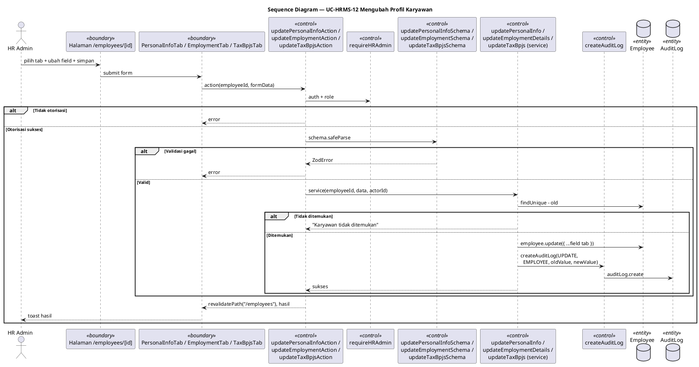
```plantuml
@startuml sequence_update_employee_profile
title Sequence Diagram — UC-HRMS-12 Mengubah Profil Karyawan

actor "HR Admin" as HR
participant "Halaman /employees/[id]" as UI <<boundary>>
participant "PersonalInfoTab / EmploymentTab / TaxBpjsTab" as Tab <<boundary>>
participant "updatePersonalInfoAction /\nupdateEmploymentAction /\nupdateTaxBpjsAction" as Act <<control>>
participant "requireHRAdmin" as Guard <<control>>
participant "updatePersonalInfoSchema /\nupdateEmploymentSchema /\nupdateTaxBpjsSchema" as Val <<control>>
participant "updatePersonalInfo /\nupdateEmploymentDetails /\nupdateTaxBpjs (service)" as Svc <<control>>
participant "createAuditLog" as Audit <<control>>
database "Employee" as E1 <<entity>>
database "AuditLog" as E2 <<entity>>

HR -> UI : pilih tab + ubah field + simpan
UI -> Tab : submit form
Tab -> Act : action(employeeId, formData)
Act -> Guard : auth + role
alt Tidak otorisasi
  Act --> Tab : error
else Otorisasi sukses
  Act -> Val : schema.safeParse
  alt Validasi gagal
    Val --> Act : ZodError
    Act --> Tab : error
  else Valid
    Act -> Svc : service(employeeId, data, actorId)
    Svc -> E1 : findUnique - old
    alt Tidak ditemukan
      Svc --> Act : "Karyawan tidak ditemukan"
    else Ditemukan
      Svc -> E1 : employee.update({ ...field tab })
      Svc -> Audit : createAuditLog(UPDATE,\n  EMPLOYEE, oldValue, newValue)
      Audit -> E2 : auditLog.create
      Svc --> Act : sukses
    end
  end
  Act --> Tab : revalidatePath("/employees"), hasil
  Tab --> HR : toast hasil
end
@enduml
```

[Sisipkan gambar di sini]

**Gambar 4.68 *Sequence Diagram* Mengubah Profil Karyawan (SD-HRMS-12)**

**13. Sequence Diagram Mengelola Dokumen Karyawan (SD-HRMS-13)**

*Sequence diagram* Mengelola Dokumen Karyawan menggambarkan interaksi antar objek berdasarkan urutan waktu ketika HR Admin (atau pengguna ber-akses) mengunggah, mengunduh, atau menghapus dokumen pada tab "Dokumen" di `/employees/[id]`. Untuk unggah, tab memanggil `POST /api/employees/[id]/documents` (`src/app/api/employees/[id]/documents/route.ts`). *Route handler* memanggil `auth()` dan memeriksa peran `HR_ADMIN`/`SUPER_ADMIN`, lalu memvalidasi *MIME type* (`application/pdf`, `image/jpeg`, `image/png`), ukuran (≤ 5 MB), dan `documentType` (anggota *enum* `DocumentType`). *Handler* membuat direktori `uploads/employees/[id]`, menulis berkas dengan nama unik (`Date.now()` + sanitized name), kemudian memanggil `createDocumentRecord` (`src/lib/services/employee-document.service.ts`) yang menyimpan *record* `EmployeeDocument` dan mencatat *audit log*. Untuk unduh, *route handler* `GET /api/employees/[id]/documents/[docId]` memanggil `canAccessEmployeeDocuments(userId, role, employeeId)` yang menerapkan ACL bertingkat (HR Admin: semua; Manager: sesama departemen; Employee: hanya miliknya sendiri). Bila berhak, *handler* membaca berkas dari *filesystem* lalu mengirim *response* dengan `Content-Disposition: attachment`. Untuk hapus, *handler* `DELETE` memanggil `deleteDocument(docId, actorId)` yang melakukan `fs.unlink` dan `prisma.employeeDocument.delete`. Gambar 4.69 menunjukkan *sequence diagram* Mengelola Dokumen Karyawan.

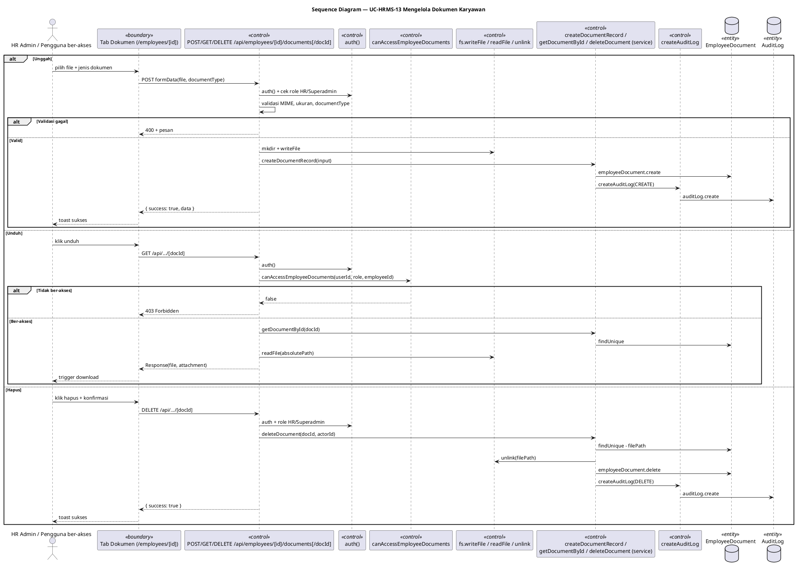
```plantuml
@startuml sequence_manage_documents
title Sequence Diagram — UC-HRMS-13 Mengelola Dokumen Karyawan

actor "HR Admin / Pengguna ber-akses" as U
participant "Tab Dokumen (/employees/[id])" as UI <<boundary>>
participant "POST/GET/DELETE /api/employees/[id]/documents[/docId]" as Route <<control>>
participant "auth()" as Sess <<control>>
participant "canAccessEmployeeDocuments" as Acl <<control>>
participant "fs.writeFile / readFile / unlink" as FS <<control>>
participant "createDocumentRecord /\ngetDocumentById / deleteDocument (service)" as Svc <<control>>
participant "createAuditLog" as Audit <<control>>
database "EmployeeDocument" as E1 <<entity>>
database "AuditLog" as E2 <<entity>>

alt Unggah
  U -> UI : pilih file + jenis dokumen
  UI -> Route : POST formData(file, documentType)
  Route -> Sess : auth() + cek role HR/Superadmin
  Route -> Route : validasi MIME, ukuran, documentType
  alt Validasi gagal
    Route --> UI : 400 + pesan
  else Valid
    Route -> FS : mkdir + writeFile
    Route -> Svc : createDocumentRecord(input)
    Svc -> E1 : employeeDocument.create
    Svc -> Audit : createAuditLog(CREATE)
    Audit -> E2 : auditLog.create
    Route --> UI : { success: true, data }
    UI --> U : toast sukses
  end
else Unduh
  U -> UI : klik unduh
  UI -> Route : GET /api/.../[docId]
  Route -> Sess : auth()
  Route -> Acl : canAccessEmployeeDocuments(userId, role, employeeId)
  alt Tidak ber-akses
    Acl --> Route : false
    Route --> UI : 403 Forbidden
  else Ber-akses
    Route -> Svc : getDocumentById(docId)
    Svc -> E1 : findUnique
    Route -> FS : readFile(absolutePath)
    Route --> UI : Response(file, attachment)
    UI --> U : trigger download
  end
else Hapus
  U -> UI : klik hapus + konfirmasi
  UI -> Route : DELETE /api/.../[docId]
  Route -> Sess : auth + role HR/Superadmin
  Route -> Svc : deleteDocument(docId, actorId)
  Svc -> E1 : findUnique - filePath
  Svc -> FS : unlink(filePath)
  Svc -> E1 : employeeDocument.delete
  Svc -> Audit : createAuditLog(DELETE)
  Audit -> E2 : auditLog.create
  Route --> UI : { success: true }
  UI --> U : toast sukses
end
@enduml
```

[Sisipkan gambar di sini]

**Gambar 4.69 *Sequence Diagram* Mengelola Dokumen Karyawan (SD-HRMS-13)**

**14. Sequence Diagram Mengelola Kontak Darurat (SD-HRMS-14)**

*Sequence diagram* Mengelola Kontak Darurat menggambarkan interaksi antar objek berdasarkan urutan waktu ketika HR Admin menambah, mengubah, atau menghapus kontak darurat pada tab "Kontak Darurat" di profil karyawan. *Action* `createEmergencyContactAction`, `updateEmergencyContactAction`, dan `deleteEmergencyContactAction` (`src/lib/actions/employee-document.actions.ts`) memanggil `requireHRAdmin()` sebagai *guard*. `createEmergencyContactAction` menerapkan batasan maksimal tiga kontak per karyawan dengan memanggil `prisma.emergencyContact.count({ employeeId })` sebelum `create`. *Update* dan *delete* memverifikasi `existing.employeeId === employeeId` untuk mencegah aksi lintas-karyawan. Setiap aksi mencatat *audit log* dengan modul `EMERGENCY_CONTACT`. Gambar 4.70 menunjukkan *sequence diagram* Mengelola Kontak Darurat.

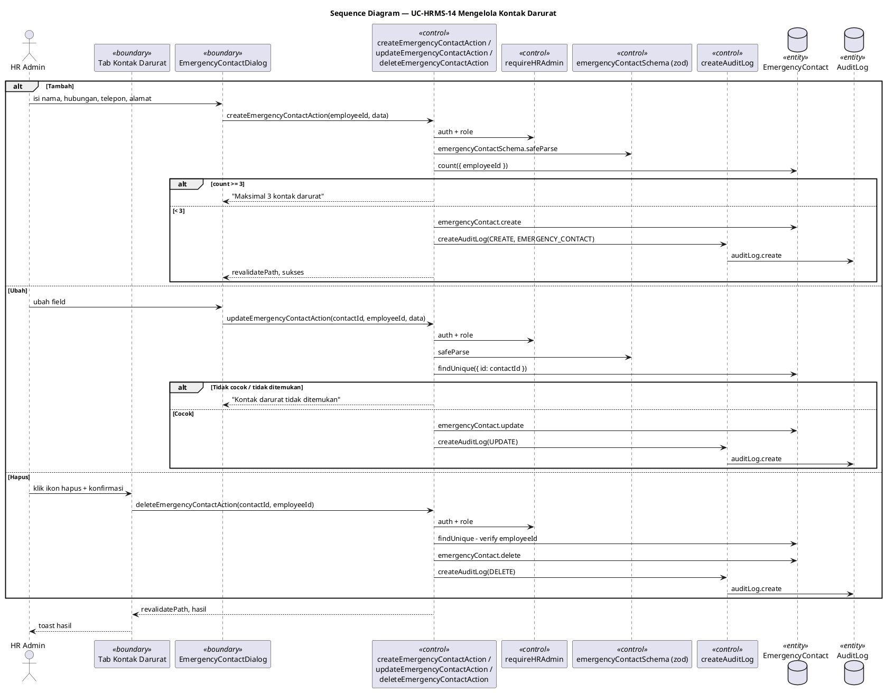
```plantuml
@startuml sequence_manage_emergency_contact
title Sequence Diagram — UC-HRMS-14 Mengelola Kontak Darurat

actor "HR Admin" as HR
participant "Tab Kontak Darurat" as UI <<boundary>>
participant "EmergencyContactDialog" as Dlg <<boundary>>
participant "createEmergencyContactAction /\nupdateEmergencyContactAction /\ndeleteEmergencyContactAction" as Act <<control>>
participant "requireHRAdmin" as Guard <<control>>
participant "emergencyContactSchema (zod)" as Val <<control>>
participant "createAuditLog" as Audit <<control>>
database "EmergencyContact" as E1 <<entity>>
database "AuditLog" as E2 <<entity>>

alt Tambah
  HR -> Dlg : isi nama, hubungan, telepon, alamat
  Dlg -> Act : createEmergencyContactAction(employeeId, data)
  Act -> Guard : auth + role
  Act -> Val : emergencyContactSchema.safeParse
  Act -> E1 : count({ employeeId })
  alt count >= 3
    Act --> Dlg : "Maksimal 3 kontak darurat"
  else < 3
    Act -> E1 : emergencyContact.create
    Act -> Audit : createAuditLog(CREATE, EMERGENCY_CONTACT)
    Audit -> E2 : auditLog.create
    Act --> Dlg : revalidatePath, sukses
  end
else Ubah
  HR -> Dlg : ubah field
  Dlg -> Act : updateEmergencyContactAction(contactId, employeeId, data)
  Act -> Guard : auth + role
  Act -> Val : safeParse
  Act -> E1 : findUnique({ id: contactId })
  alt Tidak cocok / tidak ditemukan
    Act --> Dlg : "Kontak darurat tidak ditemukan"
  else Cocok
    Act -> E1 : emergencyContact.update
    Act -> Audit : createAuditLog(UPDATE)
    Audit -> E2 : auditLog.create
  end
else Hapus
  HR -> UI : klik ikon hapus + konfirmasi
  UI -> Act : deleteEmergencyContactAction(contactId, employeeId)
  Act -> Guard : auth + role
  Act -> E1 : findUnique - verify employeeId
  Act -> E1 : emergencyContact.delete
  Act -> Audit : createAuditLog(DELETE)
  Audit -> E2 : auditLog.create
end
Act --> UI : revalidatePath, hasil
UI --> HR : toast hasil
@enduml
```

[Sisipkan gambar di sini]

**Gambar 4.70 *Sequence Diagram* Mengelola Kontak Darurat (SD-HRMS-14)**

**15. Sequence Diagram Menonaktifkan Karyawan (SD-HRMS-15)**

*Sequence diagram* Menonaktifkan Karyawan menggambarkan interaksi antar objek berdasarkan urutan waktu ketika HR Admin menekan tombol "Nonaktifkan Karyawan" pada `/employees/[id]`. Dialog konfirmasi memanggil `deactivateEmployeeAction(employeeId, formData)` (`src/lib/actions/employee.actions.ts:147`). *Action* memanggil `requireHRAdmin()` dan `deactivateEmployeeSchema.safeParse` (validasi `terminationDate` dan `terminationReason`), kemudian `deactivateEmployee(employeeId, data, actorId)` pada *service*. *Service* membaca data lama; bila tidak ditemukan, mengembalikan `"Karyawan tidak ditemukan"`; bila sudah nonaktif, mengembalikan `"Karyawan sudah tidak aktif"`. Bila aktif, *service* membuka `prisma.$transaction` yang menjalankan dua operasi atomik: `employee.update({ isActive: false, terminationDate, terminationReason })` dan `user.update({ isActive: false })` agar akun *login* juga ikut nonaktif. Setelah transaksi, *service* memanggil `createAuditLog(UPDATE, EMPLOYEE, oldValue, newValue)`. Gambar 4.71 menunjukkan *sequence diagram* Menonaktifkan Karyawan.

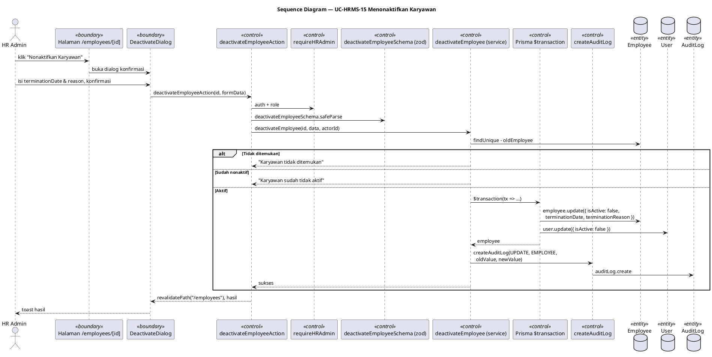
```plantuml
@startuml sequence_deactivate_employee
title Sequence Diagram — UC-HRMS-15 Menonaktifkan Karyawan

actor "HR Admin" as HR
participant "Halaman /employees/[id]" as UI <<boundary>>
participant "DeactivateDialog" as Dlg <<boundary>>
participant "deactivateEmployeeAction" as Act <<control>>
participant "requireHRAdmin" as Guard <<control>>
participant "deactivateEmployeeSchema (zod)" as Val <<control>>
participant "deactivateEmployee (service)" as Svc <<control>>
participant "Prisma $transaction" as TX <<control>>
participant "createAuditLog" as Audit <<control>>
database "Employee" as E1 <<entity>>
database "User" as E2 <<entity>>
database "AuditLog" as E3 <<entity>>

HR -> UI : klik "Nonaktifkan Karyawan"
UI -> Dlg : buka dialog konfirmasi
HR -> Dlg : isi terminationDate & reason, konfirmasi
Dlg -> Act : deactivateEmployeeAction(id, formData)
Act -> Guard : auth + role
Act -> Val : deactivateEmployeeSchema.safeParse
Act -> Svc : deactivateEmployee(id, data, actorId)
Svc -> E1 : findUnique - oldEmployee
alt Tidak ditemukan
  Svc --> Act : "Karyawan tidak ditemukan"
else Sudah nonaktif
  Svc --> Act : "Karyawan sudah tidak aktif"
else Aktif
  Svc -> TX : $transaction(tx => ...)
  TX -> E1 : employee.update({ isActive: false,\n  terminationDate, terminationReason })
  TX -> E2 : user.update({ isActive: false })
  TX --> Svc : employee
  Svc -> Audit : createAuditLog(UPDATE, EMPLOYEE,\n  oldValue, newValue)
  Audit -> E3 : auditLog.create
  Svc --> Act : sukses
end
Act --> Dlg : revalidatePath("/employees"), hasil
Dlg --> HR : toast hasil
@enduml
```

[Sisipkan gambar di sini]

**Gambar 4.71 *Sequence Diagram* Menonaktifkan Karyawan (SD-HRMS-15)**

**16. Sequence Diagram Mengelola Lowongan (SD-HRMS-16)**

*Sequence diagram* Mengelola Lowongan menggambarkan interaksi antar objek berdasarkan urutan waktu ketika HR Admin membuat lowongan baru, mengubah datanya, atau mengganti status `OPEN`/`CLOSED`. *Action* `createVacancyAction`, `updateVacancyAction`, dan `toggleVacancyStatusAction` (`src/lib/actions/recruitment.actions.ts`) seluruhnya memanggil `requireHRAdmin()`. Tambah dan ubah menggunakan *Zod schema* `createVacancySchema`/`updateVacancySchema` lalu `prisma.vacancy.create` (status default `OPEN`) atau `prisma.vacancy.update`. `toggleVacancyStatusAction` memuat lowongan via `findUniqueOrThrow`, menetapkan `newStatus = (status === "OPEN" ? "CLOSED" : "OPEN")`, lalu melakukan `update`. Setiap aksi mencatat *audit log* dengan modul `"Lowongan"` dan memanggil `revalidatePath("/recruitment")`. Gambar 4.72 menunjukkan *sequence diagram* Mengelola Lowongan.

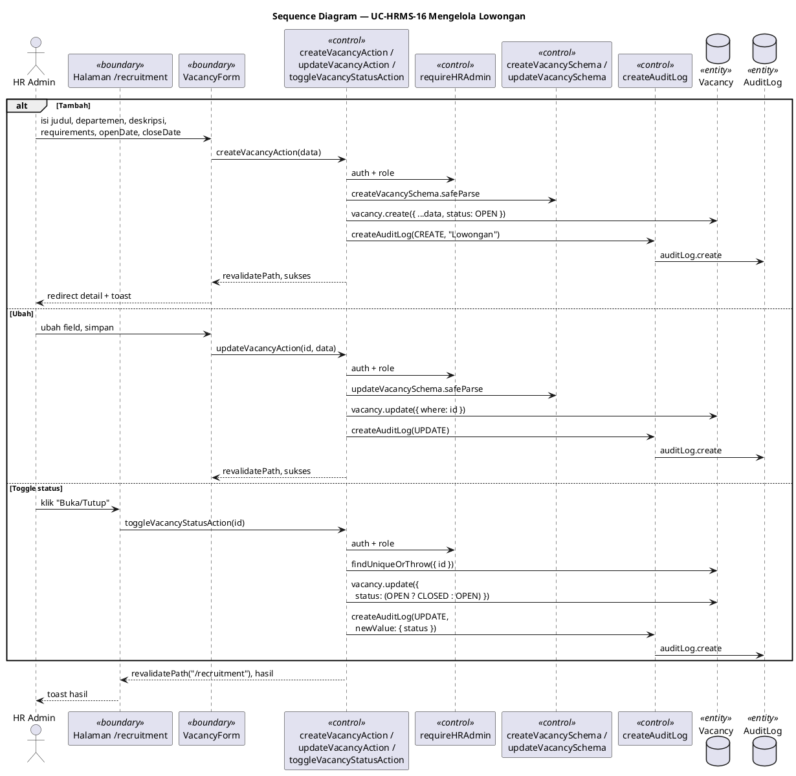
```plantuml
@startuml sequence_manage_vacancy
title Sequence Diagram — UC-HRMS-16 Mengelola Lowongan

actor "HR Admin" as HR
participant "Halaman /recruitment" as UI <<boundary>>
participant "VacancyForm" as Form <<boundary>>
participant "createVacancyAction /\nupdateVacancyAction /\ntoggleVacancyStatusAction" as Act <<control>>
participant "requireHRAdmin" as Guard <<control>>
participant "createVacancySchema /\nupdateVacancySchema" as Val <<control>>
participant "createAuditLog" as Audit <<control>>
database "Vacancy" as E1 <<entity>>
database "AuditLog" as E2 <<entity>>

alt Tambah
  HR -> Form : isi judul, departemen, deskripsi,\nrequirements, openDate, closeDate
  Form -> Act : createVacancyAction(data)
  Act -> Guard : auth + role
  Act -> Val : createVacancySchema.safeParse
  Act -> E1 : vacancy.create({ ...data, status: OPEN })
  Act -> Audit : createAuditLog(CREATE, "Lowongan")
  Audit -> E2 : auditLog.create
  Act --> Form : revalidatePath, sukses
  Form --> HR : redirect detail + toast
else Ubah
  HR -> Form : ubah field, simpan
  Form -> Act : updateVacancyAction(id, data)
  Act -> Guard : auth + role
  Act -> Val : updateVacancySchema.safeParse
  Act -> E1 : vacancy.update({ where: id })
  Act -> Audit : createAuditLog(UPDATE)
  Audit -> E2 : auditLog.create
  Act --> Form : revalidatePath, sukses
else Toggle status
  HR -> UI : klik "Buka/Tutup"
  UI -> Act : toggleVacancyStatusAction(id)
  Act -> Guard : auth + role
  Act -> E1 : findUniqueOrThrow({ id })
  Act -> E1 : vacancy.update({\n  status: (OPEN ? CLOSED : OPEN) })
  Act -> Audit : createAuditLog(UPDATE,\n  newValue: { status })
  Audit -> E2 : auditLog.create
end
Act --> UI : revalidatePath("/recruitment"), hasil
UI --> HR : toast hasil
@enduml
```

[Sisipkan gambar di sini]

**Gambar 4.72 *Sequence Diagram* Mengelola Lowongan (SD-HRMS-16)**

**17. Sequence Diagram Mengelola Kandidat (SD-HRMS-17)**

*Sequence diagram* Mengelola Kandidat menggambarkan interaksi antar objek berdasarkan urutan waktu ketika HR Admin menambahkan kandidat baru pada suatu lowongan dan mengunggah CV. Dialog `CandidateDialog` memanggil `createCandidateAction(vacancyId, data)` (`src/lib/actions/recruitment.actions.ts:118`). *Action* memanggil `requireHRAdmin()` lalu `createCandidateSchema.safeParse(data)`. Setelah validasi sukses, *action* menjalankan `prisma.candidate.create({ ...data, vacancyId })` (tahap awal default `MELAMAR`), `createAuditLog(CREATE, "Kandidat")`, dan `revalidatePath("/recruitment/[vacancyId]")`. Bila berkas CV dipilih, dialog memanggil `POST /api/recruitment/cv` (`src/app/api/recruitment/cv/route.ts`) yang memvalidasi *MIME type* dan ukuran ≤ 5 MB, memverifikasi kandidat ada di basis data, menyimpan berkas ke `uploads/cv/`, lalu memperbarui `candidate.cvPath`. Gambar 4.73 menunjukkan *sequence diagram* Mengelola Kandidat.

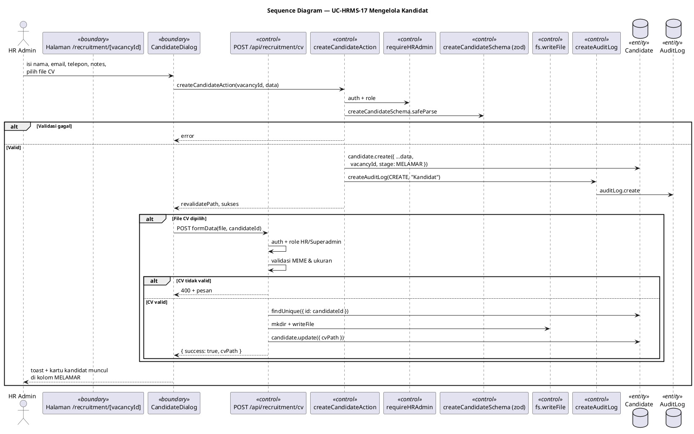
```plantuml
@startuml sequence_manage_candidate
title Sequence Diagram — UC-HRMS-17 Mengelola Kandidat

actor "HR Admin" as HR
participant "Halaman /recruitment/[vacancyId]" as UI <<boundary>>
participant "CandidateDialog" as Dlg <<boundary>>
participant "POST /api/recruitment/cv" as Route <<control>>
participant "createCandidateAction" as Act <<control>>
participant "requireHRAdmin" as Guard <<control>>
participant "createCandidateSchema (zod)" as Val <<control>>
participant "fs.writeFile" as FS <<control>>
participant "createAuditLog" as Audit <<control>>
database "Candidate" as E1 <<entity>>
database "AuditLog" as E2 <<entity>>

HR -> Dlg : isi nama, email, telepon, notes,\npilih file CV
Dlg -> Act : createCandidateAction(vacancyId, data)
Act -> Guard : auth + role
Act -> Val : createCandidateSchema.safeParse
alt Validasi gagal
  Act --> Dlg : error
else Valid
  Act -> E1 : candidate.create({ ...data,\n  vacancyId, stage: MELAMAR })
  Act -> Audit : createAuditLog(CREATE, "Kandidat")
  Audit -> E2 : auditLog.create
  Act --> Dlg : revalidatePath, sukses
  alt File CV dipilih
    Dlg -> Route : POST formData(file, candidateId)
    Route -> Route : auth + role HR/Superadmin
    Route -> Route : validasi MIME & ukuran
    alt CV tidak valid
      Route --> Dlg : 400 + pesan
    else CV valid
      Route -> E1 : findUnique({ id: candidateId })
      Route -> FS : mkdir + writeFile
      Route -> E1 : candidate.update({ cvPath })
      Route --> Dlg : { success: true, cvPath }
    end
  end
  Dlg --> HR : toast + kartu kandidat muncul\ndi kolom MELAMAR
end
@enduml
```

[Sisipkan gambar di sini]

**Gambar 4.73 *Sequence Diagram* Mengelola Kandidat (SD-HRMS-17)**

**18. Sequence Diagram Mengubah Tahap Kandidat (SD-HRMS-18)**

*Sequence diagram* Mengubah Tahap Kandidat menggambarkan interaksi antar objek berdasarkan urutan waktu ketika HR Admin memindahkan kartu kandidat antar kolom pada *Kanban board* lowongan. Alur dimulai ketika HR Admin menggeser kartu pada *boundary* `Kanban Board` di halaman `/recruitment/[vacancyId]`. Komponen *Kanban* (dibangun di atas `@dnd-kit`) menangkap *event* `onDragEnd` dan melakukan *optimistic update* pada *state* lokal sebelum memanggil `updateCandidateStageAction(candidateId, { stage })` (`src/lib/actions/recruitment.actions.ts:148`). Kontroler memanggil `requireHRAdmin()` untuk verifikasi peran. Bila gagal, *Kanban* mengembalikan kartu ke kolom semula dan menampilkan *toast* kesalahan. Bila otorisasi sukses, kontroler memanggil `updateCandidateStageSchema.safeParse(data)` untuk memastikan tahap valid (`CandidateStage` enum). Setelah validasi sukses, kontroler memanggil `prisma.candidate.update` untuk memperbarui *field* `stage`. Kontroler kemudian memanggil `createAuditLog` untuk mencatat aksi `UPDATE` pada modul `"Kandidat"`. Akhirnya kontroler memanggil `revalidatePath(`/recruitment/{vacancyId}`)` dan mengembalikan `{ success: true }`. *Kanban* menetapkan perubahan dan menampilkan *toast* sukses. Gambar 4.74 menunjukkan *sequence diagram* Mengubah Tahap Kandidat.

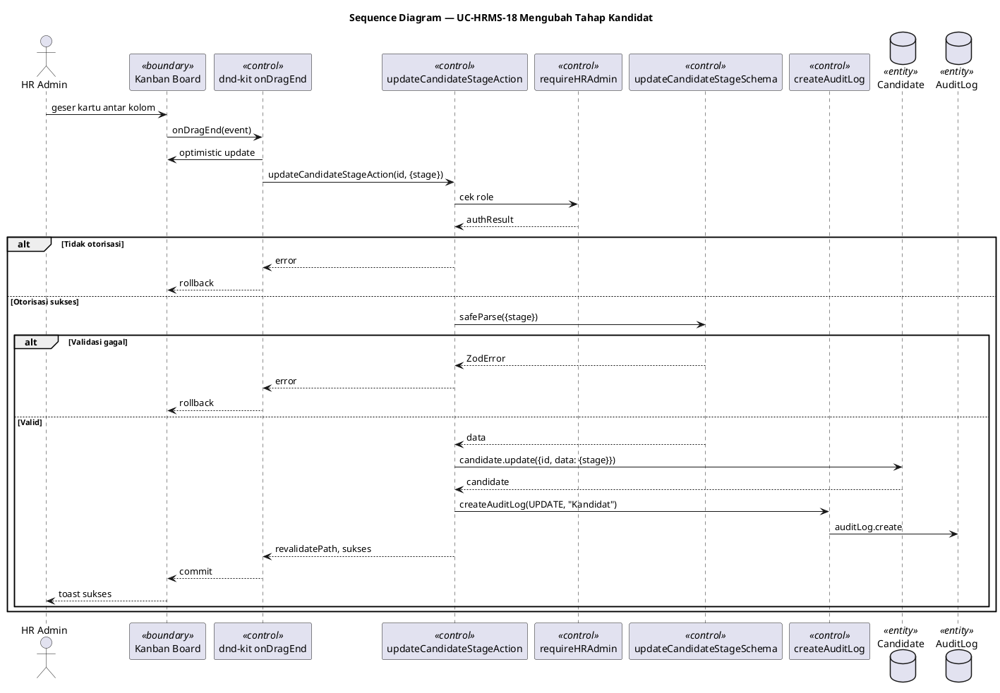
```plantuml
@startuml sequence_update_candidate_stage
title Sequence Diagram — UC-HRMS-18 Mengubah Tahap Kandidat

actor "HR Admin" as HR
participant "Kanban Board" as UI <<boundary>>
participant "dnd-kit onDragEnd" as Dnd <<control>>
participant "updateCandidateStageAction" as Act <<control>>
participant "requireHRAdmin" as Guard <<control>>
participant "updateCandidateStageSchema" as Val <<control>>
participant "createAuditLog" as Audit <<control>>
database "Candidate" as E1 <<entity>>
database "AuditLog" as E2 <<entity>>

HR -> UI : geser kartu antar kolom
UI -> Dnd : onDragEnd(event)
Dnd -> UI : optimistic update
Dnd -> Act : updateCandidateStageAction(id, {stage})
Act -> Guard : cek role
Guard --> Act : authResult
alt Tidak otorisasi
  Act --> Dnd : error
  Dnd --> UI : rollback
else Otorisasi sukses
  Act -> Val : safeParse({stage})
  alt Validasi gagal
    Val --> Act : ZodError
    Act --> Dnd : error
    Dnd --> UI : rollback
  else Valid
    Val --> Act : data
    Act -> E1 : candidate.update({id, data: {stage}})
    E1 --> Act : candidate
    Act -> Audit : createAuditLog(UPDATE, "Kandidat")
    Audit -> E2 : auditLog.create
    Act --> Dnd : revalidatePath, sukses
    Dnd --> UI : commit
    UI --> HR : toast sukses
  end
end
@enduml
```

[Sisipkan gambar di sini]

**Gambar 4.74 *Sequence Diagram* Mengubah Tahap Kandidat (SD-HRMS-18)**

**19. Sequence Diagram Menjadwalkan *Interview* (SD-HRMS-19)**

*Sequence diagram* Menjadwalkan *Interview* menggambarkan interaksi antar objek berdasarkan urutan waktu ketika HR Admin menjadwalkan wawancara pada halaman `/recruitment/candidates/[candidateId]`. Dialog `InterviewDialog` memanggil `createInterviewAction(candidateId, data)` (`src/lib/actions/recruitment.actions.ts:218`). *Action* memanggil `requireHRAdmin()`, lalu `createInterviewSchema.safeParse` (memvalidasi `scheduledAt`, `interviewerName?`, `notes?`). Setelah validasi sukses, *action* menjalankan `prisma.interview.create({ ...data, candidateId })` dan `createAuditLog(CREATE, "Wawancara")`. *Action* kemudian mengambil `candidate.vacancyId` untuk memanggil `revalidatePath` ganda — pada halaman detail kandidat maupun halaman kanban lowongan. Gambar 4.75 menunjukkan *sequence diagram* Menjadwalkan *Interview*.

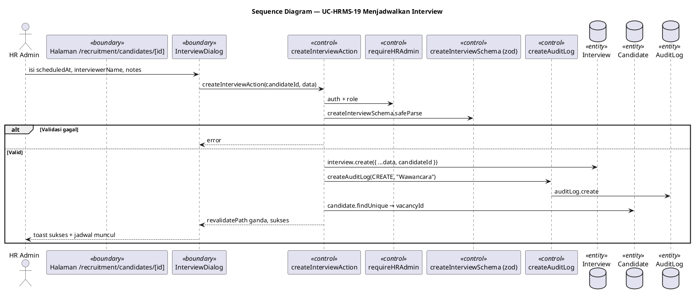
```plantuml
@startuml sequence_schedule_interview
title Sequence Diagram — UC-HRMS-19 Menjadwalkan Interview

actor "HR Admin" as HR
participant "Halaman /recruitment/candidates/[id]" as UI <<boundary>>
participant "InterviewDialog" as Dlg <<boundary>>
participant "createInterviewAction" as Act <<control>>
participant "requireHRAdmin" as Guard <<control>>
participant "createInterviewSchema (zod)" as Val <<control>>
participant "createAuditLog" as Audit <<control>>
database "Interview" as E1 <<entity>>
database "Candidate" as E2 <<entity>>
database "AuditLog" as E3 <<entity>>

HR -> Dlg : isi scheduledAt, interviewerName, notes
Dlg -> Act : createInterviewAction(candidateId, data)
Act -> Guard : auth + role
Act -> Val : createInterviewSchema.safeParse
alt Validasi gagal
  Act --> Dlg : error
else Valid
  Act -> E1 : interview.create({ ...data, candidateId })
  Act -> Audit : createAuditLog(CREATE, "Wawancara")
  Audit -> E3 : auditLog.create
  Act -> E2 : candidate.findUnique → vacancyId
  Act --> Dlg : revalidatePath ganda, sukses
  Dlg --> HR : toast sukses + jadwal muncul
end
@enduml
```

[Sisipkan gambar di sini]

**Gambar 4.75 *Sequence Diagram* Menjadwalkan *Interview* (SD-HRMS-19)**

**20. Sequence Diagram Mengelola Penawaran Kerja (SD-HRMS-20)**

*Sequence diagram* Mengelola Penawaran Kerja menggambarkan interaksi antar objek berdasarkan urutan waktu ketika HR Admin mencatat *offer salary* dan menghasilkan *offer letter* PDF. Untuk pencatatan penawaran, `OfferForm` memanggil `updateOfferAction(candidateId, data)` (`src/lib/actions/recruitment.actions.ts:179`). *Action* memanggil `requireHRAdmin()` dan `updateOfferSchema.safeParse`. Bila valid, *action* menjalankan `prisma.candidate.update({ offerSalary, offerNotes })` dan `createAuditLog(UPDATE, "Kandidat")`. Untuk pengunduhan *offer letter*, halaman memanggil `GET /api/recruitment/offer-letter/[candidateId]` (`src/app/api/recruitment/offer-letter/[candidateId]/route.ts`). *Route handler* memanggil `auth()` dengan *guard* peran HR/Superadmin, memuat `candidate` dengan `include: { vacancy: { include: { department } } }`, dan memeriksa tiga prasyarat: kandidat ada, `stage === "DITERIMA"`, dan `offerSalary` tidak null. Bila valid, *handler* memanggil `renderToStream(<OfferLetterDocument data={...} />)` (dari `@react-pdf/renderer`) dan mengembalikan *response* PDF dengan `Content-Disposition: attachment`. Gambar 4.76 menunjukkan *sequence diagram* Mengelola Penawaran Kerja.

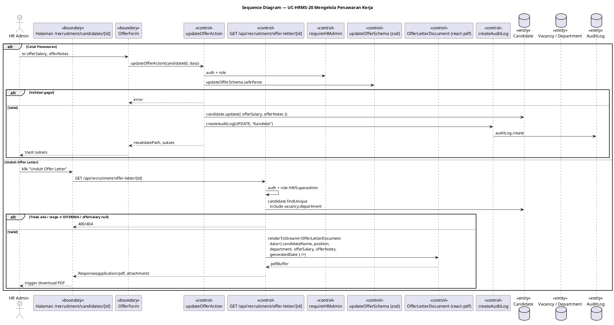
```plantuml
@startuml sequence_manage_offer
title Sequence Diagram — UC-HRMS-20 Mengelola Penawaran Kerja

actor "HR Admin" as HR
participant "Halaman /recruitment/candidates/[id]" as UI <<boundary>>
participant "OfferForm" as Form <<boundary>>
participant "updateOfferAction" as Act <<control>>
participant "GET /api/recruitment/offer-letter/[id]" as Route <<control>>
participant "requireHRAdmin" as Guard <<control>>
participant "updateOfferSchema (zod)" as Val <<control>>
participant "OfferLetterDocument (react-pdf)" as PDF <<control>>
participant "createAuditLog" as Audit <<control>>
database "Candidate" as E1 <<entity>>
database "Vacancy / Department" as E2 <<entity>>
database "AuditLog" as E3 <<entity>>

alt Catat Penawaran
  HR -> Form : isi offerSalary, offerNotes
  Form -> Act : updateOfferAction(candidateId, data)
  Act -> Guard : auth + role
  Act -> Val : updateOfferSchema.safeParse
  alt Validasi gagal
    Act --> Form : error
  else Valid
    Act -> E1 : candidate.update({ offerSalary, offerNotes })
    Act -> Audit : createAuditLog(UPDATE, "Kandidat")
    Audit -> E3 : auditLog.create
    Act --> Form : revalidatePath, sukses
    Form --> HR : toast sukses
  end
else Unduh Offer Letter
  HR -> UI : klik "Unduh Offer Letter"
  UI -> Route : GET /api/recruitment/offer-letter/[id]
  Route -> Route : auth + role HR/Superadmin
  Route -> E1 : candidate.findUnique\n  include vacancy.department
  alt Tidak ada / stage ≠ DITERIMA / offerSalary null
    Route --> UI : 400/404
  else Valid
    Route -> PDF : renderToStream(<OfferLetterDocument\n  data={ candidateName, position,\n  department, offerSalary, offerNotes,\n  generatedDate } />)
    PDF --> Route : pdfBuffer
    Route --> UI : Response(application/pdf, attachment)
    UI --> HR : trigger download PDF
  end
end
@enduml
```

[Sisipkan gambar di sini]

**Gambar 4.76 *Sequence Diagram* Mengelola Penawaran Kerja (SD-HRMS-20)**

**21. Sequence Diagram Mengonversi Kandidat menjadi Karyawan (SD-HRMS-21)**

*Sequence diagram* Mengonversi Kandidat menjadi Karyawan menggambarkan interaksi antar objek berdasarkan urutan waktu ketika HR Admin menjembatani modul *Recruitment Management* dan *Employee Data Management*. Halaman detail kandidat memanggil `convertCandidateToEmployeeAction(candidateId)` (`src/lib/actions/recruitment.actions.ts:256`). *Action* memanggil `requireHRAdmin()` lalu `prisma.candidate.findUniqueOrThrow` dengan `include: { vacancy: { include: { department } } }`. *Action* memeriksa `candidate.stage === "DITERIMA"`; bila bukan, mengembalikan `"Hanya kandidat dengan status Diterima yang dapat dikonversi"`. Bila valid, *action* mengisi `candidate.hiredAt = now()`, mencatat *audit log* dengan `newValue: { hiredAt, converted: true }`, dan mengembalikan objek `prefill` (nama, email, telepon, `departmentId`, `cvPath`, `candidateId`). Halaman lalu mengarahkan HR Admin ke `/employees/new` dengan *prefill* tersebut. Setelah HR Admin melengkapi data akun dan menekan "Simpan", aliran berlanjut ke `createEmployeeAction` (SD-HRMS-11) yang membuat `User` dan `Employee` dalam satu transaksi. Gambar 4.77 menunjukkan *sequence diagram* Mengonversi Kandidat menjadi Karyawan.

```plantuml
@startuml sequence_convert_candidate
title Sequence Diagram — UC-HRMS-21 Mengonversi Kandidat menjadi Karyawan

actor "HR Admin" as HR
participant "CandidateDetail" as UI <<boundary>>
participant "convertCandidateToEmployeeAction" as Act <<control>>
participant "requireHRAdmin" as Guard <<control>>
participant "createAuditLog" as Audit <<control>>
participant "Halaman /employees/new (prefill)" as NewPage <<boundary>>
participant "createEmployeeAction (lihat SD-11)" as ActE <<control>>
database "Candidate" as E1 <<entity>>
database "Vacancy / Department" as E2 <<entity>>
database "AuditLog" as E3 <<entity>>

HR -> UI : klik "Konversi ke Karyawan"
UI -> Act : convertCandidateToEmployeeAction(candidateId)
Act -> Guard : auth + role
Act -> E1 : candidate.findUniqueOrThrow\n  include vacancy.department
alt stage ≠ DITERIMA
  Act --> UI : "Hanya kandidat Diterima yang\ndapat dikonversi"
else stage = DITERIMA
  Act -> E1 : candidate.update({ hiredAt: now })
  Act -> Audit : createAuditLog(UPDATE, "Kandidat",\n  newValue: { hiredAt, converted: true })
  Audit -> E3 : auditLog.create
  Act --> UI : { success: true, prefill: {\n  fullName, email, phone,\n  departmentId, cvPath, candidateId } }
  UI --> HR : redirect /employees/new dengan prefill
  HR -> NewPage : tinjau prefill + isi data akun
  NewPage -> ActE : createEmployeeAction(formData)
  ActE --> NewPage : { success: true, data: { id } }
  NewPage --> HR : redirect /employees/[id] + toast sukses
end
@enduml
```

[Sisipkan gambar di sini]

**Gambar 4.77 *Sequence Diagram* Mengonversi Kandidat menjadi Karyawan (SD-HRMS-21)**

**22. Sequence Diagram Mencatat Kehadiran (SD-HRMS-22)**

*Sequence diagram* Mencatat Kehadiran menggambarkan interaksi antar objek berdasarkan urutan waktu ketika karyawan melakukan *clock in* pada halaman `/attendance`. Alur dimulai ketika karyawan menekan tombol "Absen Masuk" pada *boundary* halaman absensi. Komponen tombol memanggil `navigator.geolocation.getCurrentPosition` (*Geolocation API* peramban) untuk memperoleh `latitude` dan `longitude`. Halaman lalu memanggil `clockInAction({ latitude, longitude })` (`src/lib/actions/attendance.actions.ts:19`). Kontroler memanggil `auth()` untuk memastikan *session* valid. Bila tidak valid, kontroler mengembalikan `"Sesi tidak valid"`. Selanjutnya kontroler memanggil `headers()` untuk membaca `x-forwarded-for` atau `x-real-ip` sebagai `clientIp`. Kontroler memanggil `prisma.employee.findUnique({ userId, include: { officeLocation } })`. Bila profil tidak ditemukan, akun nonaktif, atau `officeLocation` belum dikonfigurasi, kontroler mengembalikan pesan kesalahan yang sesuai. Bila data lengkap, kontroler memanggil `verifyLocation(clientIp, coords, employee.officeLocation)` yang memeriksa IP terhadap `allowedIPs` dan jarak GPS terhadap `radiusMeters`. Bila tidak lolos, kontroler mengembalikan pesan kesalahan. Bila lolos, kontroler menghitung tanggal lokal Asia/Jakarta, lalu memanggil `calculateAttendanceFlags(nowUtc, null, workStartTime, workEndTime)` untuk memperoleh `isLate` dan `lateMinutes`. Kontroler memanggil `prisma.attendanceRecord.create` dengan *field* `employeeId`, `officeLocationId`, `date`, `clockIn`, `clockInIp`, `clockInLat`, `clockInLon`, `isLate`, dan `lateMinutes`. Bila Prisma melempar `P2002` (pelanggaran *unique constraint* `[employeeId, date]`), kontroler mengembalikan `"Anda sudah melakukan absen masuk hari ini"`. Bila sukses, kontroler memanggil `revalidatePath("/attendance")` dan mengembalikan `{ success: true }`. Halaman lalu memuat status hari ini dan menampilkan *toast* sukses. Gambar 4.78 menunjukkan *sequence diagram* Mencatat Kehadiran.

```plantuml
@startuml sequence_clock_in
title Sequence Diagram — UC-HRMS-22 Mencatat Kehadiran (Clock In)

actor "Karyawan" as EM
participant "Halaman /attendance" as UI <<boundary>>
participant "Geolocation API" as Geo <<control>>
participant "clockInAction" as Act <<control>>
participant "auth()" as Sess <<control>>
participant "headers()" as Hdr <<control>>
participant "verifyLocation" as Loc <<control>>
participant "calculateAttendanceFlags" as Calc <<control>>
database "Employee" as E1 <<entity>>
database "OfficeLocation" as E2 <<entity>>
database "AttendanceRecord" as E3 <<entity>>

EM -> UI : klik "Absen Masuk"
UI -> Geo : getCurrentPosition()
Geo --> UI : {latitude, longitude}
UI -> Act : clockInAction(coords)
Act -> Sess : auth()
Sess --> Act : session
alt Sesi tidak valid
  Act --> UI : error
else Sesi valid
  Act -> Hdr : headers()
  Hdr --> Act : clientIp
  Act -> E1 : employee.findUnique({userId, include: officeLocation})
  E1 --> Act : employee + officeLocation
  alt Tidak punya officeLocation / nonaktif
    Act --> UI : error
  else Data lengkap
    Act -> Loc : verifyLocation(ip, coords, location)
    Loc -> E2 : baca allowedIPs, lat, lon, radius
    Loc --> Act : {allowed, reason?}
    alt Lokasi tidak diizinkan
      Act --> UI : error
    else Lokasi valid
      Act -> Calc : calculateAttendanceFlags(now, null, start, end)
      Calc --> Act : {isLate, lateMinutes}
      Act -> E3 : attendanceRecord.create
      alt P2002 (sudah absen)
        E3 --> Act : Prisma error
        Act --> UI : error
      else Berhasil
        E3 --> Act : record
        Act --> UI : revalidatePath, sukses
        UI --> EM : status hari ini
      end
    end
  end
end
@enduml
```

[Sisipkan gambar di sini]

**Gambar 4.78 *Sequence Diagram* Mencatat Kehadiran (SD-HRMS-22)**

**23. Sequence Diagram Melihat Rekap Absensi (SD-HRMS-23)**

*Sequence diagram* Melihat Rekap Absensi menggambarkan interaksi antar objek berdasarkan urutan waktu ketika HR Admin atau *Manager* membuka `/attendance-admin`. Halaman membaca `searchParams` (`month`, `year`, `departmentId?`) lalu memanggil `auth()`. Bila peran adalah `MANAGER`, halaman lebih dulu memanggil `getEmployeeByUserId(userId)` untuk mengambil `departmentId` *manager*, kemudian memanggil `getMonthlyAttendanceRecap` dengan `departmentId` tersebut sehingga data ter-*scope* divisi. Bila peran adalah `HR_ADMIN`/`SUPER_ADMIN`, halaman memanggil `getMonthlyAttendanceRecap` tanpa pembatasan divisi (kecuali bila filter dipilih). `getMonthlyAttendanceRecap` (`src/lib/services/attendance.service.ts:142`) menjalankan `prisma.attendanceRecord.findMany` dengan `date` dalam rentang bulan terpilih dan `include` `employee.department`/`position`. Komponen `AttendanceFilters` mengubah `URL searchParams` untuk filter, dan halaman me-*refetch*. Klik baris karyawan mengarahkan ke `/attendance-admin/[employeeId]`. Gambar 4.79 menunjukkan *sequence diagram* Melihat Rekap Absensi.

```plantuml
@startuml sequence_view_attendance_recap
title Sequence Diagram — UC-HRMS-23 Melihat Rekap Absensi

actor "HR Admin / Manager" as U
participant "Halaman /attendance-admin" as UI <<boundary>>
participant "AttendanceFilters" as Flt <<boundary>>
participant "auth()" as Sess <<control>>
participant "getEmployeeByUserId" as ByUser <<control>>
participant "getMonthlyAttendanceRecap" as Get <<control>>
database "Employee" as E1 <<entity>>
database "AttendanceRecord" as E2 <<entity>>

U -> UI : akses /attendance-admin?month=&year=
UI -> Sess : auth()
alt role = MANAGER
  UI -> ByUser : getEmployeeByUserId(userId)
  ByUser -> E1 : findUnique → departmentId
  UI -> Get : getMonthlyAttendanceRecap({\n  month, year, departmentId: manager })
  Get -> E2 : findMany where date in range,\n  employee.departmentId = manager
else role = HR_ADMIN / SUPER_ADMIN
  UI -> Get : getMonthlyAttendanceRecap({ month, year, departmentId? })
  Get -> E2 : findMany where date in range,\n  include employee.department, position
end
Get --> UI : records
UI --> U : tabel rekap
U -> Flt : ubah filter (bulan/tahun/dept)
Flt -> UI : update searchParams
UI -> Get : getMonthlyAttendanceRecap(filterBaru)
Get --> UI : data hasil filter
UI --> U : refresh tabel
alt Lihat detail per karyawan
  U -> UI : klik baris karyawan
  UI --> U : navigate /attendance-admin/[employeeId]
end
@enduml
```

[Sisipkan gambar di sini]

**Gambar 4.79 *Sequence Diagram* Melihat Rekap Absensi (SD-HRMS-23)**

**24. Sequence Diagram Koreksi Manual Absensi (SD-HRMS-24)**

*Sequence diagram* Koreksi Manual Absensi menggambarkan interaksi antar objek berdasarkan urutan waktu ketika HR Admin mengubah catatan absensi yang tidak akurat. Dialog `ManualOverrideDialog` memanggil `manualOverrideAction(input)` (`src/lib/actions/attendance.actions.ts:166`). *Action* memanggil `auth()` dengan *guard* peran HR/Superadmin, lalu `manualAttendanceSchema.safeParse(input)` yang memvalidasi `employeeId`, `date`, `clockIn`/`clockOut` (format `HH:MM`), dan `overrideReason`. *Action* membaca `employee` dengan `include: officeLocation`, lalu mengonversi jam WIB ke UTC secara manual (`setUTCHours(jam - 7, menit)`) karena `Date` UTC dipakai sebagai *source of truth*. *Action* memanggil `calculateAttendanceFlags(clockInUtc, clockOutUtc, scheduleStart, scheduleEnd)` untuk menghitung *flags*. Bila `employee.officeLocationId` null, *action* mengambil `officeLocation.findFirst` sebagai *fallback*. Kemudian *action* menjalankan `prisma.attendanceRecord.upsert` dengan kunci komposit `[employeeId, date]`, mengisi `isManualOverride: true`, `overrideById`, dan `overrideReason`. Setelah *upsert*, *action* mencatat *audit log* dan memanggil `revalidatePath("/attendance-admin")`. Gambar 4.80 menunjukkan *sequence diagram* Koreksi Manual Absensi.

```plantuml
@startuml sequence_manual_override
title Sequence Diagram — UC-HRMS-24 Koreksi Manual Absensi

actor "HR Admin" as HR
participant "Halaman /attendance-admin" as UI <<boundary>>
participant "ManualOverrideDialog" as Dlg <<boundary>>
participant "manualOverrideAction" as Act <<control>>
participant "auth()" as Sess <<control>>
participant "manualAttendanceSchema (zod)" as Val <<control>>
participant "calculateAttendanceFlags" as Calc <<control>>
participant "createAuditLog" as Audit <<control>>
database "Employee" as E1 <<entity>>
database "OfficeLocation" as E2 <<entity>>
database "AttendanceRecord" as E3 <<entity>>
database "AuditLog" as E4 <<entity>>

HR -> Dlg : pilih karyawan, tanggal, jam masuk/pulang, alasan
Dlg -> Act : manualOverrideAction(input)
Act -> Sess : auth() + cek role HR/Superadmin
alt Tidak otorisasi
  Act --> Dlg : "Akses ditolak"
else Otorisasi sukses
  Act -> Val : manualAttendanceSchema.safeParse
  alt Validasi gagal
    Val --> Act : ZodError
    Act --> Dlg : pesan validasi
  else Valid
    Act -> E1 : employee.findUnique include officeLocation
    alt Tidak ditemukan
      Act --> Dlg : "Karyawan tidak ditemukan"
    else Ditemukan
      Act -> Act : konversi WIB → UTC\n  (jam - 7, atur dateOnly UTC)
      Act -> Calc : calculateAttendanceFlags(\n  clockInUtc, clockOutUtc, start, end)
      Calc --> Act : { isLate, lateMinutes,\n  isEarlyOut, earlyOutMinutes,\n  overtimeMinutes, totalMinutes }
      alt officeLocationId null
        Act -> E2 : officeLocation.findFirst (fallback)
      end
      Act -> E3 : attendanceRecord.upsert({\n  where: employeeId_date,\n  create/update: {\n    isManualOverride: true,\n    overrideById, overrideReason, ...flags } })
      Act -> Audit : createAuditLog(UPDATE, "Absensi")
      Audit -> E4 : auditLog.create
      Act --> Dlg : revalidatePath, sukses
      Dlg --> HR : toast sukses + tabel refresh
    end
  end
end
@enduml
```

[Sisipkan gambar di sini]

**Gambar 4.80 *Sequence Diagram* Koreksi Manual Absensi (SD-HRMS-24)**

**25. Sequence Diagram Mengekspor Rekap Absensi (SD-HRMS-25)**

*Sequence diagram* Mengekspor Rekap Absensi menggambarkan interaksi antar objek berdasarkan urutan waktu ketika HR Admin atau *Manager* mengunduh rekap absensi dalam format CSV/Excel atau PDF. Halaman memanggil `GET /api/attendance/export?month=&year=&format=&departmentId=` (`src/app/api/attendance/export/route.ts`). *Route handler* memanggil `auth()` dengan *guard* peran HR/Superadmin, lalu `getMonthlyAttendanceRecap({ month, year, departmentId })`. Bila `format === "pdf"`, *handler* memanggil `renderToStream(<AttendancePDFDocument data, month, year />)` (`@react-pdf/renderer`) dan mengembalikan *response* PDF. Bila format default `xlsx`, *handler* memetakan tiap *record* ke baris berisi kolom NIK, Nama, Departemen, Jabatan, Tanggal, Jam Masuk/Pulang, Total Jam, Terlambat, Lembur, dan Override Manual (dikonversi ke zona WIB). *Handler* lalu memanggil `XLSX.utils.json_to_sheet` dan `XLSX.write` untuk menghasilkan *workbook* yang dikirim sebagai *response* dengan *MIME* `openxmlformats-officedocument.spreadsheetml.sheet`. Gambar 4.81 menunjukkan *sequence diagram* Mengekspor Rekap Absensi.

```plantuml
@startuml sequence_export_attendance
title Sequence Diagram — UC-HRMS-25 Mengekspor Rekap Absensi

actor "HR Admin / Manager" as U
participant "Halaman /attendance-admin" as UI <<boundary>>
participant "GET /api/attendance/export" as Route <<control>>
participant "auth()" as Sess <<control>>
participant "getMonthlyAttendanceRecap" as Get <<control>>
participant "XLSX.write" as Xls <<control>>
participant "AttendancePDFDocument (react-pdf)" as PDF <<control>>
database "AttendanceRecord" as E1 <<entity>>

U -> UI : pilih format + filter, klik "Ekspor"
UI -> Route : GET /api/attendance/export\n?month=&year=&format=&departmentId=
Route -> Sess : auth()
alt role bukan HR/Superadmin
  Route --> UI : 401 Unauthorized
else Otorisasi sukses
  Route -> Get : getMonthlyAttendanceRecap({ month, year, departmentId })
  Get -> E1 : findMany include employee, department, position
  Get --> Route : records
  alt format = "pdf"
    Route -> PDF : renderToStream(<AttendancePDFDocument\n  data, month, year />)
    PDF --> Route : pdfBuffer
    Route --> UI : Response(application/pdf, attachment)
  else format = "xlsx"
    Route -> Route : map records → rows (NIK, Nama,\n  Dept, Jabatan, Tanggal, Jam Masuk/Pulang,\n  Total Jam, Terlambat, Lembur, Override)
    Route -> Xls : json_to_sheet + book_append_sheet + write
    Xls --> Route : workbook buffer
    Route --> UI : Response(application/vnd.openxmlformats…,\n  attachment)
  end
  UI --> U : trigger download
end
@enduml
```

[Sisipkan gambar di sini]

**Gambar 4.81 *Sequence Diagram* Mengekspor Rekap Absensi (SD-HRMS-25)**

**26. Sequence Diagram Mengajukan Cuti (SD-HRMS-26)**

*Sequence diagram* Mengajukan Cuti menggambarkan interaksi antar objek berdasarkan urutan waktu ketika karyawan mengajukan cuti melalui *form* di halaman `/leave`. Alur dimulai ketika karyawan memilih jenis cuti, rentang tanggal, dan mengisi alasan, lalu menekan tombol "Kirim Pengajuan" pada *boundary* `LeaveRequestForm`. Komponen *form* memanggil `submitLeaveAction(formData)` (`src/lib/actions/leave.actions.ts:23`). Kontroler memanggil `auth()`, kemudian `submitLeaveSchema.safeParse(formData)` yang memvalidasi `leaveTypeId`, `startDate`, `endDate`, dan `reason` dengan *refinement* `endDate >= startDate`. Bila validasi gagal, kontroler mengembalikan pesan kesalahan. Bila berhasil, kontroler memanggil `prisma.employee.findUnique({ userId })` untuk memperoleh `employeeId` dan memastikan `isActive` bernilai `true`. Bila tidak aktif, kontroler mengembalikan `"Akun karyawan tidak aktif"`. Selanjutnya kontroler memanggil `submitLeaveRequest(...)` pada *service* (`src/lib/services/leave.service.ts:102`). *Service* memanggil `countWorkingDays(startDate, endDate)`; bila hasilnya `0`, *service* melempar `"Rentang tidak mencakup hari kerja"`. *Service* memanggil `ensureLeaveBalances(employeeId)` untuk memastikan saldo cuti tahun berjalan sudah dibuat per `LeaveType`. *Service* lalu membaca `LeaveBalance` untuk pasangan `(employeeId, leaveTypeId, year)` dan memastikan `allocatedDays - usedDays >= workingDays`; bila tidak, *service* melempar `"Saldo cuti tidak mencukupi"`. *Service* memanggil `resolveInitialStage(employeeId)` untuk menentukan status awal — `PENDING_MANAGER` bila karyawan memiliki *manager* dalam satu departemen, atau `PENDING_HR` bila tidak. *Service* lalu memanggil `prisma.leaveRequest.create` dengan seluruh *field* termasuk `workingDays` dan `status`. Setelah *service* sukses, kontroler memanggil `createAuditLog` untuk mencatat aksi `CREATE` pada modul `"Permintaan Cuti"`, lalu `revalidatePath("/leave")`, dan mengembalikan `{ success: true }`. Komponen *form* menampilkan *toast* sukses dan riwayat cuti diperbarui. Gambar 4.82 menunjukkan *sequence diagram* Mengajukan Cuti.

```plantuml
@startuml sequence_submit_leave
title Sequence Diagram — UC-HRMS-26 Mengajukan Cuti

actor "Karyawan" as EM
participant "LeaveRequestForm" as UI <<boundary>>
participant "submitLeaveAction" as Act <<control>>
participant "auth()" as Sess <<control>>
participant "submitLeaveSchema" as Val <<control>>
participant "submitLeaveRequest (service)" as Svc <<control>>
participant "countWorkingDays" as Cnt <<control>>
participant "ensureLeaveBalances" as Ens <<control>>
participant "resolveInitialStage" as Stg <<control>>
participant "createAuditLog" as Audit <<control>>
database "Employee" as E1 <<entity>>
database "LeaveBalance" as E2 <<entity>>
database "LeaveRequest" as E3 <<entity>>
database "AuditLog" as E4 <<entity>>

EM -> UI : isi form & kirim
UI -> Act : submitLeaveAction(formData)
Act -> Sess : auth()
Act -> Val : safeParse(formData)
alt Validasi gagal
  Val --> Act : ZodError
  Act --> UI : error
else Valid
  Val --> Act : data
  Act -> E1 : employee.findUnique({userId})
  E1 --> Act : {id, isActive}
  alt Nonaktif
    Act --> UI : error
  else Aktif
    Act -> Svc : submitLeaveRequest(input)
    Svc -> Cnt : countWorkingDays(start, end)
    Cnt --> Svc : workingDays
    alt workingDays = 0
      Svc --> Act : throw
    else > 0
      Svc -> Ens : ensureLeaveBalances(id)
      Ens -> E2 : create balances per LeaveType
      Svc -> E2 : findUnique balance
      E2 --> Svc : balance
      alt Saldo kurang
        Svc --> Act : throw "saldo tidak cukup"
      else Cukup
        Svc -> Stg : resolveInitialStage(id)
        Stg --> Svc : initialStatus
        Svc -> E3 : leaveRequest.create
        E3 --> Svc : leaveRequest
        Svc --> Act : ok
        Act -> Audit : createAuditLog(CREATE)
        Audit -> E4 : auditLog.create
        Act --> UI : revalidatePath, sukses
        UI --> EM : toast sukses
      end
    end
  end
end
@enduml
```

[Sisipkan gambar di sini]

**Gambar 4.82 *Sequence Diagram* Mengajukan Cuti (SD-HRMS-26)**

**27. Sequence Diagram Menyetujui / Menolak Cuti (SD-HRMS-27)**

*Sequence diagram* Menyetujui / Menolak Cuti menggambarkan interaksi antar objek berdasarkan urutan waktu ketika *Manager* atau HR Admin memberikan keputusan persetujuan dua tahap pada halaman `/leave/manage`. Dialog `ApproveRejectDialog` memanggil `approveLeaveAction` atau `rejectLeaveAction` (`src/lib/actions/leave.actions.ts`). *Action* memanggil `auth()` dengan *guard* peran `MANAGER`/`HR_ADMIN`/`SUPER_ADMIN`, lalu memvalidasi input via `approveLeaveSchema`/`rejectLeaveSchema`. Untuk persetujuan, *action* memanggil `approveLeaveRequest` (`src/lib/services/leave.service.ts:155`) yang membuka `prisma.$transaction`. Di dalam transaksi: (1) `leaveRequest.findUnique` dengan `include employee.userId, departmentId`; (2) *self-approval guard* (`request.employee.userId === approverUserId`); (3) bila status `PENDING_MANAGER`, *service* memastikan peran adalah `MANAGER` dan `approver.departmentId === request.employee.departmentId`, lalu meng-*update* status ke `PENDING_HR` beserta `managerApprovedById`, `managerNotes`, `managerApprovedAt`; (4) bila status `PENDING_HR`, *service* memastikan peran adalah `HR_ADMIN`/`SUPER_ADMIN`, melakukan `leaveBalance.update` dengan `usedDays.increment: workingDays`, lalu meng-*update* status ke `APPROVED` beserta `hrApprovedById`, `hrNotes`, `hrApprovedAt`. Untuk penolakan, `rejectLeaveRequest` mengikuti pola serupa namun tidak melakukan *increment* saldo dan menetapkan status `REJECTED`. Setelah transaksi sukses, *action* memanggil `createAuditLog` dan `revalidatePath`. Gambar 4.83 menunjukkan *sequence diagram* Menyetujui / Menolak Cuti.

```plantuml
@startuml sequence_approve_leave
title Sequence Diagram — UC-HRMS-27 Menyetujui / Menolak Cuti

actor "Manager / HR Admin" as U
participant "Halaman /leave/manage" as UI <<boundary>>
participant "ApproveRejectDialog" as Dlg <<boundary>>
participant "approveLeaveAction / rejectLeaveAction" as Act <<control>>
participant "auth()" as Sess <<control>>
participant "approveLeaveSchema / rejectLeaveSchema" as Val <<control>>
participant "approveLeaveRequest /\nrejectLeaveRequest (service)" as Svc <<control>>
participant "Prisma $transaction" as TX <<control>>
participant "createAuditLog" as Audit <<control>>
database "LeaveRequest" as E1 <<entity>>
database "Employee" as E2 <<entity>>
database "LeaveBalance" as E3 <<entity>>
database "AuditLog" as E4 <<entity>>

U -> Dlg : klik Setujui/Tolak + isi catatan
Dlg -> Act : action({ leaveRequestId, notes })
Act -> Sess : auth() + cek role MANAGER/HR/Superadmin
Act -> Val : schema.safeParse
alt Validasi gagal
  Act --> Dlg : error
else Valid
  alt Setujui
    Act -> Svc : approveLeaveRequest(id, approverUserId, role, notes)
    Svc -> TX : $transaction(tx => ...)
    TX -> E1 : findUnique include employee.userId, departmentId
    alt Self-approval
      TX --> Svc : throw
    else status = PENDING_MANAGER
      alt Bukan MANAGER
        TX --> Svc : throw "Hanya Manager"
      else MANAGER lain divisi
        TX -> E2 : approver.departmentId
        TX --> Svc : throw "Hanya cuti divisi Anda"
      else MANAGER sama divisi
        TX -> E1 : update({ status: PENDING_HR,\n  managerApprovedById, managerNotes,\n  managerApprovedAt })
      end
    else status = PENDING_HR
      alt Bukan HR/Superadmin
        TX --> Svc : throw "Hanya Admin HR"
      else HR/Superadmin
        TX -> E3 : leaveBalance.update({\n  where: employeeId_leaveTypeId_year,\n  data: { usedDays: { increment: workingDays } } })
        TX -> E1 : update({ status: APPROVED,\n  hrApprovedById, hrNotes, hrApprovedAt })
      end
    else status lain
      TX --> Svc : throw "Sudah diproses"
    end
    Svc -> Audit : createAuditLog(UPDATE, "Permintaan Cuti")
    Audit -> E4 : auditLog.create
  else Tolak
    Act -> Svc : rejectLeaveRequest(id, approverUserId, role, notes)
    Svc -> E1 : findUnique include employee
    Svc -> Svc : self-rejection guard
    alt status = PENDING_MANAGER
      Svc -> E2 : cek approver.departmentId sama
      Svc -> E1 : update({ status: REJECTED,\n  managerApprovedById, managerNotes, managerApprovedAt })
    else status = PENDING_HR
      Svc -> E1 : update({ status: REJECTED,\n  hrApprovedById, hrNotes, hrApprovedAt })
    end
    Svc -> Audit : createAuditLog(UPDATE)
    Audit -> E4 : auditLog.create
  end
  Act --> Dlg : revalidatePath, sukses
  Dlg --> U : toast hasil
end
@enduml
```

[Sisipkan gambar di sini]

**Gambar 4.83 *Sequence Diagram* Menyetujui / Menolak Cuti (SD-HRMS-27)**

**28. Sequence Diagram Membatalkan Cuti (SD-HRMS-28)**

*Sequence diagram* Membatalkan Cuti menggambarkan interaksi antar objek berdasarkan urutan waktu ketika karyawan membatalkan pengajuan cuti yang masih menunggu. Tombol "Batalkan" pada riwayat di `/leave` memanggil `cancelLeaveAction(leaveRequestId)` (`src/lib/actions/leave.actions.ts:171`). *Action* memanggil `auth()`, lalu memuat `employee` melalui `findUnique({ userId })` untuk memperoleh `employeeId`. *Action* meneruskan ke `cancelLeaveRequest(leaveRequestId, employeeId)` (`src/lib/services/leave.service.ts:298`). *Service* memuat `leaveRequest`, melakukan *guard*: (a) `request.employeeId === employeeId` (kepemilikan), dan (b) `status ∈ {PENDING_MANAGER, PENDING_HR}` (hanya menunggu). Bila lolos, *service* meng-*update* status menjadi `CANCELLED`. Setelah *service* sukses, *action* mencatat *audit log* dan memanggil `revalidatePath("/leave")`. Gambar 4.84 menunjukkan *sequence diagram* Membatalkan Cuti.

```plantuml
@startuml sequence_cancel_leave
title Sequence Diagram — UC-HRMS-28 Membatalkan Cuti

actor "Karyawan" as EM
participant "Halaman /leave" as UI <<boundary>>
participant "cancelLeaveAction" as Act <<control>>
participant "auth()" as Sess <<control>>
participant "cancelLeaveRequest (service)" as Svc <<control>>
participant "createAuditLog" as Audit <<control>>
database "Employee" as E1 <<entity>>
database "LeaveRequest" as E2 <<entity>>
database "AuditLog" as E3 <<entity>>

EM -> UI : klik "Batalkan" pada pengajuan
UI -> Act : cancelLeaveAction(leaveRequestId)
Act -> Sess : auth()
alt Session tidak valid
  Act --> UI : "Sesi tidak valid"
else Session valid
  Act -> E1 : employee.findUnique({ userId })
  alt Profil tidak ditemukan
    Act --> UI : "Profil karyawan tidak ditemukan"
  else Ada
    Act -> Svc : cancelLeaveRequest(id, employeeId)
    Svc -> E2 : leaveRequest.findUnique({ id })
    alt Tidak ditemukan / bukan milik / sudah final
      Svc --> Act : throw
    else PENDING_MANAGER / PENDING_HR & milik sendiri
      Svc -> E2 : leaveRequest.update({ status: CANCELLED })
      Svc --> Act : ok
      Act -> Audit : createAuditLog(UPDATE,\n  newValue: { status: CANCELLED })
      Audit -> E3 : auditLog.create
    end
  end
  Act --> UI : revalidatePath("/leave"), hasil
  UI --> EM : toast hasil + riwayat refresh
end
@enduml
```

[Sisipkan gambar di sini]

**Gambar 4.84 *Sequence Diagram* Membatalkan Cuti (SD-HRMS-28)**

**29. Sequence Diagram Melihat Laporan Cuti (SD-HRMS-29)**

*Sequence diagram* Melihat Laporan Cuti menggambarkan interaksi antar objek berdasarkan urutan waktu ketika HR Admin meninjau KPI dan grafik tren cuti pada `/leave/report`. Halaman memanggil `auth()` dengan *guard* peran HR/Superadmin. Halaman lalu memanggil `getLeaveRequests({ year })` (`src/lib/services/leave.service.ts:329`) yang melakukan `prisma.leaveRequest.findMany` dengan filter `startDate` dalam rentang tahun dipilih, lalu mengagregasi data per status (`PENDING_MANAGER`, `PENDING_HR`, `APPROVED`, `REJECTED`, `CANCELLED`), per `leaveType`, dan per bulan. Hasil agregasi di-*render* sebagai *KPI cards* dan *trend chart* menggunakan Recharts. Komponen `LeaveReportFilters` memperbarui `URL searchParams` untuk filter periode, dan halaman me-*refetch* + me-*re-render* grafik. Gambar 4.85 menunjukkan *sequence diagram* Melihat Laporan Cuti.

```plantuml
@startuml sequence_leave_report
title Sequence Diagram — UC-HRMS-29 Melihat Laporan Cuti

actor "HR Admin" as HR
participant "Halaman /leave/report" as UI <<boundary>>
participant "LeaveReportFilters" as Flt <<boundary>>
participant "auth()" as Sess <<control>>
participant "getLeaveRequests + agregasi" as Get <<control>>
participant "KPI Cards + Trend Chart (Recharts)" as Chart <<boundary>>
database "LeaveRequest" as E1 <<entity>>
database "LeaveType / Employee" as E2 <<entity>>

HR -> UI : akses /leave/report
UI -> Sess : auth()
alt role bukan HR/Superadmin
  UI --> HR : redirect /dashboard
else Otorisasi sukses
  UI -> Get : getLeaveRequests({ year }) + agregasi
  Get -> E1 : findMany where startDate in year,\n  include employee, leaveType
  Get --> UI : { kpis, trend, byType, byStatus }
  UI -> Chart : render KPI + chart
  Chart --> HR : tampilan grafik
  HR -> Flt : ubah filter periode
  Flt -> UI : update searchParams
  UI -> Get : getLeaveRequests(filterBaru)
  Get --> UI : data hasil filter
  UI -> Chart : re-render
  Chart --> HR : update tampilan
end
@enduml
```

[Sisipkan gambar di sini]

**Gambar 4.85 *Sequence Diagram* Melihat Laporan Cuti (SD-HRMS-29)**

**30. Sequence Diagram Mengimpor Data *Payroll* (SD-HRMS-30)**

*Sequence diagram* Mengimpor Data *Payroll* menggambarkan interaksi antar objek berdasarkan urutan waktu ketika HR Admin mengunggah berkas Excel/CSV hasil perhitungan gaji eksternal ke dalam sistem. Alur dimulai ketika HR Admin mengunduh *template* via `GET /api/payroll/template` (yang memanggil `buildPayrollTemplate` di sisi *server*), mengisi *template* di Excel, lalu kembali ke halaman `/payroll` dan mengunggah berkas pada *boundary* `ImportPayrollForm`. Komponen *form* memanggil `importPayrollAction(formData)` (`src/lib/actions/payroll.actions.ts:36`). Kontroler memanggil `requireHRAdmin()` untuk verifikasi peran. Setelah otorisasi sukses, kontroler memanggil `importPayrollSchema.safeParse({ month, year })`. Bila periode tidak valid, kontroler mengembalikan pesan kesalahan. Selanjutnya kontroler memvalidasi keberadaan dan ekstensi berkas (`.xlsx`, `.xls`, atau `.csv`); bila tidak sesuai, kontroler mengembalikan `"Format file harus .xlsx, .xls, atau .csv"`. Kontroler membaca berkas menjadi `Buffer` dan memanggil `parsePayrollWorkbook(buffer)` pada *service* `payroll-import.service.ts`. Fungsi tersebut mengembalikan `{ rows, errors }`; bila terdapat *error* struktural, kontroler mengembalikan ringkasan kesalahan dengan format `Baris N (kolom): pesan`. Bila parsing sukses, kontroler memanggil `matchRowsToEmployees(rows)` yang mencocokkan setiap NIK pada baris dengan entitas `Employee`; bila terdapat NIK yang tidak ditemukan, kontroler mengembalikan ringkasan NIK invalid. Setelah seluruh baris cocok, kontroler memanggil `persistImportedPayroll({ month, year, rows: matched, createdBy })`. *Service* melakukan *upsert* `PayrollRun` untuk pasangan `[month, year]` dengan status `DRAFT`, menghapus *entries* sebelumnya untuk *run* yang sama, lalu memanggil `createMany` untuk membuat banyak `PayrollEntry` yang menyimpan *snapshot* lengkap (*earnings*, *deductions*, *takeHomePay*, *benefits*, dan ringkasan absensi). Kontroler memanggil `createAuditLog` untuk modul `"Payroll"` dengan aksi `CREATE`, lalu `revalidatePath("/payroll")` dan `revalidatePath("/payroll/[id]")`. Kontroler mengembalikan `{ payrollRunId, entryCount, warnings: [] }` ke komponen *form*, yang kemudian mengarahkan HR Admin ke halaman detail periode. Gambar 4.86 menunjukkan *sequence diagram* Mengimpor Data *Payroll*.

```plantuml
@startuml sequence_import_payroll
title Sequence Diagram — UC-HRMS-30 Mengimpor Data Payroll

actor "HR Admin" as HR
participant "ImportPayrollForm" as UI <<boundary>>
participant "importPayrollAction" as Act <<control>>
participant "requireHRAdmin" as Guard <<control>>
participant "importPayrollSchema" as Val <<control>>
participant "parsePayrollWorkbook" as Parse <<control>>
participant "matchRowsToEmployees" as Match <<control>>
participant "persistImportedPayroll" as Persist <<control>>
participant "createAuditLog" as Audit <<control>>
database "Employee" as E1 <<entity>>
database "PayrollRun" as E2 <<entity>>
database "PayrollEntry" as E3 <<entity>>
database "AuditLog" as E4 <<entity>>

HR -> UI : unduh template
HR -> UI : unggah file & pilih periode
UI -> Act : importPayrollAction(formData)
Act -> Guard : cek role
Guard --> Act : authResult
alt Tidak otorisasi
  Act --> UI : error
else Otorisasi sukses
  Act -> Val : safeParse({month, year})
  alt Periode invalid
    Val --> Act : error
    Act --> UI : error
  else Valid
    Act -> Act : cek ekstensi file
    alt Format salah
      Act --> UI : error
    else Format valid
      Act -> Parse : parsePayrollWorkbook(buffer)
      Parse --> Act : {rows, errors}
      alt errors > 0
        Act --> UI : daftar error
      else Struktur valid
        Act -> Match : matchRowsToEmployees(rows)
        Match -> E1 : findMany NIK IN (...)
        E1 --> Match : employees
        Match --> Act : {matched, matchErrors}
        alt matchErrors > 0
          Act --> UI : daftar NIK invalid
        else Semua NIK cocok
          Act -> Persist : persistImportedPayroll(input)
          Persist -> E2 : upsert PayrollRun (DRAFT)
          Persist -> E3 : deleteMany & createMany entries
          Persist --> Act : {id, _count}
          Act -> Audit : createAuditLog(CREATE)
          Audit -> E4 : auditLog.create
          Act --> UI : revalidatePath, {payrollRunId, count}
          UI --> HR : redirect ke /payroll/[id]
        end
      end
    end
  end
end
@enduml
```

[Sisipkan gambar di sini]

**Gambar 4.86 *Sequence Diagram* Mengimpor Data *Payroll* (SD-HRMS-30)**

**31. Sequence Diagram Memfinalisasi *Payroll* (SD-HRMS-31)**

*Sequence diagram* Memfinalisasi *Payroll* menggambarkan interaksi antar objek berdasarkan urutan waktu ketika HR Admin mengubah status periode *payroll* dari `DRAFT` menjadi `FINALIZED` pada halaman `/payroll/[periodId]`. Dialog konfirmasi memanggil `finalizePayrollAction({ payrollRunId })` (`src/lib/actions/payroll.actions.ts:140`). *Action* memanggil `requireHRAdmin()` lalu `finalizePayrollSchema.safeParse(input)`. Setelah validasi sukses, *action* memanggil `finalizePayroll(payrollRunId)` pada *service* (`src/lib/services/payroll.service.ts:159`). *Service* memuat `payrollRun` dengan `select: { status }`. Bila *run* tidak ditemukan, melempar `"PayrollRun tidak ditemukan"`; bila sudah `FINALIZED`, melempar `"Payroll sudah difinalisasi"`. Bila status masih `DRAFT`, *service* menjalankan `prisma.payrollRun.update({ status: "FINALIZED" })`. *Action* lalu memanggil `createAuditLog(UPDATE, "Payroll", oldValue: { status: "DRAFT" }, newValue: { status: "FINALIZED" })` dan `revalidatePath` ganda untuk halaman list dan detail. Gambar 4.87 menunjukkan *sequence diagram* Memfinalisasi *Payroll*.

```plantuml
@startuml sequence_finalize_payroll
title Sequence Diagram — UC-HRMS-31 Memfinalisasi Payroll

actor "HR Admin" as HR
participant "Halaman /payroll/[periodId]" as UI <<boundary>>
participant "FinalizeDialog" as Dlg <<boundary>>
participant "finalizePayrollAction" as Act <<control>>
participant "requireHRAdmin" as Guard <<control>>
participant "finalizePayrollSchema (zod)" as Val <<control>>
participant "finalizePayroll (service)" as Svc <<control>>
participant "createAuditLog" as Audit <<control>>
database "PayrollRun" as E1 <<entity>>
database "AuditLog" as E2 <<entity>>

HR -> UI : tinjau entries, klik "Finalisasi"
UI -> Dlg : tampilkan konfirmasi
HR -> Dlg : klik "Konfirmasi"
Dlg -> Act : finalizePayrollAction({ payrollRunId })
Act -> Guard : auth + role
alt Tidak otorisasi
  Act --> Dlg : error
else Otorisasi sukses
  Act -> Val : finalizePayrollSchema.safeParse
  alt Validasi gagal
    Act --> Dlg : error
  else Valid
    Act -> Svc : finalizePayroll(payrollRunId)
    Svc -> E1 : payrollRun.findUnique select status
    alt Tidak ditemukan
      Svc --> Act : throw "PayrollRun tidak ditemukan"
    else Sudah FINALIZED
      Svc --> Act : throw "Payroll sudah difinalisasi"
    else DRAFT
      Svc -> E1 : payrollRun.update({ status: FINALIZED })
      Svc --> Act : run
      Act -> Audit : createAuditLog(UPDATE, "Payroll",\n  old: { status: DRAFT },\n  new: { status: FINALIZED })
      Audit -> E2 : auditLog.create
    end
    Act --> Dlg : revalidatePath ganda, hasil
    Dlg --> HR : toast hasil + status FINALIZED
  end
end
@enduml
```

[Sisipkan gambar di sini]

**Gambar 4.87 *Sequence Diagram* Memfinalisasi *Payroll* (SD-HRMS-31)**

**32. Sequence Diagram Melihat dan Mengunduh Slip Gaji (SD-HRMS-32)**

*Sequence diagram* Melihat dan Mengunduh Slip Gaji menggambarkan interaksi antar objek berdasarkan urutan waktu ketika karyawan, HR Admin, atau *Manager* mengunduh slip gaji PDF. Halaman `/payslip` memuat daftar slip yang dapat diakses pengguna (untuk *Employee*: hanya miliknya sendiri; untuk HR/Manager: semua entries pada periode `FINALIZED`). Tombol unduh memanggil `GET /api/payroll/payslip/[entryId]` (`src/app/api/payroll/payslip/[entryId]/route.ts`). *Route handler* memanggil `auth()`, lalu `prisma.payrollEntry.findUnique({ include: { payrollRun } })`. Bila bukan HR/Superadmin, *handler* mengambil `employee.findUnique({ userId })` dan memeriksa `employee.id === entry.employeeId`; bila tidak cocok, mengembalikan `403 Forbidden`. *Handler* lalu memeriksa `payrollRun.status === "FINALIZED"`; bila masih DRAFT, mengembalikan `400 "Payroll belum difinalisasi"`. Bila lolos, *handler* membangun objek `PayslipData` berisi seluruh komponen *earnings*, *deductions*, *benefits*, dan ringkasan absensi dari *entry*, lalu memanggil `renderToStream(<PayslipDocument data={...} />)` dan mengembalikan *response* PDF dengan `filename="Payslip-YYYY-MM-NIK.pdf"`. Gambar 4.88 menunjukkan *sequence diagram* Melihat dan Mengunduh Slip Gaji.

```plantuml
@startuml sequence_download_payslip
title Sequence Diagram — UC-HRMS-32 Melihat dan Mengunduh Slip Gaji

actor "Employee / HR Admin / Manager" as U
participant "Halaman /payslip" as UI <<boundary>>
participant "GET /api/payroll/payslip/[entryId]" as Route <<control>>
participant "auth()" as Sess <<control>>
participant "PayslipDocument (react-pdf)" as PDF <<control>>
database "PayrollEntry" as E1 <<entity>>
database "PayrollRun" as E2 <<entity>>
database "Employee" as E3 <<entity>>

U -> UI : akses /payslip
UI --> U : daftar slip per periode
U -> UI : klik "Unduh PDF"
UI -> Route : GET /api/payroll/payslip/[entryId]
Route -> Sess : auth()
alt Session tidak valid
  Route --> UI : 401
else Session valid
  Route -> E1 : payrollEntry.findUnique include payrollRun
  alt Entry tidak ditemukan
    Route --> UI : 404
  else Bukan HR/Superadmin
    Route -> E3 : employee.findUnique({ userId })
    alt employee.id ≠ entry.employeeId
      Route --> UI : 403 Forbidden
    else Milik sendiri
      Route -> Route : lanjut
    end
  else HR/Superadmin
    Route -> Route : lewati cek kepemilikan
  end
  alt payrollRun.status ≠ FINALIZED
    Route --> UI : 400 "Payroll belum difinalisasi"
  else FINALIZED
    Route -> Route : build PayslipData (earnings,\n  deductions, benefits, attendance)
    Route -> PDF : renderToStream(<PayslipDocument data={...} />)
    PDF --> Route : pdfBuffer
    Route --> UI : Response(application/pdf,\n  filename="Payslip-YYYY-MM-NIK.pdf")
    UI --> U : trigger download PDF
  end
end
@enduml
```

[Sisipkan gambar di sini]

**Gambar 4.88 *Sequence Diagram* Melihat dan Mengunduh Slip Gaji (SD-HRMS-32)**

### 4.5.2 Class Diagram

*Class diagram* merupakan refinemen dari *updated domain model* (Gambar 4.56) dengan menambahkan operasi (*method*) eksplisit pada setiap kelas. Atribut diambil langsung dari `prisma/schema.prisma` agar tetap konsisten dengan basis kode. Operasi yang dicantumkan adalah *server action* dan fungsi *service* yang berinteraksi dengan entitas terkait, sebagaimana terdokumentasi di sub-bab 4 audit basis kode (Lampiran).

Karena jumlah kelas cukup banyak (tujuh belas kelas), *class diagram* disajikan dalam lima diagram modular untuk menjaga keterbacaan, yaitu: (1) modul Autentikasi, Administrasi Sistem & Audit; (2) modul *Employee Data Management*; (3) modul *Attendance & Leave Management*; (4) modul *Payroll Management*; dan (5) modul *Recruitment Management*. Visibility atribut dinotasikan dengan `+` (publik) untuk seluruh *field* Prisma kecuali `hashedPassword` pada `User` yang dinotasikan `-` (privat) karena merupakan rahasia.

**1. Modul Autentikasi, Administrasi Sistem & Audit**

Modul ini menyatukan tujuh kelas yang terkait dengan autentikasi pengguna dan administrasi data *master* yang dapat diakses oleh Superadmin. Kelas `User` merepresentasikan akun pengguna sistem dengan atribut `id`, `name`, `email`, `hashedPassword`, `role` (`Role`), `isActive`, `createdAt`, dan `updatedAt`. Operasi utama meliputi `signIn` dan `signOut` (dari NextAuth) serta `createUserAction`, `updateUserAction`, dan `toggleUserActiveAction` (dari `user.actions.ts`). Kelas `Department` (`id`, `name`, `description?`, `deletedAt?`, `createdAt`, `updatedAt`) memiliki operasi `createDepartmentAction`, `updateDepartmentAction`, dan `deleteDepartmentAction` yang menerapkan pola *soft delete*. Kelas `Position` (`id`, `name`, `departmentId`, `deletedAt?`) memiliki operasi yang setara dan terikat pada `Department` (multiplicity 1 ke banyak). Kelas `OfficeLocation` (`id`, `name`, `address?`, `allowedIPs: String[]`, `latitude?`, `longitude?`, `radiusMeters?`, `workStartTime?`, `workEndTime?`, `deletedAt?`) memiliki operasi CRUD dan operasi `verifyLocation` yang digunakan pada modul absensi. Kelas `LeaveType` (`id`, `name`, `annualQuota`, `isPaid`, `genderRestriction?`, `deletedAt?`) memiliki operasi CRUD untuk jenis cuti. Kelas `AuditLog` (`id`, `userId`, `action` (`AuditAction`), `module`, `targetId`, `oldValue?` Json, `newValue?` Json, `createdAt`) memiliki operasi `createAuditLog` (helper di `src/lib/prisma.ts`) dan `listAuditLogs`. Relasi antar kelas pada modul ini meliputi `User 1 — * AuditLog` (asosiasi *performs*) dan `Department 1 — * Position` (asosiasi *has*). Gambar 4.89 menunjukkan *class diagram* modul ini.

```plantuml
@startuml class_diagram_auth_admin
title Class Diagram — Modul Autentikasi, Administrasi Sistem & Audit

class User {
  + id: String
  + name: String
  + email: String
  - hashedPassword: String
  + role: Role
  + isActive: Boolean
  + createdAt: DateTime
  + updatedAt: DateTime
  --
  + signIn(email, password): Session
  + signOut(): void
  + createUserAction(data): ServiceResult
  + updateUserAction(id, data): ServiceResult
  + toggleUserActiveAction(id): ServiceResult
}

class Department {
  + id: String
  + name: String
  + description: String?
  + deletedAt: DateTime?
  --
  + createDepartmentAction(data)
  + updateDepartmentAction(id, data)
  + deleteDepartmentAction(id)
}

class Position {
  + id: String
  + name: String
  + departmentId: String
  + deletedAt: DateTime?
  --
  + createPositionAction(data)
  + updatePositionAction(id, data)
  + deletePositionAction(id)
}

class OfficeLocation {
  + id: String
  + name: String
  + address: String?
  + allowedIPs: String[]
  + latitude: Float?
  + longitude: Float?
  + radiusMeters: Int?
  + workStartTime: String?
  + workEndTime: String?
  + deletedAt: DateTime?
  --
  + createOfficeLocationAction(data)
  + updateOfficeLocationAction(id, data)
  + deleteOfficeLocationAction(id)
  + verifyLocation(ip, coords): VerifyResult
}

class LeaveType {
  + id: String
  + name: String
  + annualQuota: Int
  + isPaid: Boolean
  + genderRestriction: String?
  + deletedAt: DateTime?
  --
  + createLeaveTypeAction(data)
  + updateLeaveTypeAction(id, data)
  + deleteLeaveTypeAction(id)
}

class AuditLog {
  + id: String
  + userId: String
  + action: AuditAction
  + module: String
  + targetId: String
  + oldValue: Json?
  + newValue: Json?
  + createdAt: DateTime
  --
  + createAuditLog(input): void
  + listAuditLogs(filter): AuditLog[]
}

User "1" -- "*" AuditLog
Department "1" -- "*" Position
@enduml
```

[Sisipkan gambar di sini]

**Gambar 4.89 *Class Diagram* Modul Autentikasi, Administrasi Sistem & Audit**

**2. Modul *Employee Data Management***

Modul ini terdiri atas kelas inti `Employee` beserta dua kelas pendukung yang berelasi komposisi (*cascade delete*), yaitu `EmployeeDocument` dan `EmergencyContact`. `Employee` memiliki seluruh atribut sebagaimana didefinisikan pada `prisma/schema.prisma` (`id`, `nik`, `userId`, `namaLengkap`, `nikKtp?`, `tempatLahir?`, `tanggalLahir?`, `jenisKelamin?` (`Gender`), `statusPernikahan?` (`MaritalStatus`), `agama?` (`Religion`), `alamat?`, `nomorHp?`, `email`, `departmentId`, `positionId`, `officeLocationId?`, `contractType` (`ContractType`), `joinDate`, `isActive`, `terminationDate?`, `terminationReason?`, `npwp?`, `ptkpStatus?` (`PTKPStatus`), `bpjsKesehatanNo?`, `bpjsKetenagakerjaanNo?`, `isTaxBorneByCompany`, `createdAt`, `updatedAt`). Operasi yang melekat meliputi `createEmployeeAction`, `updatePersonalInfoAction`, `updateEmploymentAction`, `updateTaxBpjsAction`, `deactivateEmployeeAction`, serta fungsi *query* `getEmployees` dan `getEmployeeById`. `EmployeeDocument` (`id`, `employeeId`, `documentType` (`DocumentType`), `fileName`, `filePath`, `fileSize`, `mimeType`) menampung berkas yang diunggah ke *filesystem* lokal melalui *route* `POST /api/employees/[id]/documents`. `EmergencyContact` (`id`, `employeeId`, `name`, `relationship`, `phone`, `address?`) memiliki operasi `createEmergencyContactAction`, `updateEmergencyContactAction`, dan `deleteEmergencyContactAction`. Relasi yang berlaku pada modul ini adalah `User 1 — 0..1 Employee` (asosiasi *owns* dengan multiplicity satu-ke-paling-banyak-satu), `Department 1 — * Employee`, `Position 1 — * Employee`, `OfficeLocation 1 — 0..* Employee` (opsional), `Employee 1 — * EmployeeDocument` dan `Employee 1 — * EmergencyContact` (keduanya komposisi karena di-*cascade delete* pada skema). Gambar 4.90 menunjukkan *class diagram* modul ini.

```plantuml
@startuml class_diagram_employee
title Class Diagram — Modul Employee Data Management

class User
class Employee {
  + id: String
  + nik: String
  + userId: String
  + namaLengkap: String
  + nikKtp: String?
  + tempatLahir: String?
  + tanggalLahir: DateTime?
  + jenisKelamin: Gender?
  + statusPernikahan: MaritalStatus?
  + agama: Religion?
  + alamat: String?
  + nomorHp: String?
  + email: String
  + departmentId: String
  + positionId: String
  + officeLocationId: String?
  + contractType: ContractType
  + joinDate: DateTime
  + isActive: Boolean
  + terminationDate: DateTime?
  + terminationReason: String?
  + npwp: String?
  + ptkpStatus: PTKPStatus?
  + bpjsKesehatanNo: String?
  + bpjsKetenagakerjaanNo: String?
  + isTaxBorneByCompany: Boolean
  --
  + createEmployeeAction(data)
  + updatePersonalInfoAction(id, data)
  + updateEmploymentAction(id, data)
  + updateTaxBpjsAction(id, data)
  + deactivateEmployeeAction(id, data)
  + getEmployees(params)
}

class EmployeeDocument {
  + id: String
  + employeeId: String
  + documentType: DocumentType
  + fileName: String
  + filePath: String
  + fileSize: Int
  + mimeType: String
  --
  + uploadDocument(file)
  + downloadDocument(id)
  + deleteDocument(id)
}

class EmergencyContact {
  + id: String
  + employeeId: String
  + name: String
  + relationship: String
  + phone: String
  + address: String?
  --
  + createEmergencyContactAction(data)
  + updateEmergencyContactAction(id, data)
  + deleteEmergencyContactAction(id)
}

class Department
class Position
class OfficeLocation

User "1" -- "0..1" Employee
Department "1" -- "*" Employee
Position "1" -- "*" Employee
OfficeLocation "1" -- "0..*" Employee
Employee "1" *-- "*" EmployeeDocument
Employee "1" *-- "*" EmergencyContact
@enduml
```

[Sisipkan gambar di sini]

**Gambar 4.90 *Class Diagram* Modul *Employee Data Management***

**3. Modul *Attendance & Leave Management***

Modul ini terdiri atas tiga kelas inti yang menampung data kehadiran dan cuti karyawan: `AttendanceRecord`, `LeaveRequest`, dan `LeaveBalance`. `AttendanceRecord` memiliki atribut `id`, `employeeId`, `officeLocationId`, `date` (Date), `clockIn?`, `clockOut?`, `clockInIp?`, `clockOutIp?`, `clockInLat?` (Float), `clockInLon?` (Float), `isLate`, `lateMinutes`, `isEarlyOut`, `earlyOutMinutes`, `overtimeMinutes`, `totalMinutes`, `isManualOverride`, `overrideById?`, `overrideReason?`, `createdAt`, `updatedAt`. Operasi yang melekat meliputi `clockInAction`, `clockOutAction`, `manualOverrideAction`, fungsi *query* `getMonthlyAttendanceRecap`, dan fungsi *helper* `calculateAttendanceFlags`. `LeaveRequest` memiliki atribut `id`, `employeeId`, `leaveTypeId`, `startDate` (Date), `endDate` (Date), `workingDays`, `reason`, `status` (`LeaveStatus`), `managerApprovedById?`, `managerNotes?`, `managerApprovedAt?`, `hrApprovedById?`, `hrNotes?`, `hrApprovedAt?`. Operasi meliputi `submitLeaveAction`, `approveLeaveAction`, `rejectLeaveAction`, `cancelLeaveAction`, serta `countWorkingDays`. `LeaveBalance` memiliki atribut `id`, `employeeId`, `leaveTypeId`, `year`, `allocatedDays`, `usedDays`, dengan operasi `ensureLeaveBalances` dan `getLeaveBalances`. Relasi yang berlaku adalah `Employee 1 — * AttendanceRecord`, `OfficeLocation 1 — * AttendanceRecord`, `User 1 — 0..* AttendanceRecord` (sebagai *overrider*, *named relation* `AttendanceOverrides`), `Employee 1 — * LeaveRequest`, `LeaveType 1 — * LeaveRequest`, `User 1 — 0..* LeaveRequest` (dua *named relation* yaitu `LeaveManagerApprovals` dan `LeaveHRApprovals`), `Employee 1 — * LeaveBalance`, dan `LeaveType 1 — * LeaveBalance`. Gambar 4.91 menunjukkan *class diagram* modul ini.

```plantuml
@startuml class_diagram_attendance_leave
title Class Diagram — Modul Attendance & Leave Management

class Employee
class OfficeLocation
class User
class LeaveType

class AttendanceRecord {
  + id: String
  + employeeId: String
  + officeLocationId: String
  + date: Date
  + clockIn: DateTime?
  + clockOut: DateTime?
  + clockInIp: String?
  + clockOutIp: String?
  + clockInLat: Float?
  + clockInLon: Float?
  + isLate: Boolean
  + lateMinutes: Int
  + isEarlyOut: Boolean
  + earlyOutMinutes: Int
  + overtimeMinutes: Int
  + totalMinutes: Int
  + isManualOverride: Boolean
  + overrideById: String?
  + overrideReason: String?
  --
  + clockInAction(coords)
  + clockOutAction(coords)
  + manualOverrideAction(input)
  + getMonthlyAttendanceRecap(filter)
  + calculateAttendanceFlags(in, out, sched)
}

class LeaveRequest {
  + id: String
  + employeeId: String
  + leaveTypeId: String
  + startDate: Date
  + endDate: Date
  + workingDays: Int
  + reason: String
  + status: LeaveStatus
  + managerApprovedById: String?
  + managerNotes: String?
  + managerApprovedAt: DateTime?
  + hrApprovedById: String?
  + hrNotes: String?
  + hrApprovedAt: DateTime?
  --
  + submitLeaveAction(data)
  + approveLeaveAction(input)
  + rejectLeaveAction(input)
  + cancelLeaveAction(id)
  + countWorkingDays(start, end)
}

class LeaveBalance {
  + id: String
  + employeeId: String
  + leaveTypeId: String
  + year: Int
  + allocatedDays: Int
  + usedDays: Int
  --
  + ensureLeaveBalances(employeeId)
  + getLeaveBalances(employeeId, year)
}

Employee "1" -- "*" AttendanceRecord
OfficeLocation "1" -- "*" AttendanceRecord
User "1" -- "0..*" AttendanceRecord
Employee "1" -- "*" LeaveRequest
LeaveType "1" -- "*" LeaveRequest
User "1" -- "0..*" LeaveRequest
Employee "1" -- "*" LeaveBalance
LeaveType "1" -- "*" LeaveBalance
@enduml
```

[Sisipkan gambar di sini]

**Gambar 4.91 *Class Diagram* Modul *Attendance & Leave Management***

**4. Modul *Payroll Management***

Modul ini terdiri atas dua kelas yang membentuk relasi komposisi: `PayrollRun` sebagai *parent* dan `PayrollEntry` sebagai *child* dengan *cascade delete*. `PayrollRun` (`id`, `month`, `year`, `status` (`PayrollStatus`), `createdBy`, `createdAt`, `updatedAt`) memiliki *unique constraint* `[month, year]` dan operasi `importPayrollAction`, `finalizePayrollAction`, `getPayrollRuns`, serta `buildPayrollTemplate`. `PayrollEntry` merupakan *snapshot* tidak-dapat-diubah dari komponen gaji seorang karyawan untuk satu periode. Atribut dikelompokkan menjadi enam bagian. (a) *Foreign key* dan *snapshot* identitas karyawan: `id`, `payrollRunId`, `employeeId`, `employeeNik`, `employeeName`, `jobPosition`, `organization`, `gradeLevel`, `ptkpStatus`, `npwp?`. (b) *Earnings* (`Decimal(15,2)`): `basicSalary`, `tunjanganKomunikasi`, `tunjanganKehadiran`, `tunjanganJabatan`, `tunjanganLainnya`, `taxAllowance`, `thr`, `totalEarnings`. (c) *Deductions* (`Decimal(15,2)`): `bpjsKesehatanEmployee`, `jhtEmployee`, `jaminanPensiunEmployee`, `pph21`, `potonganKeterlambatan`, `potonganKoperasi`, `potonganLainnya`, `totalDeductions`. (d) Hasil bersih: `takeHomePay`. (e) *Benefits* informasional (porsi perusahaan): `jkk`, `jkm`, `jhtCompany`, `jaminanPensiunCompany`, `bpjsKesehatanCompany`, `totalBenefits`. (f) Ringkasan absensi: `actualWorkingDay`, `scheduleWorkingDay`, `dayoff`, `nationalHoliday`, `companyHoliday`, `specialHoliday`, `attendanceCodes`. Operasi yang berinteraksi dengan kelas ini meliputi `parsePayrollWorkbook`, `matchRowsToEmployees`, `persistImportedPayroll`, dan `renderPayslipPDF` (di *route* `/api/payroll/payslip/[entryId]`). Relasi pada modul ini adalah `PayrollRun 1 *— * PayrollEntry` (komposisi) dan `Employee 1 — * PayrollEntry` (asosiasi). Gambar 4.92 menunjukkan *class diagram* modul ini.

```plantuml
@startuml class_diagram_payroll
title Class Diagram — Modul Payroll Management

class Employee

class PayrollRun {
  + id: String
  + month: Int
  + year: Int
  + status: PayrollStatus
  + createdBy: String
  --
  + importPayrollAction(formData)
  + finalizePayrollAction(input)
  + getPayrollRuns()
  + buildPayrollTemplate()
}

class PayrollEntry {
  + id: String
  + payrollRunId: String
  + employeeId: String
  + employeeNik: String
  + employeeName: String
  + jobPosition: String
  + organization: String
  + gradeLevel: String
  + ptkpStatus: String
  + npwp: String?
  + basicSalary: Decimal
  + tunjanganKomunikasi: Decimal
  + tunjanganKehadiran: Decimal
  + tunjanganJabatan: Decimal
  + tunjanganLainnya: Decimal
  + taxAllowance: Decimal
  + thr: Decimal
  + totalEarnings: Decimal
  + bpjsKesehatanEmployee: Decimal
  + jhtEmployee: Decimal
  + jaminanPensiunEmployee: Decimal
  + pph21: Decimal
  + potonganKeterlambatan: Decimal
  + potonganKoperasi: Decimal
  + potonganLainnya: Decimal
  + totalDeductions: Decimal
  + takeHomePay: Decimal
  + jkk: Decimal
  + jkm: Decimal
  + jhtCompany: Decimal
  + jaminanPensiunCompany: Decimal
  + bpjsKesehatanCompany: Decimal
  + totalBenefits: Decimal
  + actualWorkingDay: Int
  + scheduleWorkingDay: Int
  + dayoff: Int
  + nationalHoliday: Int
  + companyHoliday: Int
  + specialHoliday: Int
  + attendanceCodes: String
  --
  + parsePayrollWorkbook(buffer)
  + matchRowsToEmployees(rows)
  + persistImportedPayroll(input)
  + renderPayslipPDF(entryId)
}

Employee "1" -- "*" PayrollEntry
PayrollRun "1" *-- "*" PayrollEntry
@enduml
```

[Sisipkan gambar di sini]

**Gambar 4.92 *Class Diagram* Modul *Payroll Management***

**5. Modul *Recruitment Management***

Modul ini terdiri atas tiga kelas yang membentuk dua relasi komposisi berantai: `Vacancy → Candidate → Interview`. `Vacancy` (`id`, `title`, `departmentId`, `description`, `requirements`, `status` (`VacancyStatus`), `openDate`, `closeDate?`, `createdAt`, `updatedAt`) memiliki operasi `createVacancyAction`, `updateVacancyAction`, dan `toggleVacancyStatusAction`. `Candidate` (`id`, `vacancyId`, `name`, `email`, `phone?`, `stage` (`CandidateStage`), `cvPath?`, `notes?`, `offerSalary?` Decimal, `offerNotes?`, `hiredAt?`, `createdAt`, `updatedAt`) memiliki operasi `createCandidateAction`, `updateCandidateStageAction`, `updateOfferAction`, `convertCandidateToEmployeeAction`, dan `renderOfferLetterPDF` (di *route* `/api/recruitment/offer-letter/[candidateId]`). `Interview` (`id`, `candidateId`, `scheduledAt`, `interviewerName?`, `notes?`, `createdAt`, `updatedAt`) memiliki operasi `createInterviewAction`. Relasi yang berlaku adalah `Department 1 — * Vacancy`, `Vacancy 1 *— * Candidate` (komposisi), dan `Candidate 1 *— * Interview` (komposisi). Selain itu, `convertCandidateToEmployeeAction` menciptakan entitas baru `User` (peran `EMPLOYEE`) dan `Employee` dari data kandidat — relasi ini dimodelkan sebagai *dependency* (`..>`) karena bukan asosiasi struktural tetap. Gambar 4.93 menunjukkan *class diagram* modul ini.

```plantuml
@startuml class_diagram_recruitment
title Class Diagram — Modul Recruitment Management

class Department
class Employee
class User

class Vacancy {
  + id: String
  + title: String
  + departmentId: String
  + description: String
  + requirements: String
  + status: VacancyStatus
  + openDate: DateTime
  + closeDate: DateTime?
  --
  + createVacancyAction(data)
  + updateVacancyAction(id, data)
  + toggleVacancyStatusAction(id)
}

class Candidate {
  + id: String
  + vacancyId: String
  + name: String
  + email: String
  + phone: String?
  + stage: CandidateStage
  + cvPath: String?
  + notes: String?
  + offerSalary: Decimal?
  + offerNotes: String?
  + hiredAt: DateTime?
  --
  + createCandidateAction(data)
  + updateCandidateStageAction(id, data)
  + updateOfferAction(id, data)
  + convertCandidateToEmployeeAction(id)
  + renderOfferLetterPDF(id)
}

class Interview {
  + id: String
  + candidateId: String
  + scheduledAt: DateTime
  + interviewerName: String?
  + notes: String?
  --
  + createInterviewAction(data)
}

Department "1" -- "*" Vacancy
Vacancy "1" *-- "*" Candidate
Candidate "1" *-- "*" Interview
Candidate "1" ..> "0..1" Employee
Candidate "1" ..> "0..1" User
@enduml
```

[Sisipkan gambar di sini]

**Gambar 4.93 *Class Diagram* Modul *Recruitment Management***

Dengan diselesaikannya kelima *class diagram* di atas, seluruh tujuh belas entitas pada *updated domain model* (Gambar 4.56) telah dipetakan menjadi kelas-kelas terinci yang siap menjadi acuan implementasi. Atribut yang dicantumkan sepenuhnya konsisten dengan `prisma/schema.prisma` dan operasi yang dicantumkan dapat ditelusuri ke *server action* serta fungsi *service* yang nyata pada basis kode. Tahap *detailed design* dengan demikian dinyatakan selesai dan siap menjadi masukan bagi tahap *implementation* sebagaimana akan diuraikan pada bab berikutnya.
